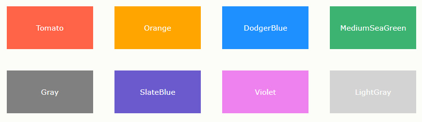
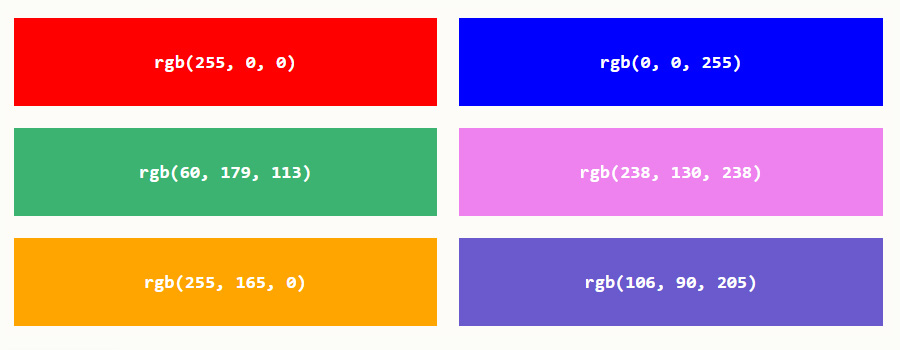
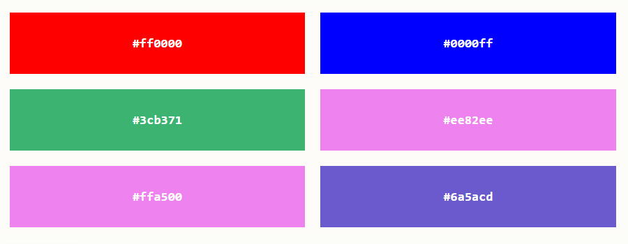
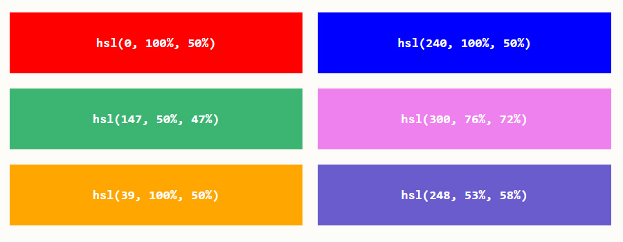

# 长度单位与颜色分类

## 长度

&emsp;&emsp;CSS中使用的每个属性都允许拥有一个或一组值，例如：`color : red ` 代码中，其中color为属性，red为值。在CSS中有很多属性是用来控制位置和尺寸的，所以它们的值必须是一个表示长度的数值，而数值是需要添加单位的。

&emsp;&emsp;CSS中有两种长度单位——绝对长度单位和相对长度单位。重要的是要知道它们之间的区别，以便理解它们控制的元素将变得有多大。

## 绝对长度单位

&emsp;&emsp;以下都是绝对长度单位——它们与其他任何东西都没有关系，通常被认为总是相同的大小。

| 单位 | 名称 |
| ------ | ------ |
| cm | 厘米 |
| mm | 毫米 |
| in | 英寸 |
| pt | 点 |
| px | 像素 |

&emsp;&emsp;这些绝对长度单位中，除了px像素经常使用外，其他并不常用。

## 相对长度单位

&emsp;&emsp;相对长度单位相对于其他一些东西，比如父元素的字体大小，或者视图端口的大小。使用相对单位的好处是，经过一些仔细的规划，您可以使文本或其他元素的大小与页面上的其他内容相对应。以下列出了常见相对单位。

| 单位 | 名称 |
| ------ | ------ |
| em | 在font-size中使用是相对于父元素的字体大小，在其他属性中使用是相对于自身的字体大小 |
| ex | 字符“x”的高度 |
| ch | 数字“0”的宽度 |
| rem | 根元素的字体大小 |
| lh | 元素的line-height |
| vw | 视窗宽度的1% |
| vh | 视窗高度的1% |
| vmin | 视窗较小尺寸的1% |
| vmax | 视图大尺寸的1% |

&emsp;&emsp;像rem和vw单位会在移动端布局中所使用，本教程的第六章中将对rem和vw单位进行详细的讲解，这里就不再赘述了。

## 颜色

&emsp;&emsp;在CSS中指定颜色的方法有很多，其中一些是最近才实现的。在CSS中，相同的颜色值可以在任何地方使用，无论您指定的是文本颜色、背景颜色还是其他颜色。

&emsp;&emsp;现代计算机的标准颜色系统是24位的，它允许通过不同的红、绿、蓝通道的组合显示大约1670万种不同的颜色，每个通道有256个不同的值(256 x 256 x 256 = 16,777,216)。让我们来看看在CSS中指定颜色的一些方法。

## 颜色关键词

&emsp;&emsp;可以直接在代码中使用颜色单词进行赋值，例如：`color : red `，这是一种指定颜色的简单易懂的方式。

	
    
部分颜色关键词

## RGB颜色

&emsp;&emsp;在CSS中，可以使用公式`rgb(red, green, blue)`将颜色指定为RGB值。每个参数 (red、green 以及 blue) 定义了 0 到 255 之间的颜色强度。

&emsp;&emsp;要显示黑色，请将所有颜色参数设置为 0，如下所示：`rgb(0, 0, 0)`；要显示白色，请将所有颜色参数设置为 255，如下所示：`rgb(255, 255, 255)`。

	
    
部分RGB颜色

## HEX颜色

&emsp;&emsp;在CSS中，可以使用`#rrggbb`格式的十六进制值指定颜色。其中 rr（红色）、gg（绿色）和 bb（蓝色）是介于 00 和 ff 之间的十六进制值（与十进制 0-255 相同）。

	
    
部分HEX颜色

## HSL颜色

&emsp;&emsp;在CSS中，可以使用色相、饱和度和明度（HSL）来指定颜色，格式如下：`hsla(hue, saturation, lightness)`。

&emsp;&emsp;色相（hue）是色轮上从 0 到 360 的度数。0 是红色，120 是绿色，240 是蓝色。饱和度（saturation）是一个百分比值，0％ 表示灰色阴影，而 100％ 是全色。亮度（lightness）也是百分比，0％ 是黑色，50％ 是既不明也不暗，100％是白色。

	
    
部分HSL颜色

&emsp;&emsp;本章当中，将通过各种软件，测量出UI设计图中的尺寸长度及颜色取值。
