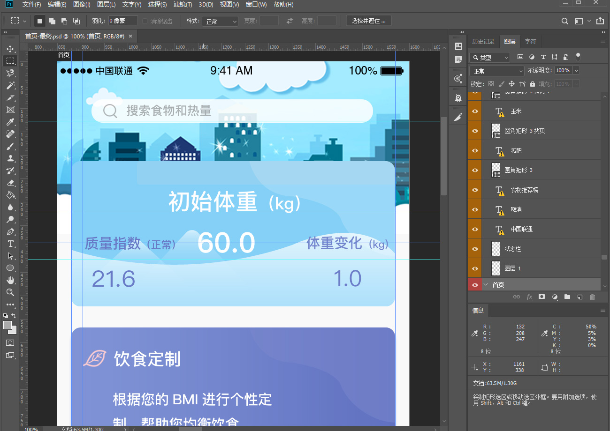
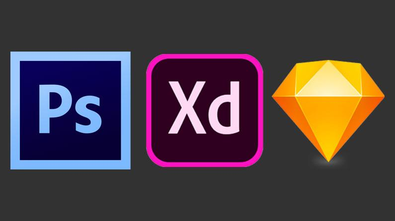

# UI设计图的源文件种类

## 布局与UI设计图

&emsp;&emsp;开发一个网页，通常需要先有一套UI设计图，然后web前端开发人员会根据设计图进行元素尺寸、位置、颜色等信息的获取，从而根据这些信息来完成CSS布局。

## 什么是设计图源文件

&emsp;&emsp;通常我们认知中的JPG、PNG、GIF等图片格式，属于设计图的效果展示类文件，并不属于真正的源文件。源文件是可以查看到图片的所有的图层，通道、参考线、注解和颜色模式等信息，开发人员通过操作源文件，可以更加方便的控制图片，并快速的获取到图片信息。

&emsp;&emsp;下面展示一下，PSD源文件在PhotoShop软件中打开的样子：

	
    
PSD源文件

## 常见的源文件有哪些

1. .psd格式源文件，通过[PhotoShop](https://www.adobe.com/products/photoshop.html)工具制作。
2. .sketch格式源文件，通过[Sketch](https://www.sketch.com/)工具制作。
3. .xd格式源文件，通过[Xd](https://www.adobe.com/products/xd.html)工具制作。

	
    
Ps Xd Sketch

&emsp;&emsp;通常在项目中，UI设计师会提供给我们UI设计图的源文件，web前端开发人员会根据源文件进行切图处理和信息获取。在下一小节中，将选择PSD源文件给大家演示是如何进行操作的，其他格式操作类似，就不再赘述。