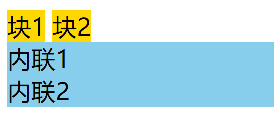
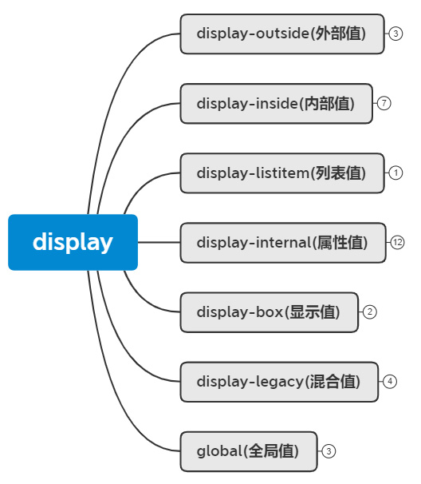
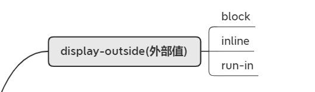
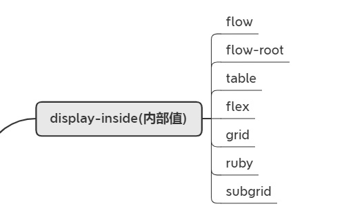
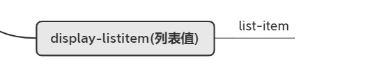
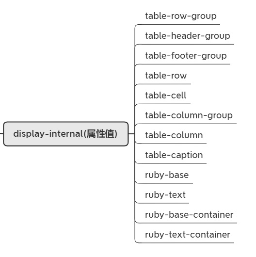
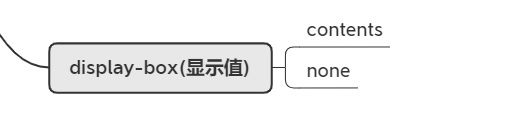
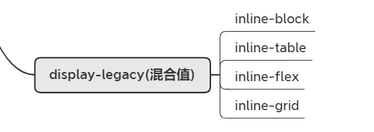
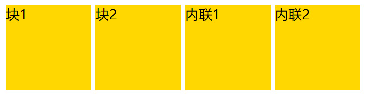
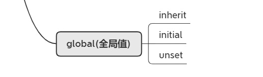

# 详解display属性

## display属性的作用

&emsp;&emsp;在CSS中display属性表示“显示框类型”，即不同的盒模型。简单来说，可以把块级盒子转成内联盒子，也可以把内联盒子转成块级盒子。

```html
<style>
.box1{ display:inline; background:gold;}
.box2{ display:block; background:skyblue;}
</style>
<div class="box1">块1</div>
<div class="box1">块2</div>
<span class="box2">内联1</span>
<span class="box2">内联2</span>
```

<div align=center>
	
    <div>改变盒模型类型</div>
</div>

&emsp;&emsp;可以看到，div具备了内联盒子的特性，而span则具备了块级盒子的特性。当然display远比这些复杂的多，像我们后面章节中讲到的弹性布局、网格布局等都是跟display有着紧密关系。

&emsp;&emsp;display属性大概可分为以下几类进行学习：

<div align=center>
	
    <div>display属性分类</div>
</div>

## display-outside(外部值)

<div align=center>
	
    <div>display属性分类</div>
</div>

&emsp;&emsp;外部值就是定义自身元素的外部表现，而不影响其内的子元素。
- `block`：表示块级盒子 像 <p>、<div>等默认就是块级盒子。
- `inline`：表示内联盒子 像 <span>、<i>等默认就是内联盒子。
- `run-in`：实验性质的属性，浏览器支持不好。

## display-inside(内部值)

<div align=center>
	
    <div>内部值</div>
</div>

&emsp;&emsp;和外部值相反，内部值就是定义子元素布局的。像flex、grid这些设置都会影响到子元素的布局形式，后面章节将详细的对flex和grid进行讲解。

- `flow-root`：一个BFC的块级盒子(注：BFC后面小节会讲解)。
- `table`：带有内部表格布局的块级盒子。
- `flex`：带有内部弹性布局的块级盒子。
- `grid`：带有内部网格布局的块级盒子。

## display-listitem(列表值)

<div align=center>
	
    <div>列表值</div>
</div>

&emsp;&emsp;`list-item`属性值是生成一个容纳内容和单独的列表行内元素盒的块级盒子，目的是为了用div去代替<ul> <li>标签之类的，<li>元素默认就是`list-item`;

## display-internal(属性值)

<div align=center>
	
    <div>属性值</div>
</div>

&emsp;&emsp;一些和table布局、ruby搭配一起控制页面布局的属性值，因为使用的比较少，这里不展开探讨。

## display-box(显示值)

<div align=center>
	
    <div>显示值</div>
</div>

- `contents`：只影响其内容的样式生效，比如：字体大小、文字颜色等；但是像背景色、边框是不会生效的。
- `none`：从盒子树中移除，包括其所有后代元素。 

## display-legacy(混合值)

<div align=center>
	
    <div>混合值</div>
</div>

- `inline-block`：对外表现成内联盒子，对内表现成块级盒子
- `inline-table`：对外表现成内联盒子，对子元素表现成表格盒子
- `inline-flex`：对外表现成内联盒子，对子元素表现成弹性盒子
- `inline-grid`：对外表现成内联盒子，对子元素表现成网格盒子

&emsp;&emsp;下面通过代码来演示一下`inline-block`的特性：

```html
<style>
.box{ display:inline-block; width:100px; height:100px; background:gold;}
</style>
<div class="box">块1</div>
<div class="box">块2</div>
<span class="box">内联1</span>
<span class="box">内联2</span>
```
<div align=center>
	
    <div>inline-block特性</div>
</div>

&emsp;&emsp;可以看到，盒子即具备了块级盒子的特性(支持宽高)又具备了内联盒子的特性(横向排列)。 关于`inline-flex`、`inline-grid`的特性会在相关章节中进行讲解。

## global(全局值)

<div align=center>
	
    <div>全局值</div>
</div>

- `inherit`：继承父元素的display属性
- `initial`：不管父元素怎么设定，恢复到浏览器最初始时的display属性
- `unset`：unset混合了 inherit 和 initial。如果父元素设值了，就用父元素的设定，如果父元素没设值，就用浏览器的缺省设定。

