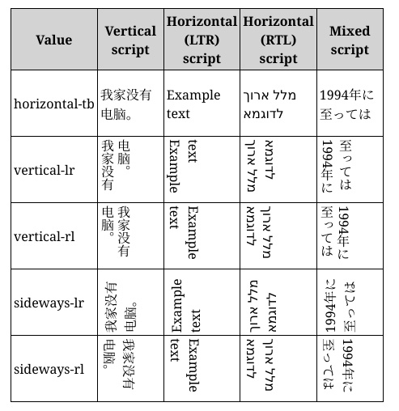

# 书写模式与逻辑属性

## 书写模式

&emsp;&emsp;绝大多数国家的阅读方式都是从左到右进行的，但是也有一小部分国家的阅读方式，可能是从右向左或从上到下。比如阿拉伯国家就是从右向左进行阅读的，所以在网页排版的时候，就要考虑到这个情况，尤其是做国际站的同学们。

<div align=center>
	
    <div>沙特阿拉伯政府截图</div>
</div>

&emsp;&emsp;书写模式即writing-mode属性，可以帮助以上下阅读的国家去展示网页内容。它定义了文本水平或垂直排布以及在块级元素中文本的行进方向。

&emsp;&emsp;可选值有：
- horizontal-tb 水平方向自上而下的书写方式
- vertical-rl 垂直方向自右而左的书写方式
- vertical-lr 垂直方向自左而右的书写方式
- sideways-rl 内容垂直方向从上到下排列
- sideways-lr 内容垂直方向从下到上排列

<div align=center>
	
    <div>writing-mode属性</div>
</div>

&emsp;&emsp;注：目前sideways-rl和sideways-lr的兼容性并不是很好。

## 逻辑属性

&emsp;&emsp;如果一套代码想实现国际化，处理不同国家的排版方式时，就会导致无法实现。代码如下：

```html
<style>
body{
    border:1px black solid;
    height:100px;
}
div{
    border:1px red solid;
    float:left;
    margin-left:30px;
}
</style>
<div>hello world</div>
<div>hello world</div>
```
<div align=center>
	
    <div>从左到右阅读</div>
</div>

&emsp;&emsp;接下来给body添加垂直方向自左而右的书写方式，可以发现布局出现了混乱，height属性依然只针对高度，而margin-left属性也依然只针对左间距。

```css
body{
    border:1px black solid;
    height:100px;
    writing-mode:vertical-lr;  /* 新增样式 */
}
```
<div align=center>
	
    <div>从上到下阅读</div>
</div>

&emsp;&emsp;那么如何更好的处理不同的书写模式呢？就要配合逻辑属性了。逻辑属性是从逻辑角度控制布局，而不是从物理、方向或维度来控制。

&emsp;&emsp;简单来说，物理属性和值指的是width、height、left、top、right、bottom等值；而逻辑属性和值指的是start、end、inline-start、inline-end、block-start、block-end等值。其中block表示垂直方向，inline表示水平方式，在不同的书写模式下，block和inline所代表的方向是会发生变化的。理解逻辑属性对于后面章节中理解弹性布局和网格布局也有非常大的帮助。

&emsp;&emsp;下面用逻辑属性和值修改一下之前代码中出现的问题。

```css
body{
    border:1px black solid;
    block-size:100px;    /* 修改样式 height:100px; */
    writing-mode:vertical-lr;  
}
div{
    border:1px red solid;
    float:left;
    margin-inline-start:30px;    /* 修改样式 margin-left:30px; */
}
```
<div align=center>
	
    <div>从上到下阅读</div>
</div>

&emsp;&emsp;下面再举一个例子
```html
<style>
section {
    text-align: start;  /* start 逻辑值 */
}
h2 {
    border-inline-start: .3em solid #ccc;    /* border-inline-start 逻辑属性 */
    padding-inline-start: .5em;     /* padding-inline-start 逻辑属性 */
}
</style>
<section dir="auto">
    <h2>第一章<h2>
    <div>本章介绍了逻辑属性和逻辑值，这是一个演示示例。div>
<section>
<section dir="auto">
    <h2>الفصل الأول<h2>
    <div>يقدم هذا الفصل القيم المنطقية والمنطقية ، والتي هي مثال توضيحي.div>
<section>
```
<div align=center>
	
    <div>逻辑属性案例</div>
</div>
&emsp;&emsp;注：dir属性可以设置元素的显示方向，是从左往右(ltr)，还是从右往左(rtl)，当设置auto时会自动根据当前语言决定排列方向，dir属性非常适合那些从右向左进行阅读的国家，例如：阿拉伯语，波斯语，希伯来语等。
