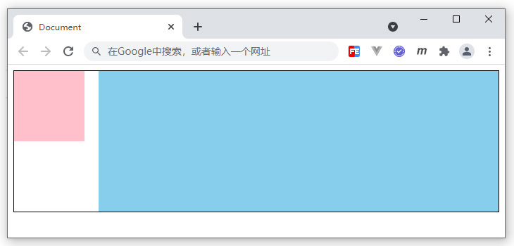

# 练习题

## 根据下面HTML结构，完成图示布局效果，编写对应CSS代码：

```html
<style>
/* 代码编写区域 */

</style>
<div class="main">
    <div class="box1"></div>
    <div class="box2"></div>
</div>
```
<div align=center>
	
    <div>练习题示例</div>
</div>

要求如下：

1. main盒子，宽高均自适应，带有黑色边框
2. box1粉色盒子，固定宽度100px * 100px
3. box2浅蓝色盒子，高度200px，宽度自适应
4. box1和box1之间间距20px

## 参考答案

```css
.main {
    border: 1px black solid;
}
.box1 {
    float: left;
    width: 100px;
    height: 100px;
    background: pink;
}
.box2 {
    height: 200px;
    background: skyblue;
    margin-left: 120px;
}
```
