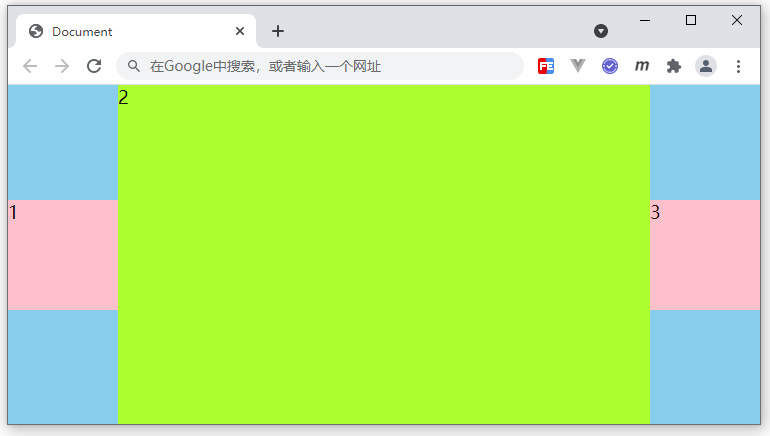

# 练习题

## 根据下面HTML结构，完成图示布局效果，编写对应CSS代码：

```html
<style>
/* 代码编写区域 */

</style>
<div class="main">
    <div>1</div>
    <div>2</div>
    <div>3</div>
</div>
```
<div align=center>
	
    <div>练习题示例</div>
</div>

要求如下：

1. main盒子，宽高均自适应可视区，带有浅蓝色背景
2. 1、3子项，宽高100px，上下居中，分居两侧
3. 2子项，宽度自适应剩余容器，高度自适应父容器
4. 浏览器改变大小时，相关盒子尺寸及位置发生相应变化

## 参考答案

```css
body {
    margin: 0;
}
.main {
    width: 100vw;
    height: 100vh;
    background: skyblue;
    display: flex;
    align-items: center;
}
.main div:nth-of-type(1) {
    width: 100px;
    height: 100px;
    background: pink;
}
.main div:nth-of-type(2) {
    flex-grow: 1;
    background: greenyellow;
    align-self: stretch;
}
.main div:nth-of-type(3) {
    width: 100px;
    height: 100px;
    background: pink;
}
```
