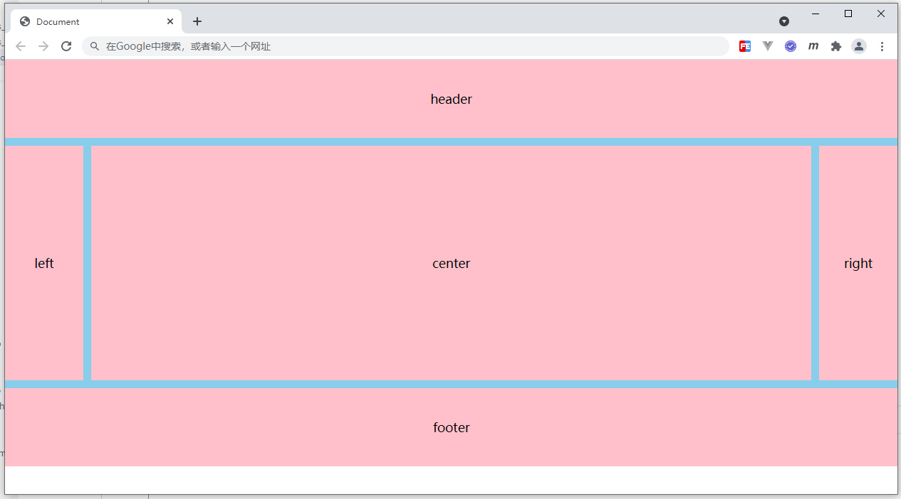

# 练习题

## 根据下面HTML结构，完成图示布局效果，编写对应CSS代码：

```html
<style>
/* 代码编写区域 */

</style>
<div class="main">
    <div>header</div>
    <div>left</div>
    <div>center</div>
    <div>right</div>
    <div>footer</div>
</div>
```
<div align=center>
	
    <div>练习题示例</div>
</div>

要求如下：

1. 采用网格进行布局，区域之间的间距为10px
2. header、footer区域，宽：自适应，高：100px
3. left、right区域，宽：100px，高：300px
4. center区域，宽：自适应剩余空间，高：300px

## 参考答案

```css
body {
    margin: 0;
}
.main {
    background: skyblue;
    display: grid;
    grid-template-columns: 100px 1fr 100px;
    grid-template-rows: 100px 300px 100px;
    gap: 10px;
}
.main div {
    background: pink;
    display: flex;
    align-items: center;
    justify-content: center;
}
.main div:first-of-type {
    grid-area: 1/1/span 1/span 3;
}
.main div:last-of-type {
    grid-area: 3/1/span 1/span 3;
}
```
