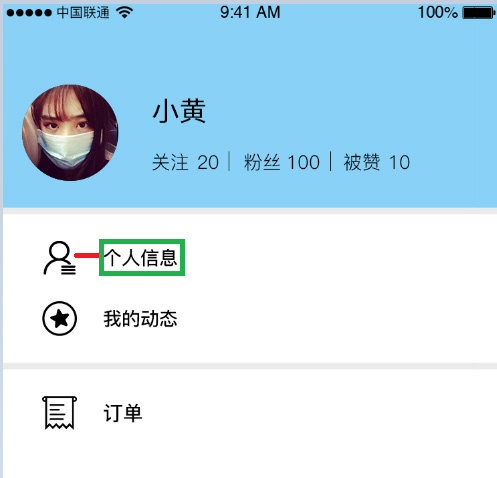

# 练习题

## 利用PxCook工具完成《个人中心.psd》相关CSS数值得获取，要求如下：

1. 源文件已提供，请通过PxCook工具打开源文件
2. 要求源文件切换到2x模式(逻辑像素)，vw单位，保留三位小数
3. 要求下图中的红色区域线段，通过PxCook自动标注形式获取其长度大小(单位vw)
4. 要求下图中的绿色区域文本，通过PxCook右侧信息中获取到尺寸大小(单位vw)和文字大小(单位vw)

	
    
练习题要求

## 参考答案

&emsp;&emsp;红色线段长度：5.6vw
&emsp;&emsp;尺寸大小：14.667vw * 3.6vw 、文字大小：3.733vw
