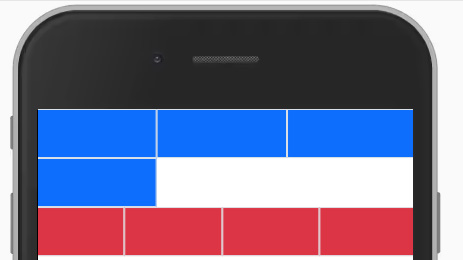

# 响应式框架Bootstrap

## Bootstrap框架简介

&emsp;&emsp;Bootstrap是最受欢迎的 HTML、CSS 和 JS 框架，用于开发响应式布局、移动设备优先的WEB项目。

&emsp;&emsp;在前面视频教程中提到的，响应断点、栅格系统、交互实现等内容，在Bootstrap框架中都已经提供好了，只需要引入框架文件即可使用。

&emsp;&emsp;Bootstrap文件可通过官方提供的网址：[https://getbootstrap.com/](https://getbootstrap.com/) 进行下载。截止到目前最新的版本为 v5.0.x 。这里强调一点，Bootstrap框架是基于jquery库来设计的，所以除了在html文件中引入Bootstrap相关文件外，还需要引入jquery.js文件，并需要确保文件的引入顺序，具体引入方式如下：

```html
<link rel="stylesheet" href="./bootstrap.css">
<script src="./jquery.js"></script>
<script src="./bootstrap.js"></script>
```

## 响应式断点的设定

&emsp;&emsp;Bootstrap中的断点值设定跟前面视频中讲解的值是一样的：

|  设备描述  |   断点值   |    标识符   |
|  ----  | ----  |  ----     |
| Extra small  |  <576px  |    |
| Small  | ≥576px |  -sm |
| Medium  | ≥768px |  -md |
| Large  | ≥992px |  -lg |
| X-Large  | ≥1200px |  -xl |
| XX-Large  | ≥1400px |  -xxl |

&emsp;&emsp;在Bootstrap框架中，能够具备响应式断点设定的样式非常多，如：float浮动、display显示框、container容器、text文本等。

```html
<div class="float-sm-start
            d-lg-block
            container-md
            text-xl-start"></div>
```


## 响应式栅格系统

&emsp;&emsp;Bootstrap中的栅格系统跟前面视频中讲解的也是一样的，不过功能更加的丰富，除了有12列响应式栅格系统外，还有栅格位置的控制和对行的栅格化控制等。

&emsp;&emsp;可通过 `offset-*-*` 模式对栅格进行偏移，代码如下：

```html
<div class="row">
    <div class="col-3 offset-1 bg-primary p-4"></div>
    <div class="col-3 offset-2 bg-danger p-4"></div>
</div>
```
<div align=center>
	
    <div>offset-*-*偏移</div>
</div>

&emsp;&emsp;可以看到第一列距离左边会空出一个栅格的大小，第二列跟第一列之间会空出两个栅格的大小，那么最后剩余的空间为三个栅格。

&emsp;&emsp;可通过 `row-*-*` 模式对行进行栅格化控制，代码如下：
```html
<div class="row row-cols-3">
    <div class="col bg-primary p-4 border"></div>
    <div class="col bg-primary p-4 border"></div>
    <div class="col bg-primary p-4 border"></div>
    <div class="col bg-primary p-4 border"></div>
</div>
<div class="row row-cols-4">
    <div class="col bg-danger p-4 border"></div>
    <div class="col bg-danger p-4 border"></div>
    <div class="col bg-danger p-4 border"></div>
    <div class="col bg-danger p-4 border"></div>
</div>
```
<div align=center>
	
    <div>row-*-*响应行</div>
</div>

&emsp;&emsp;可以看到第一行只能放置三列，而第二行可以放置四列。

## 常见bootstrap组件

&emsp;&emsp;在Bootstrap框架中提供了很多现成的组件，可直接进行使用并带有交互行为。下面展示其中一个组件，Accordion(手风琴，即折叠列表)组件。

```html
<div class="accordion" id="accordionExample">
    <div class="accordion-item">
        <h2 class="accordion-header" id="headingOne">
            <button class="accordion-button" type="button" data-bs-toggle="collapse" data-bs-target="#collapseOne" aria-expanded="true" aria-controls="collapseOne">
            第一项
            </button>
        </h2>
        <div id="collapseOne" class="accordion-collapse collapse show" aria-labelledby="headingOne" data-bs-parent="#accordionExample">
            <div class="accordion-body">
                第一项的内容
            </div>
        </div>
    </div>
    <div class="accordion-item">
        <h2 class="accordion-header" id="headingTwo">
            <button class="accordion-button collapsed" type="button" data-bs-toggle="collapse" data-bs-target="#collapseTwo" aria-expanded="false" aria-controls="collapseTwo">
            第二项
            </button>
        </h2>
        <div id="collapseTwo" class="accordion-collapse collapse" aria-labelledby="headingTwo" data-bs-parent="#accordionExample">
            <div class="accordion-body">
                第二项的内容
            </div>
        </div>
    </div>
</div>
```
<div align=center>
	
    <div>Accordion组件</div>
</div>

&emsp;&emsp;Bootstrap中的组件是通过，自定义属性 `data-*` 方式来控制交互行为的，例如在Accordion组件中通过 `data-bs-toggle="collapse" data-bs-target="#collapseOne"` 进行的。