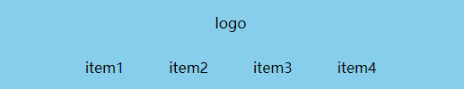
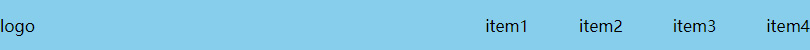

# 练习题

## 根据下面HTML结构，完成图示布局效果，编写对应CSS代码：

```html
<style>
/* 代码编写区域 */

</style>
<section class="head">
    <div>logo</div>
    <ul>
        <li>item1</li>
        <li>item2</li>
        <li>item3</li>
        <li>item4</li>
    </ul>
</section>
```
<div align=center>
	
    <div>width < 768px</div>
</div>
<div align=center>
	
    <div>width >= 768px</div>
</div>

要求如下：

1. 断点值为768px，小于768px时.head区域高100px，大于等于768px时.head区域高50px
2. div、ul在小于768px时，垂直排列，内容上下左右居中
3. div、ul在大于等于768px时，水平排列，内容上下居中，左右在两侧
4. item列表项之间间距为50px

## 参考答案

```css
* {
    margin: 0;
    padding: 0;
}
ul {
    list-style: none;
}
.head {
    height: 100px;
    background: skyblue;
    display: flex;
    flex-direction: column;
    align-items: center;
}
.head div {
    flex-grow: 1;
    display: flex;
    align-items: center;
}
.head ul {
    flex-grow: 1;
    display: flex;
    justify-content: space-between;
    align-items: center;
    column-gap: 50px;
}
@media (min-width: 768px) {
    .head {
        height: 50px;
        flex-direction: row;
    }
    .head ul {
        flex-grow: 0;
    }
}
```
