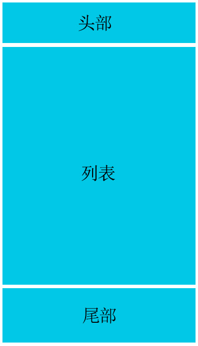

# CSS文件划分及功能分类

## CSS文件划分

&emsp;&emsp;在中大型项目中，一般会对CSS进行文件划分，根据文件的性质与用途，大概会分成：

- **公共型样式**
- **特殊型样式**
- **皮肤型样式**

&emsp;&emsp;公共型样式可命名为global.css或common.css等名字，主要包括网站通用样式编写，例如：重置默认样式reset、网站通用布局、通用模块和元件、通用响应式系统等。

```css
/* 重置样式 */
省略css代码...
/* 网站通用布局 */
省略css代码...
/* 通用模块 */
省略css代码...
/* 通用元件 */
省略css代码...
/* 通用响应式系统 */
省略css代码...
```
&emsp;&emsp;特殊型样式主要是根据当前页面来决定的文件，只针对当前页面做出特殊处理的样式，例如只在首页中用到的样式可放置到index.css中，在登录页中用到的样式可放置到login.css中。

&emsp;&emsp;皮肤型样式是针对网站需要皮肤功能时，把颜色、背景等抽离出来放到文件中的形式，例如theme-pink.css、theme-skyblue.css等。

&emsp;&emsp;CSS文件的引入顺序如下：

```html
<link href="assets/css/global.css" rel="stylesheet" type="text/css"/>
<link href="assets/css/index.css" rel="stylesheet" type="text/css"/>
<link href="assets/css/theme.css" rel="stylesheet" type="text/css"/>
```

## CSS功能分类

&emsp;&emsp;上面提到了公共型样式，在文件中具体包括哪些常见的功能呢？大概可分为如下几类：

- **重置样式**
- **网站通用布局**
- **通用模块**
- **通用元件**
- **通用响应式系统**

&emsp;&emsp;重置样式在前面章节中有介绍过，主要是去除默认样式和统一不同设备下的表现形态。通常为Reset CSS代码和Normalize CSS代码的结合版本。在本套课程中已经把二者结合成为了一个reset.css文件，并在多个综合案例中进行使用过。

&emsp;&emsp;网站通用布局主要指的是对网站中出现的大块结构进行排版。如：PC端中的菜单、内容的左右布局方案；移动端中的头部、列表、尾部的上中下布局方案等。

<div align=center>
	
    <div>菜单、内容的左右布局</div>
</div>

<div align=center>
	
    <div>头部、列表、尾部的上中下布局</div>
</div>


&emsp;&emsp;通用模块指的是网页中可以重复使用的较大的整体，比如导航、登录、注册、各种列表、评论、搜索等。

&emsp;&emsp;通用原件指的是不可再分的较为小巧的个体，通常被重复用于各种模块中，比如按钮、输入框、loading、图标等。

&emsp;&emsp;通用响应式系统指的是在不同设备下要实现响应式布局，当满足了某个断点设定后调用的相应变化样式，比如浮动添加、栅格生效、显示隐藏、版心宽度等。

