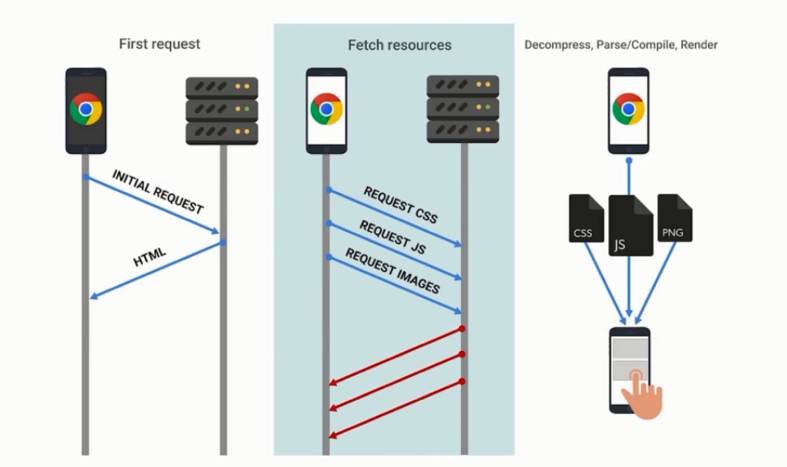
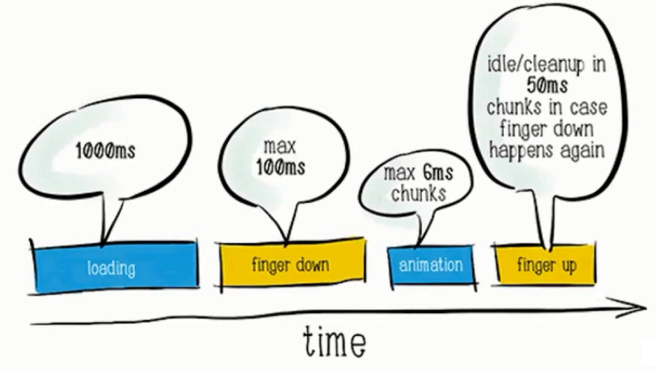

# 介绍

性能

<!-- 平凡程序员和大牛程序员、架构师的分水岭 -->

目标：使用流行的性能优化技术，快速提升 web 性能

## 性能优化意义何在？

- WPOstats 性能优化案例库 - 业界经验

## 性能优化做什么

## 行动的标准是什么

## 涉及

- HTML
- JS
- CSS
- HTTP
- Webpack
- React
- Chrome DevTools
