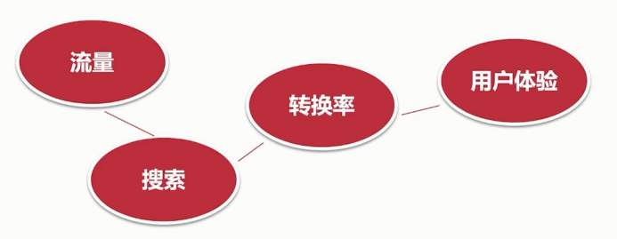
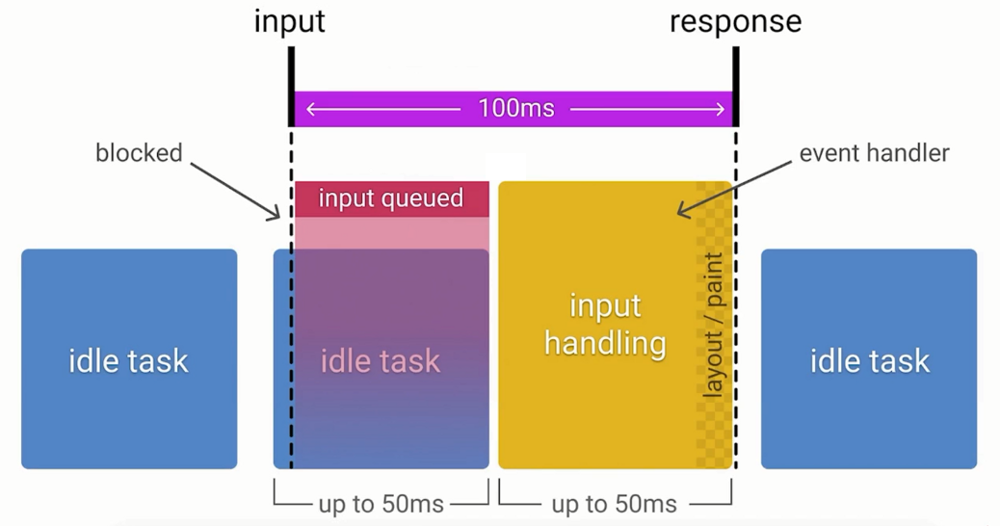

# 性能优化的指标和工具

## 为甚麽要进行 Web 性能优化

性能 - Web 网站和应用的支柱



寻找性能瓶颈

- 了解性能指标 - 多快才算快
- 利用测量工具和 APIs
- 优化问题，重新测量(迭代)

移动端挑战多

- 设备硬件、网络、屏幕尺寸、交互方式
- 用户更缺少耐心，大于 3 秒导致 53% 的跳出率(bounce rate)
- 持续增长的移动用户和移动电商业务

## 性能指标和优化目标

- First Contentful Paint
- Speed Index
- Largest Contentful Paint

- Time to Interactive
- Total Blocking Time
- Cumulative Layout Shift

Ctrl + Shift + P

- Frames Per Second(FPS )

### 性能优化 - 加载

- 理解加载瀑布图
- 基于 HAR 存储于重建性能信息
- 速度指数(Speed Index)
- 重要测量指标

- Speed Index
- TTFB
- 页面加载时间
- 首次渲染时间

### 性能优化 - 响应

- 交互动作的反馈时间
- 帧率 FPS
- 异步请求的完成时间

## RAIL 测量模型

用户对于网站延迟的反应

- 0-16ms：动画的一帧渲染不大于 16ms 时，用户会感觉动画是流畅的。
- 0-100ms：当用户进行操作时，100ms 内窗口响应用户操作，用户会有一种立即获得结果的感觉。
- 100-300ms：用户可能微微察觉到一点延迟。
- 300-1000ms：此时长范围是用户能接受的页面的加载或者视图的改变所用时长。
- 1000+ms:用户的注意力将离开正在执行的任务。
- 10000+ms:用户已经没有耐心等待下去。

什么是 RAIL 模型

RAIL 是一种以用户为中心的性能模型，又 google 提出，其主要目标是让用户满意，主要分为 response animation idle load 四个部分

- R 代表：Respponse,即”响应“的意思。一般指的是用户输入网页快速给出结果的过程，比如点击按钮，切换表单，启动动画之类的。
- A 代表：Animation，即”动画“的意思。指的是涉及 style，layout，paint，composite 过程的行为。比如：用户滚动页面，拖动刷新，页面动画等。
- I 代表：Idle，即”空闲“的意思。一般指用户看到网页到他们进行操作这一无交互时间段。
- L 代表：Load，即”加载“的意思。一般指网页加载这一段时间

- response 响应：输入延迟时间小于 100 毫秒，超过这个时间用户能感知到延迟
- animation 动画：每一帧完成时间小于 16 毫秒，因为人眼可以感知到每秒渲染渲染 60 帧的平滑动画，也即每帧约 16 毫秒
- idle 空闲：为了实现响应时间小于 100 毫秒，工作得分成不大于 50 毫秒的块，在 50 毫秒内将控制还给主线程
- load：页面在 1000 毫秒内就绪

### RAIL 评估标准



- R（响应)<100ms。 即，当用户点击按钮后，`尽量`(可以理解有些操作实在很难做到 100ms 内响应)在 100ms 的时间内要响应用户（`应该在50ms 以内完成`）。一般对于="">500ms 才能完成的操作，最好给用户一些提示。
- A（动画）<16ms/帧。但由于浏览器绘制新帧到屏幕上需要时间，所以其实真正的每帧动画能用的时间只有 10ms 。(`每10ms产生一帧`)
- I（空闲）<50ms。一般空闲时间是有 100ms，这段时间可以用来完成加载网页时非必需的加载，但是必须在 50ms 内将控制返回给主线程。（`尽可能增加空前时间`）
- L（加载）<1000ms。即，在 1s 内加载网页，无需加载所有，在满足用户需求下只需加载关键资源，从而使用户获得较好的网络体验。（`在 5s 内完成内容加载并可以交互`）

### 性能测试工具

- Chrome DevTools 开发调试、性能评测
- LightHouse 网站整体质量评估
- WebPageTest 多测试地点、全面性能报告

## 使用 WebPageTest 评估 Web 网站性能

- https://github.com/WPO-Foundation/webpagetest
- http://www.webpagetest.org

WebpageTest 主要提供了 Advanced Testing、simple Testing、Visual Comparison、Traceroute 四个功能

### 如何使用

- 填写需要测试的 URL
- 填写 Test Location，下拉选择即可，可选移动端设备（包括 Android、IOS），可选 PC 端（分地区，每个地区可支持的浏览器不同）
- 可选支持的浏览器
- 点击右侧 START TEST

剩下的就是工具自己的事情了，只需要坐等分析结果。

### 解读 WebpageTest 报告

- waterfall chart 请求瀑布图
- first view 首次访问
- repeat view 二次访问

### 如何本地部署 WebpageTest 工具

参考附 1

### 主要的指标数据

First Byte Time

- 适用对象：访问页面的第一字节时间(后端处理+重定向)
- 检查内容：目标时间包括 DNS 寻址时间+建立连接时间(Socket) + SSL 认证时间 + 100ms。当超过目标时间每 100ms 时， 性能评定将降低一个等级

Keep-Alive

- 适用对象：同一个域名下多个页面对象使用了同一个连接(Socket)
- 检查内容：响应头文件包含"Keep-Alive"的指令或者在给定的主机中多个对象中使用同一个连接

GZIP Text

- 适用对象：工具会将 MIME 类型为"text/*" 或"*java\*"的所有对象
- 检查内容：检查 Transfer-encoding 来看是否为 GZIP，如果不是则结果中会提供说明该文件是压缩过以及提供压缩比率(因此一个文件可以节省 30%的大小，通过压缩即产生了源文件 70%大小的文件)

Compress Images

- 适用对象：JPEG 图片
- 检查内容：对比使用 photoshop 质量选择为 50 后的文件大小，尺寸超出 10%为达标，10%~50%为警告，超出 50%为不达标，总体评分为图片重压缩后占原文件的百分比

Use Progressive JPEGs

- 适用对象：所有 JPEG 图片
- 检查内容：检查每个 JPEG 图片文件并计算分数，分数为图片的压缩比(压缩文件大小/原文件大小)

Cache Static

- 适用对象： 符合以下的情况的任意的非 html 对象数据，这个工具会将 MIME 类型为"text/*","*java*"或者"image/*"，此类没有明确标明过期时间(0 或者-1），cache-controlheader 设置为 private,non-store 或者 non-cachepragma header 设置为 no-cache
- 检查内容：存在一个”Expires“ header(而不是 0 或者-1),或者设置 cache-control: max-age 并设置为一个小时或超过一个小时。当过期时间设置小于 30 天，将评定为警告

Use A CDN

- 适用对象：所有静态的非 HTML 内容(css, js 以及图片)
- 检查内容：检查是否托管在一个已知的 CDN 上(CName 映射到一个已知的 CDN 网络上).超过整体页面 80%为静态资源时，则需要考虑使用 CDN，将静态资源托管在 CDN 上，你可以从这里知道当前已知的 CDN

## 使用 LightHouse 分析性能

安装及使用

- 本地 npm 安装 LightHouse
- Chrome Devtools 中使用
- 通过 chrome web store 安装插件

LightHouse git：https://github.com/GoogleChrome/lighthouse

lighthouse 依赖 node 8 或者更高的 node 版本

npm install -g lighthouse

lighthouse https://www.baidu.com/

## 使用 Chrome DevTools 分析性能测试

- LightHouse
- Throttling 调整网络吞吐
- Perormance 性能分析
- Network 网络加载分析

其他常用功能

- Animations
- Request blocking
- Rendering
- Perormance monitor

## 常用的性能测量 APIs

- 关键时间节点（Navigation Timing，Resource Timing ）
- 网络状态(Network APIs)
- 客户端服务端协商(HTTP Client Hints) && 网页显示状态(UI APIs)

计算方式：

1. DNS 解析耗时: domainLookupEnd - domainLookupStart
1. TCP 连接耗时: connectEnd - connectStart
1. SSL 安全连接耗时: connectEnd - secureConnectionStart
1. 网络请求耗时 (TTFB): responseStart - requestStart
1. 数据传输耗时: responseEnd - responseStart
1. DOM 解析耗时: domInteractive - responseEnd
1. 资源加载耗时: loadEventStart - domContentLoadedEventEnd
1. First Byte 时间: responseStart - domainLookupStart
1. 白屏时间: responseEnd - fetchStart
1. 首次可交互时间: domInteractive - fetchStart
1. DOM Ready 时间: domContentLoadEventEnd - fetchStart
1. 页面完全加载时间: loadEventStart - fetchStart
1. http 头部大小： transferSize - encodedBodySize
1. 重定向次数：performance.navigation.redirectCount
1. 重定向耗时: redirectEnd - redirectStart

```js
// 计算一些关键的性能指标
window.addEventListener('load', (event) => {
  // Time to Interactive 可交互时间
  let timing = performance.getEntriesByType('navigation')[0];
  console.log(timing.domInteractive);
  console.log(timing.fetchStart);
  let diff = timing.domInteractive - timing.fetchStart;
  console.log('TTI: ' + diff);
});
```

```js
// 观察长任务
const observer = new PerformanceObserver((list) => {
  for (const entry of list.getEntries()) {
    console.log(entry);
  }
});
// 监听 long tasks
observer.observe({entryTypes: ['longtask']});
```

```js
// 见面可见性的状态监听
let vEvent = 'visibilitychange';
if (document.webkitHidden != undefined) {
  // webkit prefix detected
  vEvent = 'webkitvisibilitychange';
}

function visibilityChanged() {
  if (document.hidden || document.webkitHidden) {
    // 页面不可见
    console.log('Web page is hidden.');
  } else {
    //   页面可见
    console.log('Web page is visible.');
  }
}

document.addEventListener(vEvent, visibilityChanged, false);
```

```js
// 监听网络状态变化
var connection =
  navigator.connection || navigator.mozConnection || navigator.webkitConnection;
var type = connection.effectiveType;

function updateConnectionStatus() {
  console.log(
    'Connection type changed from ' + type + ' to ' + connection.effectiveType
  );
  type = connection.effectiveType;
}

connection.addEventListener('change', updateConnectionStatus);
```
