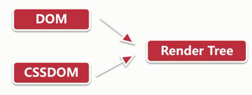
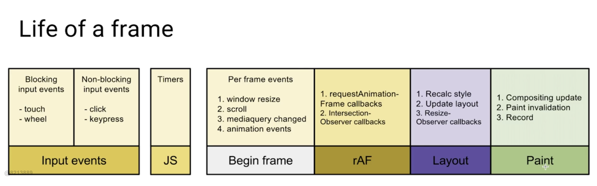
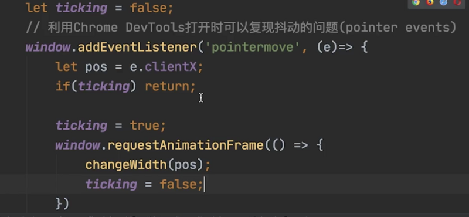
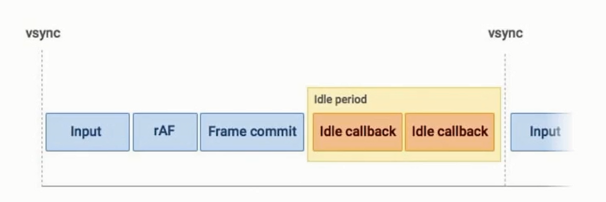
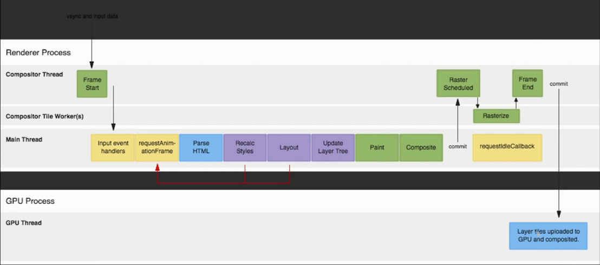

# 渲染优化

## 现代浏览器网页渲染原理

关键渲染路径(Critical Rendering Path)

## 浏览器的渲染流程


浏览器构建对象模型

- 构建 DOM 对象：HTML -> DOM
- 构建 CSSOM 对象： CSS -> CSSOM

浏览器构建渲染树



## 布局(layouts)与绘制(paint)

- 渲染树只包含网页需要的节点
- 布局计算每个节点精确的位置和大小 - 盒模型
- 绘制是像素化每个节点的过程

影响回流的操作

- 添加删除元素
- 操作 styles
- dispaly: none
- offsetLeft、scrollTop、clientWidth
- 移动元素位置
- 修改浏览器大小、字体大小

避免 layout thrashing

- 避免回流
- 读写分离

回流（reflow）与重绘（repaint）, 如何避免布局抖动

## 使用 FastDom【防止布局抖动的利器】

- fastdom: https://github.com/wilsonpage/fastdom

```js
fastdom.measure(() => {
  console.log('measure');
});

fastdom.mutate(() => {
  console.log('mutate');
});

fastdom.measure(() => {
  console.log('measure');
});

fastdom.mutate(() => {
  console.log('mutate');
});
```

```js
measure;
measure;
mutate;
mutate;
```

npm install fastdom --save

## 复合线程（compositor thread）与图层（layers）【渲染流水线的最后一站】

复合线程做什么

- 将页面拆分图层进行绘制再进行复合，就像 ps
- 利用 DevTools 了解网页的图层拆分情况
- 哪些样式仅影响复合？transform opcity

- Position - `transform: translate(npx, npx)`
- Scale - `transform: scale(n)`
- Rotation - `transform: rotate(ndeg)`
- Opacity - `opacity: 0...1`

## 减少重绘 (repaint)

利用 DevTools 识别 paint 的瓶颈

command + P 打开工具，检查重绘

Paint flashing 勾选，然后观察

利用 will-change 创建新的图层

使用 tansform,opacity 减少 repaint

只影响复合而不去触发布局和绘制。

willChange 不可过多。

willChange: 'transform'

## 高频事件防抖[解救页面卡顿]

- 滚动
- touch
- poinermove
- 触发的频率高于刷新的频率

window.requestAnimationFrame [链接在此](https://developer.mozilla.org/zh-CN/docs/Web/API/Window/requestAnimationFrame)

window.requestAnimationFrame() 告诉浏览器——你希望执行一个动画，并且要求浏览器在下次重绘之前调用指定的回调函数更新动画。该方法需要传入一个回调函数作为参数，该回调函数会在浏览器下一次重绘之前执行





包上一层函数就能去抖动，达到一帧只触发一次的目的。

## React 时间调度实现

基本原理

- requestIdleCallback 的问题
- 通过 rAF 模拟 rIC





## 链接

- [关键渲染路径](https://developers.google.cn/web/fundamentals/performance/critical-rendering-path/)
- [构建对象模型](https://developers.google.com/web/fundamentals/performance/critical-rendering-path/constructing-the-object-model?hl=zh-cn)
- [前端性能优化——关键渲染路径](https://blog.csdn.net/weixin_34318272/article/details/88860535)
- [你真的了解回流和重绘吗](https://segmentfault.com/a/1190000017329980)
- [回流（reflow）与重绘（repaint）](https://blog.csdn.net/qq_36647038/article/details/84073605)
- [网页渲染性能优化 —— 性能优化上](https://zhuanlan.zhihu.com/p/39878259)
- [requestIdleCallback 和 requestAnimationFrame 详解](https://www.jianshu.com/p/2771cb695c81)

https://www.kutu66.com//GitHub/article_102898
https://ld246.com/article/1589518580970/comment/1589518941839
