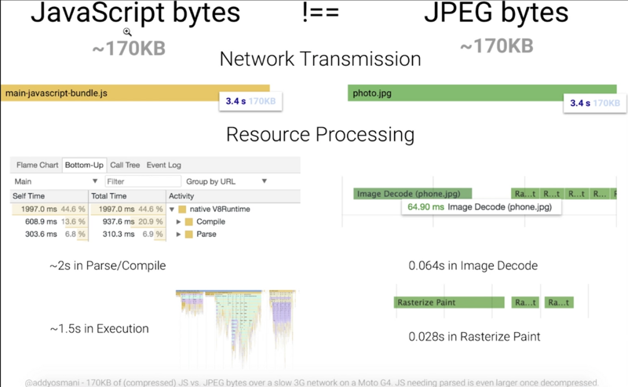
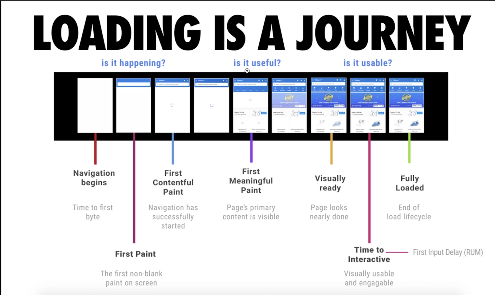
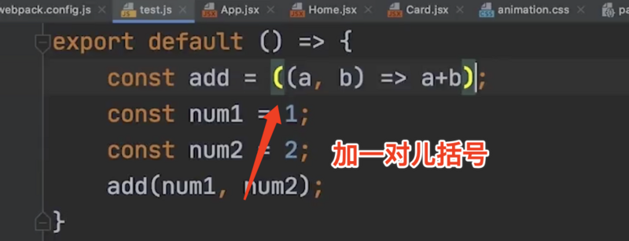
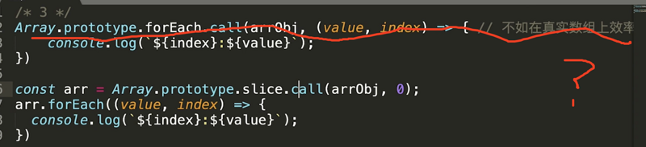
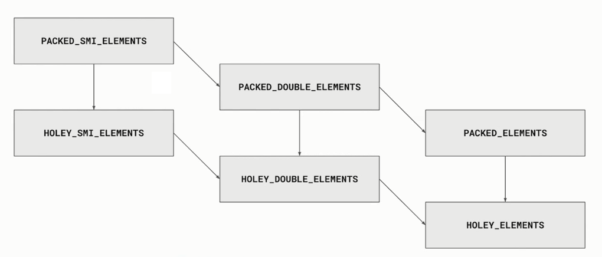

# 代码优化

## 开销和如何缩短解析时间

开销在哪里

- 加载
- 解析& 编译
- 执行

在字体，html，图片这些资源当中，最为昂贵的是 JavaScript。它后面还有解析和编译的过程。最后才是执行.



同样 170kb 的文件,js 的文件解析需要大约 2 秒，jpg 只需要解码，大概 0.06 秒，绘制的总过程 0.028s.

js 处理的时间大概需要占三分之一。就算用户能够看到我们的页面，也没办法交互。

### 解决方案

1. Code splitting 代码查分，按需加载。

当前访问路径需要哪些资源就加载哪些资源，不需要的给它延迟，访问的时候再去加载。达到减少加载 js 的目的

2. Tree shaking 代码减重

举例来说，只是引用了 loadsh 里面的一个函数，就可以把这一个函数打包到 bundle 文件中。

### 减少主线程的工作量

1. 避免长任务

   任务时间越长，占据的阻塞越久

2. 避免超过 1kb 的行间脚本

   写行间脚本可能是为了加快首屏的渲染。剩下的再通过 web 文件进行加载。

   对于行间脚本，浏览器不能进行优化。

3. 使用 rAF 和 rIC 进行时间调度

## Progressive Bootstrapping(逐步引导)

可见不可交互 vs 最小可交互资源集



## 配合 V8 有效优化代码

### v8 编译原理

node 用 v8 引擎

v8 会对代码进行优化，发现优化的不行了呢，还会反向优化，就会浪费很多时间。

保存文件，在 Node 环境下运行

```js
const {performance, PerformanceObserver} = require('perf_hooks');

const add = (a, b) => a + b;

const num1 = 1;
const num2 = 2;

performance.mark('start');

for (let i = 0; i < 10000000; i++) {
  add(num1, num2);
}

add(num1, 's');

for (let i = 0; i < 10000000; i++) {
  add(num1, num2);
}

performance.mark('end');

const observer = new PerformanceObserver((list) => {
  console.log(list.getEntries()[0]);
});
observer.observe({entryTypes: ['measure']});

performance.measure('测量1', 'start', 'end');
```

node --trace-opt --trace-deopt de-opt.js

### 抽象语法树

源码=》抽象语法树=》字节码 Bytecode=》机器码

编译过程会进行优化

运行时可能会发生反优化

### v8 优化机制

1. 脚本流

   检查超过 30kb 的脚本，就认为问价已经足够大，会单独开一个线程进行解析。

2. 字节码缓存

   经常使用的变量进行缓存

3. 懒解析

   主要针对于函数，先声明但是不解析。

## 函数优化

解析的好处，如果不需要解析，那就不用在“堆”里面分配内存，不用为它创建一个语法树。可以提高我们加载 js 的一个整体的效率。

但是现实中，我们有时候还是需要我们的函数立即去执行的。

### 函数解析方式

1. lazy parseing 懒解析 vs eager parseing 饥饿解析

   假如我们先进行懒解析，然后发现需要立即执行，还需要一个 eager parseing,这样反而性能减半。

   那么，我们怎样告诉解析器，我们需要进行 eager parseing？

   

   ```js
   export default () => {
     const add = (a, b) => a * b; // lazy parsing
     // const add = ((a, b) => a*b); // eager parsing
     const num1 = 1;
     const num2 = 2;
     add(num1, num2);
   };
   ```

2. 利用 Optimize.js 优化初次加载时间

   - https://github.com/nolanlawson/optimize-js

   上面添加的括号会在压缩的时候被去掉，但是 Optimize 会帮我们把括号找回来。

   但是现在 webpack4 已经自己能够实现这个功能。

## 对象优化

学习 js 对象，就像是练习内功。学习得好不好，就看你对对象学习的程度。

这些写法的目的就是为了迎合 V8 引擎对你的代码进行优化。

对象优化可以做哪些？

- 以相同顺序初始化对象成员，避免隐藏类的调整
- 实例化后避免添加新属性
- 尽量使用 Array 代替 array-like 对象（转换的代价<）
- 避免读取超过数组的长度
- 避免元素类型的转换

```js
/* 1 */
class RectArea {
  // HC0
  constructor(l, w) {
    this.l = l; // HC1
    this.w = w; // HC2
  }
}

const rect1 = new RectArea(3, 4); // 创建了隐藏类HC0, HC1, HC2
const rect2 = new RectArea(5, 6); // 相同的对象结构，可复用之前的所有隐藏类

const car1 = {color: 'red'}; // HC0
car1.seats = 4; // HC1

const car2 = {seats: 2}; // 没有可复用的隐藏类，创建HC2
car2.color = 'blue'; // 没有可复用的隐藏类，创建HC3

/* 2 */
const car1 = {color: 'red'}; // In-object 属性
car1.seats = 4; // Normal/Fast 属性，存储在property store里，需要通过描述数组间接查找

/* 3 */
Array.prototype.forEach.call(arrObj, (value, index) => {
  // 不如在真实数组上效率高
  console.log(`${index}: ${value}`);
});

const arr = Array.prototype.slice.call(arrObj, 0); // 转换的代价比影响优化小
arr.forEach((value, index) => {
  console.log(`${index}: ${value}`);
});

/* 4 */
function foo(array) {
  for (let i = 0; i <= array.length; i++) {
    // 越界比较
    if (array[i] > 1000) {
      // 1.沿原型链的查找 2.造成 undefined 与数进行比较
      console.log(array[i]); // 业务上无效、出错
    }
  }
}

/* 5 */
const array = [3, 2, 1]; // PACKED_SMI_ELEMENTS

array.push(4.4); // PACKED_DOUBLE_ELEMENTS
```

<!--  -->



## HTML 优化

1. 减少 ifames 的使用

   相当于多加了一个文档。父级文档要等它。

2. 压缩空白符
3. 避免深层次的嵌套

   嵌套越深，遍历越慢

4. 避免使用 table 布局

   已经 out

5. 删除注释

   语义化标签，方便浏览器做一些优化
   有些标签可以不闭合？比如，ul 里面的 li

6. css & js 尽量外链

   什么时候写在行间? 首屏优化

7. 删除元素默认属性

8. js 放在下面，别阻塞 dom 加载

总结：html 的优化占比较少，为了把优化做到极致，可以关注上面几点，但是 webpack 集成了这样的功能。（html-minifiler）

## CSS 对性能的影响

解析 css，会自右向左去读，先找出所有的 a 标签，然后再找出第二个条件进行过滤。

- 降低 css 的阻塞，用不到的到后面再进行加载。
- 利用 GPU 进行完成动画，就是使用复合图层。
- 使用 contain 属性。

  告诉浏览器，我和外面的没关系，只对我里面的元素进行更改，不用进行回流，布局的重新计算。

- font-display 属性

  在页面上先展示文字，减轻文字闪动的问题
