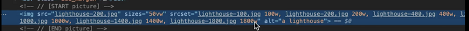

# 资源优化

## 资源的压缩与合并

目的

- 减少 http 请求量
- 减小 http 请求资源的大小

怎么做？

- html 压缩。

  - html-minifier
  - （谷歌 Dev 就没压缩，因为在别的方面做得更好）

- css 压缩

  - clean-css 等进行压缩

  js 压缩与混淆，大部分时候都是使用 webpack 在构建时进行压缩。

- css 与 js 文件合并：

有的人认为合并比较好，有的人认为拆分比较好。在网络上加载比较快。

总结就是同一模块的小文件，ok 的，因为现在都是渐进式加载。单纯的为了优化，减少 http 请求，会影响用户体验。

## 图片优化方案

- 图片格式
- 图片大小
- 适配不同屏幕
- 压缩
- 加载的优先级
- 懒加载
- 利用一些工具

## 图片格式优化

1. jpg 有损压缩 色彩好

- https://github.com/imagemin/imagemin

工具：

- imagemin 对 jpg 图片自己压缩

场景

- 使用场景，图片比较大，还想要尽量保存画质。

缺陷

- 当图片有比较多的纹理和边缘，就不太合适，因为压缩比较高，会有锯齿感。

2. PNG 透明背景：色彩上不相上下

工具

- https://github.com/imagemin/imagemin-pngquant

场景： logo，纹理。

缺陷： 大

3. webP

- 谷歌新推出的图片格式
- 色彩上与 JPG 不相上下，但是压缩比更高。
- 支持 webp 的浏览器。

## 图片加载优化

### 图片的懒加载

1. 原生的图片懒加载方案

```html

```

2. 第三方图片懒加载方案

- [react-lazy-load-image-component](https://github.com/Aljullu/react-lazy-load-image-component）
- verlok/lazyload
- yall.js
- Blazy

### 使用渐进式图片

横扫描的方式


渐进式图片


优点：刚开始就能看到图片的全貌，用户体验更好


### 响应式图片

适配。



刚开始只会加载一张图片，srcset 里面是不同尺寸的图片。会根据窗口的大小加载相应大小的图片。

- Srcset 属性的使用
- Sizes 属性的使用
- picture 的使用

## 字体优化

什么是 FOIT ？什么是 FOUT？

字体下载未完成时，浏览器隐藏或自动降级，导致字体闪烁。

Flash Of Invisible Text

Flash Of Unstyled Text

字体闪动不可避免。

```js
font-display:auto|block|swap|fallback|optional

// block
// swap 替换的字体 不会白屏，但是不好看
// fallback 100ms 提前下载完，下载完之前不显示； 还没下载完，我就替换
// optional 手机端优化，能够判断网速，不佳，默认字体，但是默认字体设置上，就不退了
```


```css
@font-face {
  unicode-range: ;
}
```

使用 AJAX + Base64

- 解决兼容性问题
- 缺点：缓存问题
