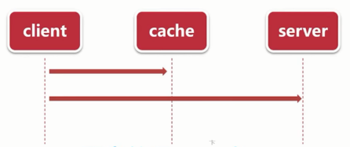
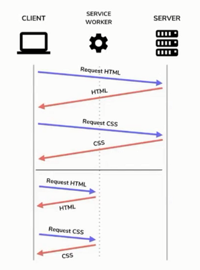
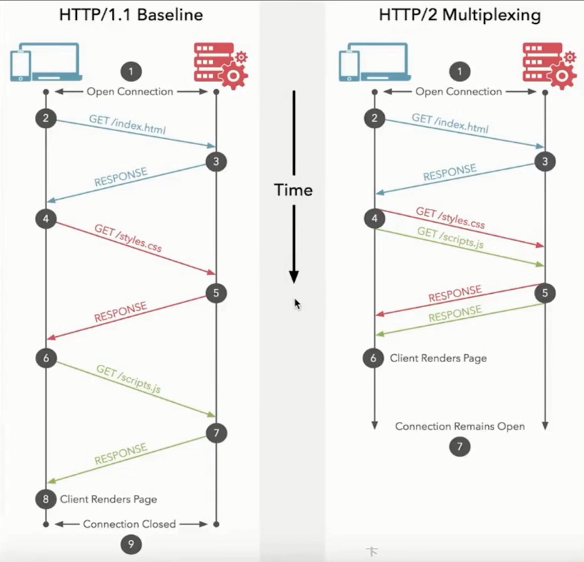
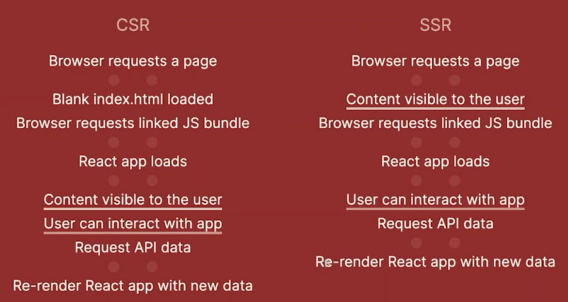

# 传输加载优化

## 启用压缩 Gzip

- 对传输资源进行体积压缩，可高达 90%
- 如何 nginx 启动 gzip

nginx 启动 gzip

```nginx
gzip on;
gzip_min_length 1k;
gzip_buffers 4 16k;
#gzip_http_version 1.0;
gzip_comp_level 2;
gzip_types text/plain application/x-javascript text/css application/xml text/javascript application/x-httpd-php image/jpeg image/gif image/png application/javascript;
gzip_vary off;
gzip_disable "MSIE [1-6]\.";
```

## 启用 Keep Alive

- 一个持久的 TCP 链接，节省了连接创建时间
- Nginx 默认开启

```nginx
http {
    keepalive_timeout  65;
    keepalive_requests 100;
}
```

## HTTP 资源缓存

- 提高重复访问时资源加载的速度



- Cache-Control/Expires
- Last-Modified + If-Modified-Since
- Etag + If-None-Match

## 理解 Service workers 技术，给网站提速

- 加速重复访问
- 离线支持

webpack

- workbox-webpack-plugin
- webpack-manifest-plugin

SW 原理



注意

- 延长了首屏时间，但页面总加载时间减少
- 只能在 localhost 或者 https 下使用
- 兼容性：https://www.caniuse.com/?search=Service%20workers

## HTTP 2 的性能提升

优势

- 二进制传输
- 请求响应多路复用
- Server push

搭建 HTTP2 服务

- HTTPS
- 适合较高的请求量

在 Nginx 配置 HTTPS

生成 ssl 证书

```bash
openssl genrsa -des3 -passout pass:x -out server.pass.key 2048

openssl rsa -passin pass:x -in server.pass.key -out server.key

openssl req -new -key server.key -out server.csr

openssl x509 -req -sha256 -days 3650 -in server.csr -signkey server.key -out server.crt
```



## 用流行的 SSR 技术给前端减负

SSR 的好处

- 加速首屏加载
- 更好的 SEO



是否使用 SSR？

- 架构 - 大型、动态页面、面向公众用户
- 搜索引擎排名很重要

React: nextjs
