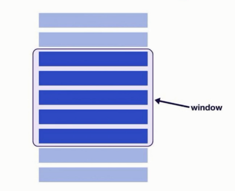

# 前沿优化解决方案

## 拯救移动端图标 SVG【拯救移动端图标】

从 PNG 到 iconfont

- https://www.iconfont.cn/
- 多个图标 - 一套字体，减少获取时的请求数量和体积
- 矢量图形，可伸缩
- 直接通过 CSS 修改样式 (颜色、大小等)

iconfont 到 SVG

- 保持了图片能力，支持多色彩
- 独立的矢量图形
- XML 语法，搜索引擎 SEO 和无障碍读屏软件读取

环境搭建

- npm i -D @svgr/webpack
- 配置 webpack
- svg 组件需要设置尺寸

## 使用 Flexbox 优化布局

优势

- 更高性能的实现方案
- 容器有能力决定子元素的大小、顺序、对齐、间隔等
- 双向布局

Flexbox 的使用

- Flex container 容器
- Flex items 元素

## 优化资源加载的顺序【给资源设置优先级】

资源优先级

- 浏览器默认安排资源加载优先级
- 使用 preload\prefetch 跳转优先级

```html
<link rel="preload" href="..." as="..." /> <link rel="prefetch" href="..." />
```

preload\prefetch 使用场景

- preload 提前加载较晚出现，但对当前页面非常重要的资源
- prefetch 提前加载后续路由页面需要的资源，优先级低

Webpack 支持的 preload\prefetch 配置

## 预渲染页面【提前完成任务的意义】

- [react-snap](https://github.com/stereobooster/react-snap)

- 配置 postbuild
- 使用 ReactDOM.hydrate()
- 内联样式，避免明显的 FOUC (样式闪烁)

```js
var isMarkupPresent = document.getElementById('root').hasChildNodes();
isMarkupPresent ? hydrate(...) ? render(...)
```

预渲染的作用

- 大型单页应用的性能瓶颈：`JS 下载 + 解析 + 执行`
- SSR 的主要问题：牺牲 `TTFB` 来补救 `First Paint`；`实现复杂`
- Pre-rendering 打包时提前渲染页面，没有服务端参与

## Windowing 提高列表性能【开源节流，用什么画什么】

什么是 Windowing



指一种优化技术，用于提高长列表的性能。当处理大量数据列表时，一次性渲染所有数据可能会导致性能问题，如卡顿、延迟或内存溢出。为了解决这个问题，可以使用窗口技术来只渲染可视区域内的列表项，而不是一次性渲染整个列表。

Windowing 的作用

- 加载大列表、大表单的每一行严重影响性能
- Lazy loading 仍然会让 DOM 变得过大
- Windowing 只渲染可见的行，渲染和滚动的性能都会提升

这种技术在前端框架（如React、Vue、Angular等）中非常有用，特别是在实现虚拟滚动（Virtual Scrolling）或无限滚动（Infinite Scrolling）功能时。以下是一些实现窗口技术的方法：

1. 虚拟滚动（Virtual Scrolling）：
- 只渲染当前视口可见的列表项。
- 当用户滚动时，动态地添加和移除列表项，以保持渲染的列表项数量在一个可管理的范围内。
- 这可以通过监听滚动事件并计算可见区域来实现。

2. 无限滚动（Infinite Scrolling）：
- 类似于虚拟滚动，但通常用于加载更多数据。
- 当用户滚动到列表底部时，自动加载并渲染更多数据。

3. 开源节流（Debouncing and Throttling）：
- 在处理频繁触发的事件（如滚动、窗口调整大小等）时，使用节流（Throttling）或防抖（Debouncing）技术来减少事件处理函数的调用频率。
- 节流会在指定的时间间隔内只执行一次函数，而防抖会在事件停止触发后的一段时间内执行函数。

4. 使用合适的渲染技术：
- 根据具体需求选择合适的渲染技术。例如，在React中可以使用React.memo来避免不必要的重新渲染，或者使用React.lazy和Suspense来实现代码分割和延迟加载。

5. 优化数据结构：
- 使用高效的数据结构（如二叉树、哈希表等）来存储和检索数据，以减少查找和更新操作的时间复杂度。

6. 使用Web Workers：
- 对于计算密集型任务，可以考虑使用Web Workers在后台线程中执行，以避免阻塞主线程。


使用 react-window：
- [react-window](https://github.com/bvaughn/react-window)
- [react-window.now.sh](https://react-window.now.sh)

练习：
- 配置一个以为列表 List
- 配置一个二维列表 Grid
- 配置滚动到指定元素

## 使用骨架组件减少布局移动(Layout Shift）【论占位置的重要性】

Skeleton/Placeholder 的作用

- 占位
- 提升用户感知性能

使用 react-placeholder

- [react-placeholder](https://github.com/buildo/react-placeholder)
- 预置的 placeholders
- 自定义 placeholder
