# 介绍

## Web 加载&渲染基本原理

问题： 从输入 URL 到页面加载显示完成都发生了什么？

分析

- 知识点广，区分度高
- 自己擅长的点可以适当展开
- 渲染过程是重点

解答

1. UI thread：搜索 Or URL？搜索引擎 or 站点请求

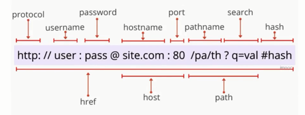

2. Network thread

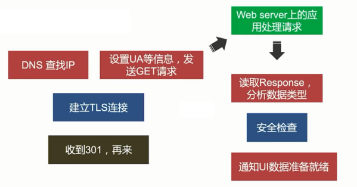

3. Renderer process

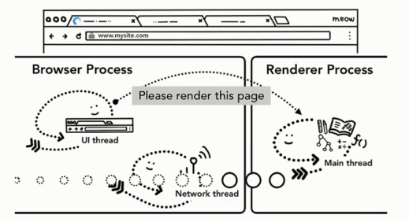

4. Render process

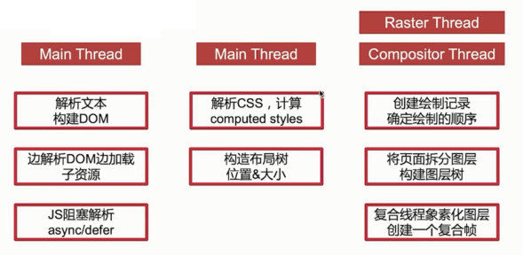

## 首屏加载优化

问题： 什么是首屏加载？怎么优化？

分析：

- web 增量加载的特点决定了首屏性能不会完美
- 过长的白屏影响用户体验和存留
- 首屏 (above the fold) - > 初次印象

解答：

首屏 - 用户加载体验的 3 个关键时刻

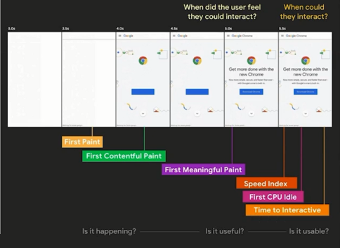

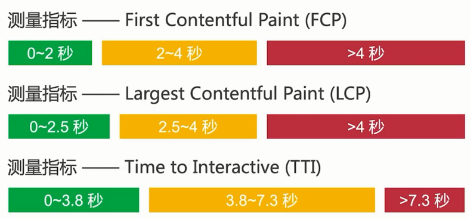

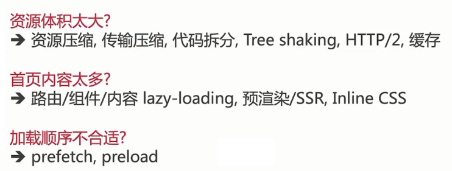

## JavaScript 内存管理

问题：JS 是怎样管理内存的？什么情况会造成内存泄露？

分析：

- 内存泄露严重影响性能
- 高级语言 != 不需要管理内存

解答：

变量创建时自动分配内存，不使用时“自动”释放内存 - GC

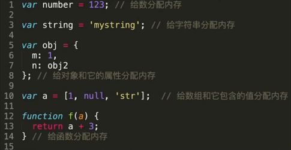

内存释放的主要问题是如何确定不再需要使用的内存

所有的 GC 都是近似实现，只能通过判断变量释放还能再次访问到

局部变量，函数执行完，没有闭包引用，就会被标记回收

全局变量，直至浏览器卸载页面时释放

**引用次数** - 无法解决循环引用的问题

**标记清除**

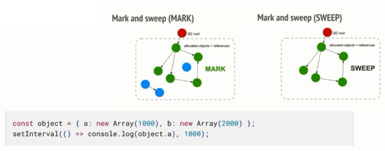

日常开发注意：

1. 避免意外的全局变量产生

   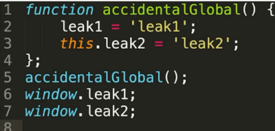

2. 避免反复运行引发大量闭包

   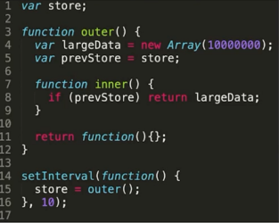

3. 避免脱离的 DOM 元素

   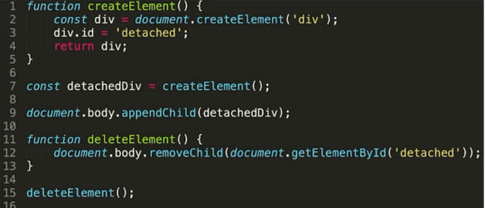

## 引用计数和标记清除

引用计数和标记清除是两种常见的垃圾回收策略，它们在内存管理中起着关键作用。以下是关于这两种策略的详细解释和比较：

### 引用计数

原理：引用计数是一种简单的垃圾回收策略，它为每个对象维护一个计数器，记录指向该对象的引用数量。当引用计数变为零时，表示该对象不再被任何变量或数据结构所引用，因此可以被安全地回收。

优点：
- 实时性：引用计数能够实时地回收不再使用的对象，从而避免内存泄漏。
- 低开销：相对于其他垃圾回收策略，引用计数的开销较低，因为它只需要在对象创建和销毁时进行计数操作。

缺点：
- 循环引用问题：引用计数无法处理循环引用的情况。例如，两个对象相互引用，即使它们在其他地方没有被引用，它们的引用计数也永远不会变为零，导致内存泄漏。
- 性能开销：频繁的引用计数操作可能会导致性能开销，尤其是在引用变化频繁的场景中。

### 标记清除

原理：标记清除是一种基于可达性分析的垃圾回收策略。它从一组根对象（如全局变量、栈上的局部变量等）开始，递归地访问这些对象的所有引用，将访问过的对象标记为“活动”的。在标记阶段结束后，所有未被标记的对象被视为垃圾，并在清除阶段被回收。

优点：
- 解决循环引用问题：标记清除能够正确处理循环引用的情况，因为它基于可达性分析来确定对象是否存活。
- 灵活性：标记清除可以适应不同的内存布局和对象关系，具有较高的灵活性。

缺点：
- 停顿时间：标记清除通常需要暂停程序的执行来进行标记和清除操作，这可能导致较长的停顿时间，影响程序的响应性。
- 内存碎片：标记清除可能会导致内存碎片化，即回收后的内存空间不连续，这可能会影响后续对象的分配效率。

总结：引用计数和标记清除各有优缺点，适用于不同的场景。引用计数适用于实时性要求较高、循环引用较少的场景，而标记清除适用于处理循环引用、对停顿时间要求不严格的场景。在实际应用中，可以根据具体需求选择合适的垃圾回收策略或结合使用多种策略来实现更高效的内存管理。
