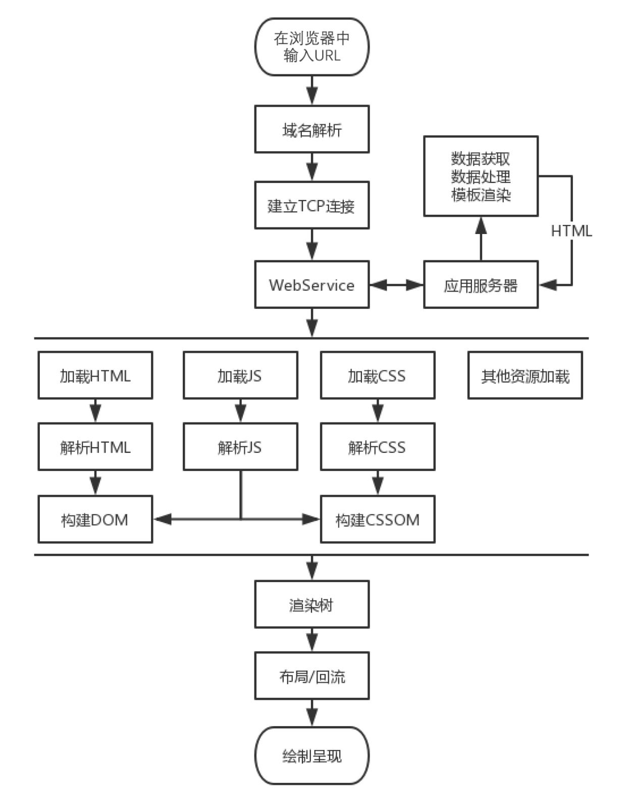

# 前端性能优化介绍

你是否经历过以下场景：

- ⾯试中
    - 了解性能优化吗？
    - 输⼊ URL 到看到整个页面经历了什么过程？
    - ...

- ⼯作中
    - 页面加载好慢，不知道是前端问题还是后端问题
    - 页面交互卡顿，不知道具体哪⾥出了问题
    - ...

如何从⼀个初级程序员提升为中级、⾼级甚⾄更⾼能⼒⽔平的程序员？

## 什么是 Web 性能

简单来说就是你的网站够不够快。

- 打开速度
- 动画效果
- 表单提交
- 列表滚动
- 页面切换
- ...

MDN 上的 Web 性能定义：Web 性能是网站或应⽤程序的客观度量和可感知的⽤户体验。

- 减少整体加载时间：减⼩⽂件体积、减少 HTTP 请求、使⽤预加载
- 使网站尽快可⽤：仅加载首屏内容，其它内容根据需要进⾏懒加载
- 平滑和交互性：使⽤ CSS 替代 JS 动画、减少 UI 重绘
- 感知表现：你的页面可能不能做得更快，但你可以让⽤户感觉更快。耗时操作要给⽤户反馈，比如加载动画、进度条、⻣架屏等提示信息
- 性能测定：性能指标、性能测试、性能监控持续优化

## 为什么要关注 Web 性能

- ⽤户的留存
- 网站的转化率
- 体验与传播
- 搜索排名
- 客户投诉
- 提升⼯作绩效
- ...

## 如何进⾏ Web 性能优化？

1. ⾸先需要了解性能指标 - 多快才算快？
2. 使⽤专业的⼯具可量化地评估出网站或应⽤的性能表现；
3. 然后⽴⾜于网站页面响应的生命周期，分析出造成较差性能表现的原因；
4. 最后进⾏技术改造、可⾏性分析等具体的优化实施。
5. 迭代优化

## 性能指标

- [RAIL 性能模型](https://web.dev/rail/)
- [基于⽤户体验的核⼼指标](https://web.dev/metrics/)
- [新⼀代性能指标：Web Vitals](https://web.dev/vitals/)

## 性能测量

如果把对网站的性能优化⽐作⼀场旅程，它⽆疑会是漫⻓且可能还略带泥泞的，那么在开始之前我们有必
要对网站进⾏性能测量，以知道优化的⽅向在何处。通常我们会借助⼀些⼯具来完成性能测量。

- 浏览器 DevTools 调试⼯具
    - 网络监控分析
    - 性能监控分析
    - ...
- 灯塔（Lighthouse）
    - 网站整体质量评估，并给出优化建议
- WebPageTest
    - 多测试地点
    - 全⾯的性能报告
    - ...

## 生命周期

网站页面的生命周期，通俗地讲就是从我们在浏览器的地址栏中输⼊⼀个 URL 后，到整个页面渲染出来的过程。整个过程包括域名解析，建⽴ TCP 连接，前后端通过 HTTP 进⾏会话，压缩与解压缩，以及前端的关键渲染路径等，把这些阶段拆解开来看，不仅能容易地获得优化性能的启发，⽽且也能为今后的前端⼯程师之路构建出完整的知识框架，网站页面加载的生命周期如下图所示。

## 优化方案

经过对网站页面性能的测量及渲染过程的了解，相信你对于糟糕性能体验的原因已经⽐较清楚了，那么接
下来便是优化性能.

- 从发出请求到收到响应的优化，比如 DNS 查询、HTTP ⻓连接、HTTP 2、HTTP 压缩、HTTP 缓存等。
- 关键渲染路径优化，比如是否存在不必要的重绘和回流。
- 加载过程的优化，比如延迟加载，是否有不需要在首屏展示的⾮关键信息，占⽤了页面加载的时间。
- 资源优化，比如图⽚、视频等不同的格式类型会有不同的使⽤场景，在使⽤的过程中是否恰当。
- 构建优化，比如压缩合并、基于 webpack 构建优化⽅案等。
- ...
