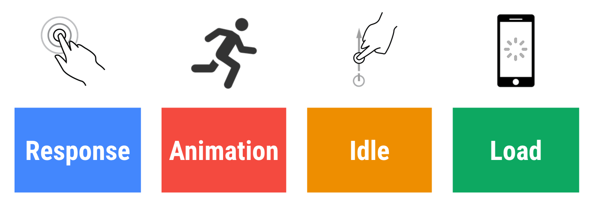
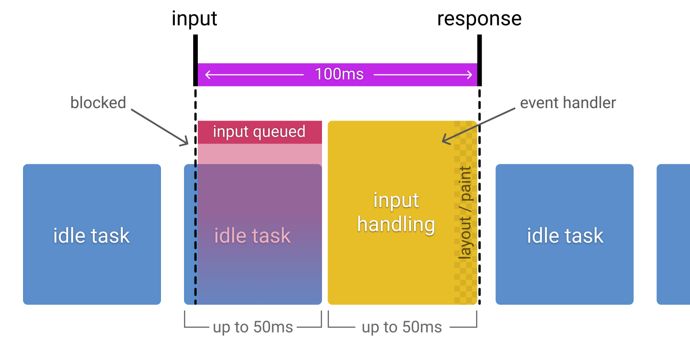

# RAIL 性能模型

[RAIL](https://web.dev/rail/) 是 Response, Animation, Idle, 和 Load 的⾸字⺟缩写, 是⼀种由 Google Chrome 团队于 2015 年提出的性能模型, ⽤于提升浏览器内的⽤户体验和性能。

RAIL 模型的理念是”以⽤户为中⼼，最终⽬标不是让您的⽹站在任何特定设备上都能运⾏很快，⽽是使⽤户满意”。

这个名字的由来是四个英⽂单词的⾸字⺟：

- 响应（Response）：应该尽可能快速的响应⽤户, 应该在 100ms 以内响应⽤户输⼊。
- 动画（Animation）：在展示动画的时候，每⼀帧应该以 16ms 进⾏渲染，这样可以保持动画效果的⼀致性，并且避免卡顿。
- 空闲（Idle）：当使⽤ Javascript 主线程的时候，应该把任务划分到执⾏时间⼩于 50ms 的⽚段中去，这样可以释放线程以进⾏⽤户交互。
- 加载（Load）：应该在⼩于 1s 的时间内加载完成你的⽹站，并可以进⾏⽤户交互。

根据⽹络条件和硬件的不同，⽤户对性能延迟的理解也有所不同。例如，通过快速的 Wi-Fi 连接在功能强⼤的台式机上加载站点通常在 1 秒内完成，⽤户对此已经习以为常。在 3G 连接速度较慢的移动设备上加载⽹站需要花费更多时间，因此移动⽤户通常更耐⼼，在移动设备上加载 5 s 是⼀个更现实的⽬标。

这四个单词代表与⽹站或应⽤的⽣命周期相关的四个⽅⾯，这些⽅⾯会以不同的⽅式影响整个⽹站的性能。

我们将⽤户作为之后性能优化的中⼼，⾸先需要了解⽤户对于延迟的反应。⽤户感知延迟的时间窗⼝，如下表所示。

| 延迟         | ⽤户反映                                                                                                            |
| ------------ | ------------------------------------------------------------------------------------------------------------------- |
| 0 ~ 16ms     | ⼈眼可以感知每秒 60 帧的动画，即每帧 16ms，除了浏览器将⼀帧画⾯绘制到屏幕上的时间，⽹站应⽤⼤约需要 10ms 来⽣成⼀帧 |
| 0 ~ 100ms    | 在该时间范围内响应⽤户操作，才会是流畅的体验                                                                        |
| 100 ~ 1000ms | 能够感觉到明显的延迟                                                                                                |
| >1s          | ⽤户的注意⼒将离开对执⾏任务的关注                                                                                  |
| >10s         | ⽤户感到失望，可能会放弃任务                                                                                        |

## 响应

指标：应该尽可能快速的响应⽤户，应该在 100ms 以内响应⽤户输⼊。

⽹站性能对于响应⽅⾯的要求是，在⽤户感知延迟之前接收到操作的反馈。⽐如⽤户进⾏了⽂本输⼊、按钮单击、表单切换及启动动画等操作后，必须在 100ms 内收到反馈，如果超过 100ms 的时间窗⼝，⽤户就会感知延迟。

看似很基本的⽤户操作背后，可能会隐藏着复杂的业务逻辑处理及⽹络请求与数据计算。对此我们应当谨慎，将较⼤开销的⼯作放在后台异步执⾏，⽽即便后台处理要数百毫秒才能完成的操作，也应当给⽤户提供及时的阶段性反馈。

看似很基本的⽤户操作背后，可能会隐藏着复杂的业务逻辑处理及⽹络请求与数据计算。对此我们应当谨慎，将较⼤开销的⼯作放在后台异步执⾏，⽽即便后台处理要数百毫秒才能完成的操作，也应当给⽤户提供及时的阶段性反馈。

## 动画

指标：在展示动画的时候，每⼀帧应该以 10ms 进⾏渲染，这样可以保持动画效果的⼀致性，并且避免卡顿。

前端所涉及的动画不仅有炫酷的 UI 特效，还包括滚动和触摸拖动等交互效果，⽽这⼀⽅⾯的性能要求就是流畅。众所周知，⼈眼具有视觉暂留特性，就是当光对视⽹膜所产⽣的视觉在光停⽌作⽤后，仍能保留⼀段时间。

研究表明这是由于视神经存在反应速度造成的，其值是 1/24s，即当我们所⻅的物体移除后，该物体在我们眼中并不会⽴即消失，⽽会延续存在 1/24s 的时间。对动画来说，⽆论动画帧率有多⾼，最后我们仅能分辨其中的 30 帧，但越⾼的帧率会带来更好的流畅体验，因此动画要尽⼒达到 60fps 的帧率。

⽬前⼤多数设备的屏幕刷新率为 60 次/秒，那么浏览器渲染动画或⻚⾯的每⼀帧的速率也需要跟设备屏幕的刷新率保持⼀致。所以根据 60fps 帧率的计算，每⼀帧画⾯的⽣成都需要经过若⼲步骤，⼀帧图像的⽣成预算为 16ms（1000ms / 60 ≈ 16.66ms），除去浏览器绘制新帧的时间，留给执⾏代码的时间仅 10ms 左右。如果⽆法符合此预算，帧率将下降，并且内容会在屏幕上抖动。 此现象通常称为卡顿，会对⽤户体验产⽣负⾯影响。关于这个维度的具体优化策略，会在后⾯优化渲染过程的相关章节中详细介绍。

- https://googlechrome.github.io/devtools-samples/jank

## 空闲

指标：当使⽤ Javascript 主线程的时候，应该把任务划分到执⾏时间⼩于 50ms 的⽚段中去，这样可以释放线程以进⾏⽤户交互。

要使⽹站响应迅速、动画流畅，通常都需要较⻓的处理时间，但以⽤户为中⼼来看待性能问题，就会发现并⾮所有⼯作都需要在响应和加载阶段完成，我们完全可以利⽤浏览器的空闲时间处理可延迟的任务，只要让⽤户感受不到延迟即可。利⽤空闲时间处理延迟，可减少预加载的数据⼤⼩，以保证⽹站或应⽤快速完成加载。

为了更加合理地利⽤浏览器的空闲时间，最好将处理任务按 50ms 为单位分组。这么做就是保证⽤户在发⽣操作后的 100ms 内给出响应。

## 加载

指标：⾸次加载应该在⼩于 5s 的时间内加载完成，并可以进⾏⽤户交互。对于后续加载，则是建议在 2 秒内完成。

⽤户感知要求我们尽量在 5s 内完成⻚⾯加载，如果没有完成，⽤户的注意⼒就会分散到其他事情上，并对当前处理的任务产⽣中断感。需要注意的是，这⾥在 5s 内完成加载并渲染出⻚⾯的要求，并⾮要完成所有⻚⾯资源的加载，从⽤户感知体验的⻆度来说，只要关键渲染路径完成，⽤户就会认为全部加载已完成。

对于其他⾮关键资源的加载，延迟到浏览器空闲时段再进⾏，是⽐较常⻅的渐进式优化策略。⽐如图⽚懒加载、代码拆分等优化⼿段。
