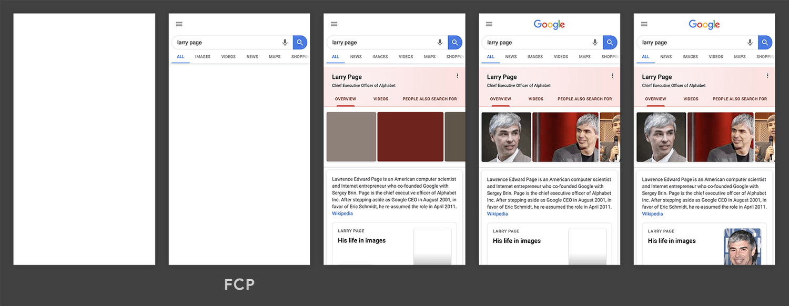
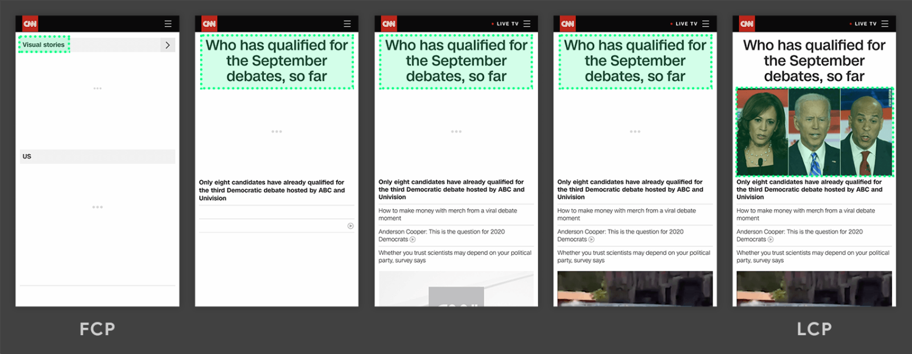
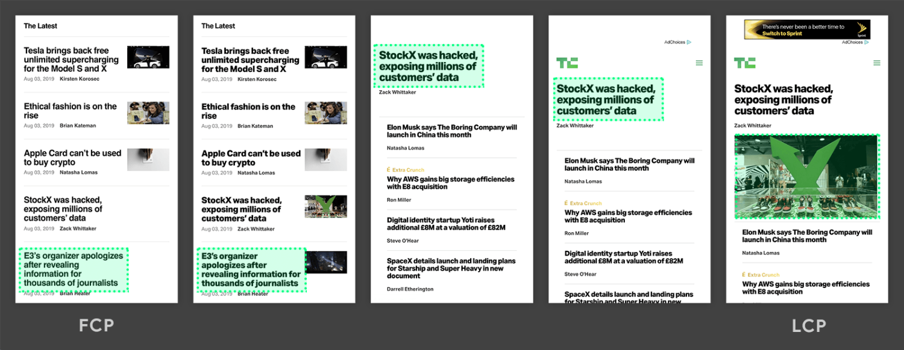
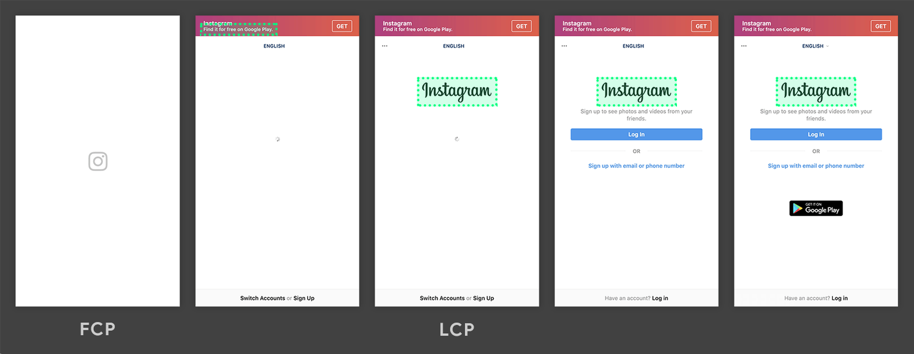
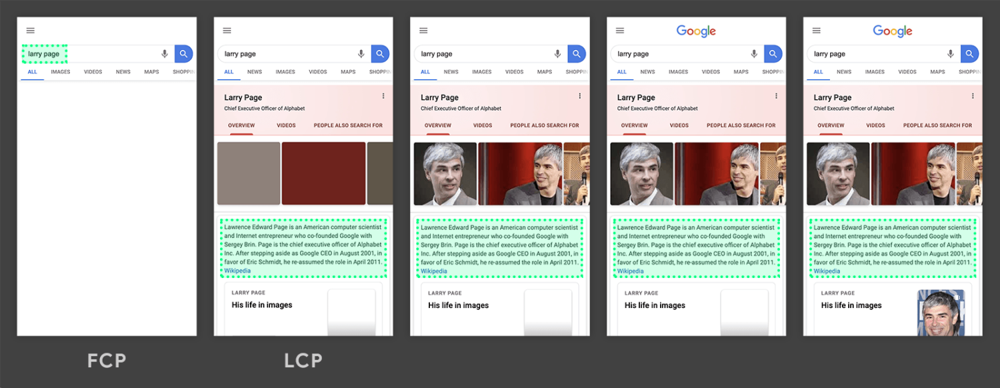
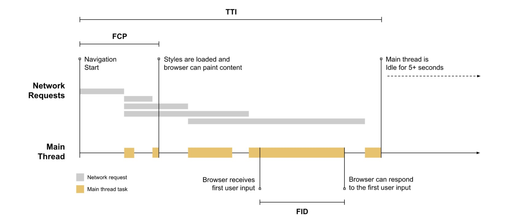
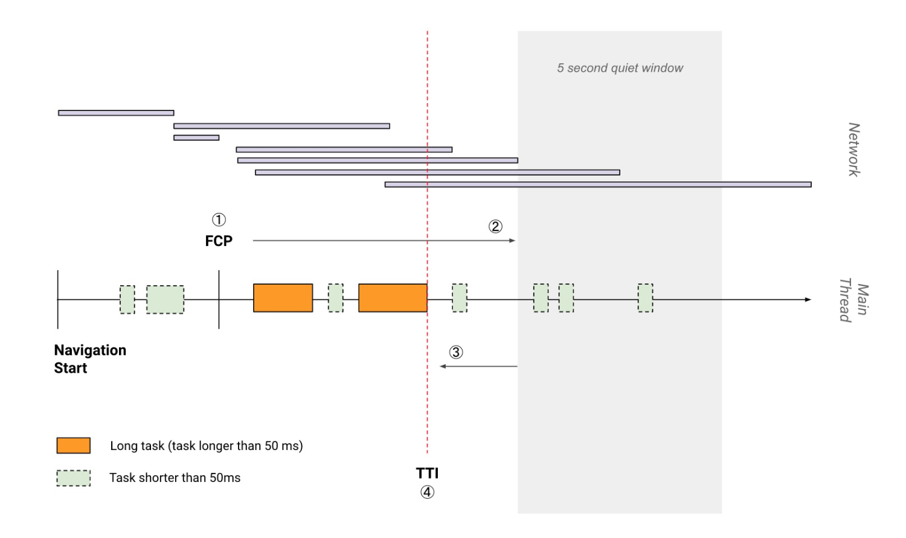
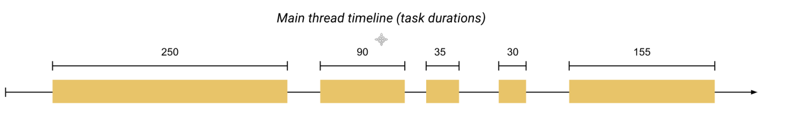
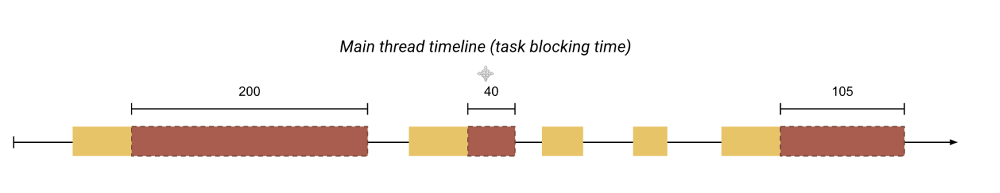
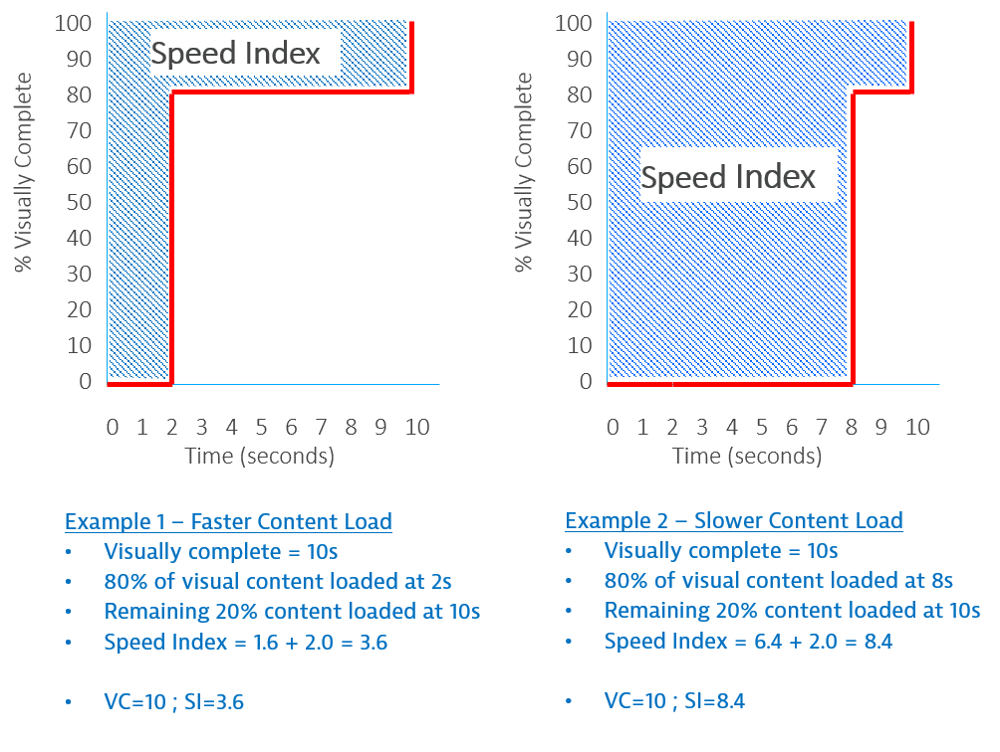

# 基于用户体验的性能指标

- First Contentful Paint（FCP）
  - 速度指标
  - 优化⽅案
- Largest Contentful Paint（LCP）
  - 速度指标
  - 优化⽅案
- First Input Delay（FID）
  - 速度指标
  - 优化⽅案
- Time to Interactive（TTI）
  - 速度指标
  - 优化⽅案
- Total Block Time（TBT）
  - 速度指标
  - 优化⽅案
- Cumulative Layout Shift（CLS）
  - 速度指标
  - 优化⽅案
- Speed Index
  - 测量⽅式
  - 速度指标
  - 优化⽅案

[基于⽤户体验的性能指标](https://web.dev/metrics/) 是 Google 在 web.dev 提的。

## First Contentful Paint（FCP）

FCP（First Contentful Paint）⾸次内容绘制，浏览器⾸次绘制来⾃ DOM 的内容的时间，内容必须是⽂本、图⽚（包含背景图）、⾮⽩⾊的 canvas 或 SVG，也包括带有正在加载中的 Web 字体的⽂本。

这是⽤户第⼀次开始看到⻚⾯内容，但仅仅有内容，并不意味着它是有⽤的内容（例如 Header、导航栏等），也不意味着有⽤户要消费的内容。

### 速度指标

| FCP 时间（以秒为单位） | 颜⾊编码     | FCP 分数（HTTP 存档百分位数） |
| ---------------------- | ------------ | ----------------------------- |
| 0–2                    | 绿⾊（快速） | 75–100                        |
| 2–4                    | 橙⾊（中等） | 50–74                         |
| 超过 4                 | 红⾊（慢）   | 0–49                          |

### 优化方案

https://web.dev/fcp/#how-to-improve-fcp

## Largest Contentful Paint（LCP）

LCP（Largest Contentful Paint）最⼤内容绘制，可视区域中最⼤的内容元素呈现到屏幕上的时间，⽤以估算⻚⾯的主要内容对⽤户可⻅时间。

LCP 考虑的元素：

- `` 元素
- `<image>` 元素内的 `<svg>` 元素
- `<video>` 元素（封⾯图）
- 通过 url() 函数加载背景图⽚的元素
- 包含⽂本节点或其他内联级⽂本元素⼦级的块级元素

为了提供良好的⽤户体验，⽹站应⼒争使⽤ 2.5 秒或更短的“最⼤内容绘画” 。为确保您达到⼤多数⽤户的这⼀⽬标，衡量移动设备和台式机设备的⻚⾯加载量的第 75 个百分位数是⼀个很好的衡量标准。

以下是⼀些示例：

在以上两个时间轴中，最⼤的元素随内容加载⽽变化。在第⼀个示例中，新内容被添加到 DOM 中，并且更改了最⼤的元素。在第⼆个示例中，布局发⽣更改，以前最⼤的内容从视⼝中删除。

通常情况下，延迟加载的内容要⽐⻚⾯上已有的内容⼤，但不⼀定是这种情况。接下来的两个示例显示了在⻚⾯完全加载之前发⽣的最⼤内容绘画。

在第⼀个示例中，Instagram 徽标相对较早地加载，即使逐渐显示其他内容，它仍然是最⼤的元素。在 Google 搜索结果⻚⾯示例中，最⼤的元素是⼀段⽂本，该⽂本在任何图像或徽标加载完成之前显示。由于所有单个图像均⼩于此段，因此在整个加载过程中，它始终是最⼤的元素。

在 Instagram 时间轴的第⼀帧中，您可能会注意到相机徽标周围没有绿⾊框。那是因为它是⼀个
`<svg>` 元素，并且 `<svg>` 元素当前不被视为 LCP 候选对象。

### 速度指标

| 速度指标 | 颜⾊编码     |
| -------- | ------------ |
| 0-2.5    | 绿⾊（快速） |
| 2.5-4    | 橙⾊（中等） |
| 超过 4   | 红⾊（慢）   |

### 优化⽅案

- https://web.dev/optimize-lcp/

## First Input Delay（FID）

FID（First Input Delay）⾸次输⼊延迟，从⽤户第⼀次与⻚⾯交互（例如单击链接、点击按钮等）到浏览器实际能够响应该交互的时间。

输⼊延迟是因为浏览器的主线程正忙于做其他事情，所以不能响应⽤户。发⽣这种情况的⼀个常⻅原因是浏览器正忙于解析和执⾏应⽤程序加载的⼤量计算的 JavaScript。

第⼀次输⼊延迟通常发⽣在第⼀次内容绘制（FCP）和可持续交互时间（TTI）之间，因为⻚⾯已经呈现了⼀些内容，但还不能可靠地交互。

如上图所示，浏览器接收到⽤户输⼊操作时，主线程正在忙于执⾏⼀个耗时⽐较⻓的任务，只有当这个任务执⾏完成后，浏览器才能响应⽤户的输⼊操作。它必须等待的时间就此⻚⾯上该⽤户的 FID 值。

例如，以下所有 HTML 元素都需要在响应⽤户交互之前等待主线程上正在进⾏的任务完成：

- ⽂本输⼊框，复选框和单选按钮（ `<input>` ，` <textarea>` ）
- 选择下拉菜单（ `<select>` ）
- 链接（ `<a>` ）

### 速度指标

| 速度指标  | 颜⾊编码     |
| --------- | ------------ |
| 0-100ms   | 绿⾊（快速） |
| 100-300ms | 橙⾊（中等） |
| 超过 300s | 红⾊（慢）   |

### 优化⽅案

- https://web.dev/fid/#how-to-improve-fid
- https://web.dev/optimize-fid/

## Time to Interactive（TTI）

表示⽹⻚第⼀次 **完全达到可交互状态** 的时间点，浏览器已经可以持续性的响应⽤户的输⼊。完全达到可交互状态的时间点是在最后⼀个⻓任务（Long Task）完成的时间, 并且在随后的 5 秒内⽹络和主线程是空闲的。

从定义上来看，中⽂名称叫可持续交互时间或可流畅交互时间更合适。

⻓任务是需要 50 毫秒以上才能完成的任务

### 速度指标

| 速度指标 | 颜⾊编码     |
| -------- | ------------ |
| 0-3.8    | 绿⾊（快速） |
| 3.9-7.3  | 橙⾊（中等） |
| 7.3      | 红⾊（慢）   |

### 优化⽅案

- https://web.dev/tti/#how-to-improve-tti

## Total Block Time（TBT）

Total Block Time（TBT）总阻塞时间，度量了 FCP 和 TTI 之间的总时间，在该时间范内，主线程被阻塞⾜够⻓的时间以防⽌输⼊响应。

只要存在⻓任务，该主线程就会被视为“阻塞”，该任务在主线程上运⾏超过 50 毫秒（ms）。我们说主线程“被阻⽌”是因为浏览器⽆法中断正在进⾏的任务。因此，如果⽤户确实在较⻓的任务中间与⻚⾯进⾏交互，则浏览器必须等待任务完成才能响应。

如果任务⾜够⻓（例如，超过 50 毫秒的任何时间），则⽤户很可能会注意到延迟并感觉⻚⾯缓慢或过时。

例如，考虑⻚⾯加载期间浏览器主线程的下图：

上⾯的时间轴有五个任务，其中三个是⻓任务，因为它们的持续时间超过 50 毫秒。下图显示了每个⻓任务的阻塞时间：

因此，虽然在主线程上运⾏任务花费的总时间为 560 毫秒，但只有 345 毫秒的时间被视为阻塞时间。

### 速度指标

| 速度指标（以毫秒为单位） | 颜⾊编码     |
| ------------------------ | ------------ |
| 0-300                    | 绿⾊（快速） |
| 300-600                  | 橙⾊（中等） |
| 超过 600                 | 红⾊（慢）   |

### 优化⽅案

- https://web.dev/tbt/#how-to-improve-tbt

## Cumulative Layout Shift（CLS）

Cumulative Layout Shift（CLS）累计布局偏移，CLS 会测量在⻚⾯整个⽣命周期中发⽣的每个意外的布局移位的所有单独布局移位分数的总和，它是⼀种保证⻚⾯的视觉稳定性从⽽提升⽤户体验的指标⽅案。

您是否曾经在⻚⾯上突然发⽣变化时在没有警告的情况下，⽂字移动了，并且您失去了位置。甚⾄更糟：您将要点击⼀个链接或⼀个按钮，但是在⼿指落下的瞬间，链接移动了，您最终单击了其他东⻄！

| 速度指标（以毫秒为单位） | 颜⾊编码     |
| ------------------------ | ------------ |
| 0-0.1                    | 绿⾊（快速） |
| 0.1-0.25                 | 橙⾊（中等） |
| 超过 0.25                | 红⾊（慢）   |

### 优化⽅案

- https://web.dev/cls/#how-to-improve-cls
- https://web.dev/optimize-cls/

## Speed Index

Speed Index（速度指数）是⼀个表示⻚⾯可视区域中内容的填充速度的指标，可以通过计算⻚⾯可⻅区域内容显示的平均时间来衡量。

### 测量⽅式

捕获浏览器加载⻚⾯过程的视频，然后对每 100ms 间隔的⻚⾯截图计算⻚⾯内容填充的百分⽐，可以得到这样⼀个曲线。

图中的 Example 1 和 Example 2 都是在 10s 时⻚⾯填充完成，但 Example 1 在 2s 时就已经填充了 80% 的内容，⽽ Example 2 在 8s 时才填充 80%。

图中阴影部分的⾯积（即时间-内容填充百分⽐曲线以上部分）的⼤⼩即可表示可视区域内⻚⾯内容的填充速度，⾯积越⼩，填充速度越快。

| 速度指数（秒内） | 颜色编码     | 速度指数得分 |
| ---------------- | ------------ | ------------ |
| 0–4.3            | 绿色（快速） | 75–100       |
| 4.4–5.8          | 橙色（中度） | 50–74        |
| 超过 5.8         | 红色（慢速） | 0–49         |

### 优化⽅案

- https://web.dev/speed-index/#how-to-improve-your-speed-index-score
