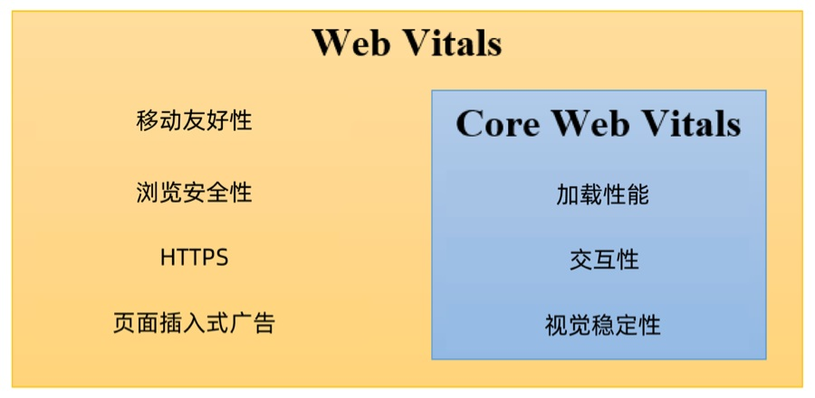
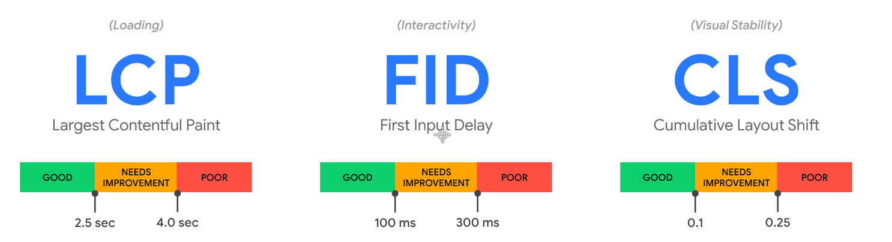

# Web Vitals

Google 开发了许多实⽤指标和⼯具，帮助衡量⽤户体验和质量，从⽽发掘优化点。⼀项名为 Web Vitals 的计划降低了学习成本，为⽹站体验提供了⼀组统⼀的质量衡量指标 — Core Web Vitals，其中包括加载体验、交互性和⻚⾯内容的视觉稳定性。

有很多⽅法可以优化⽹站的⽤户体验。若能预先了解最佳的优化衡量⽅法，可以⼤⼤节省时间和成本。

Google 在 2020 年 5 ⽉ 5 ⽇提出了新的⽤户体验量化⽅式 Web Vitals 来衡量⽹站的⽤户体验，并将这些衡量结果⽤作其排名算法的⼀部分。为了更好的理解这些内容，让我们来看看这些重要指标是什么。

## Core Web Vitals 与 Web Vitals

什么是 Web Vitals，Google 给出的定义是 ⼀个良好⽹站的基本指标（Essential metrics for a healthy site），过去要衡量⼀个⽹站的好坏，需要使⽤的指标太多了 Web Vitals 可以简化指标的学习曲线，只需聚焦于 Web Vitals 指标的表现即可。

在这些 Web Vitals 中，Google 确定了三个主要衡量指标，即在所有类型的⽹站中通⽤的 Core Web Vitals：

Core Web Vitals 是应⽤于所有 Web ⻚⾯的 Web Vitals 的⼦集，是其最重要的核⼼。

- 加载性能（LCP） — 显示最⼤内容元素所需时间
- 交互性（FID） — ⾸次输⼊延迟时间
- 视觉稳定性（CLS） — 累积布局配置偏移

这三个指标已经经过了⼀段时间的验证，如 LCP 在 WICG 已经孵化⾄少 1 年以上，FID 在 Google Chrome Labs 上已经实施 2 年以上，LCP 和 CLS（相关 Layout Instability API）已于今年⼊ W3C 草拟标准。

## 测量 Web Vitals

- 性能测试⼯具，⽐如 Lighthouse
- 使⽤ web-vitals 库：https://github.com/GoogleChrome/web-vitals
- 使⽤浏览器插件 Web Vitals：https://chrome.google.com/webstore/detail/web-vitals/ahfhijdlegdabablpippeagghigmibma

## 优化 Web Vitals

- [Optimize Largest Contentful Paint](https://web.dev/optimize-lcp/)
- [Optimize First Input Delay](https://web.dev/optimize-fid/)
- [Optimize Cumulative Layout Shift](https://web.dev/optimize-cls/)

## 参考链接

- https://web.dev/vitals/
- https://juejin.cn/post/6844904168591736846
- https://chrome.google.com/webstore/detail/webvitals/ahfhijdlegdabablpippeagghigmibma/related
- https://www.uisdc.com/web-vitals
