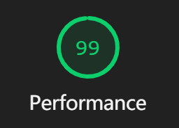
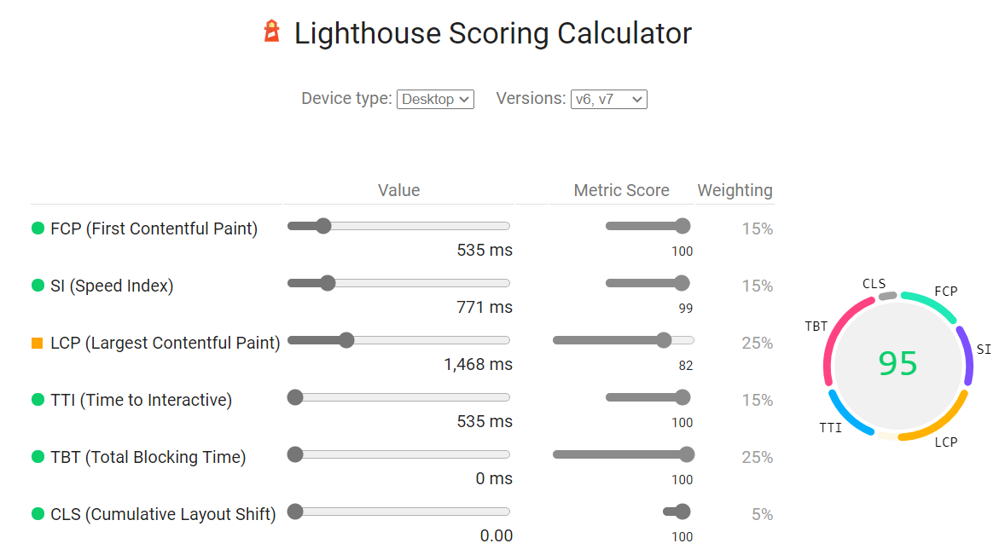
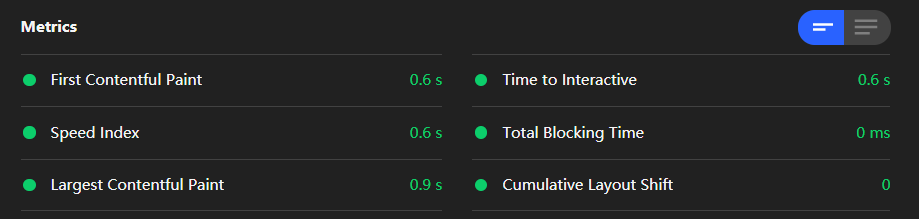
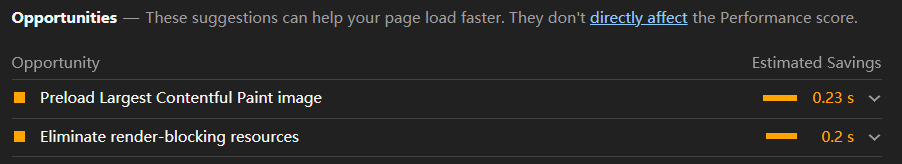
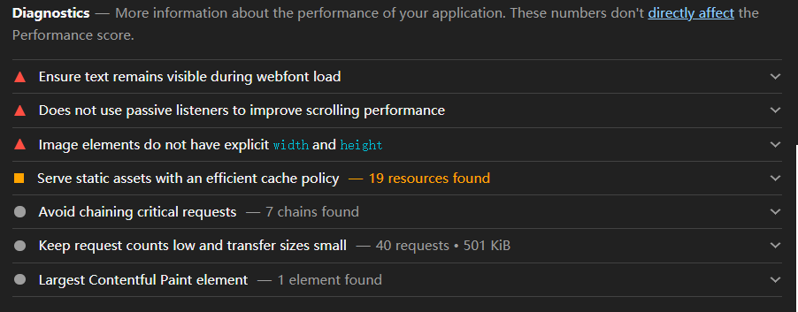
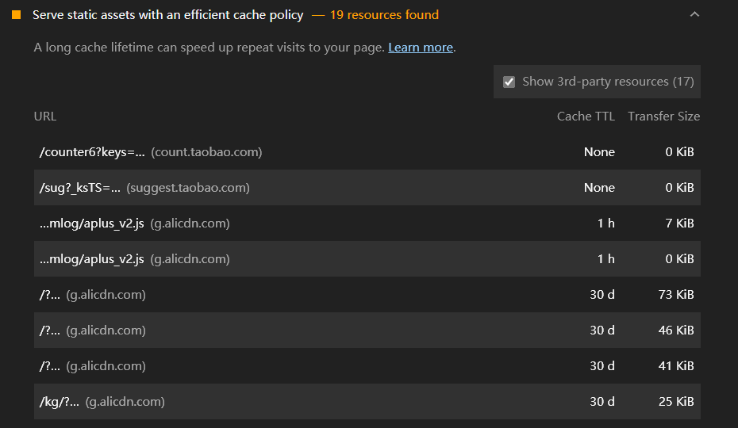
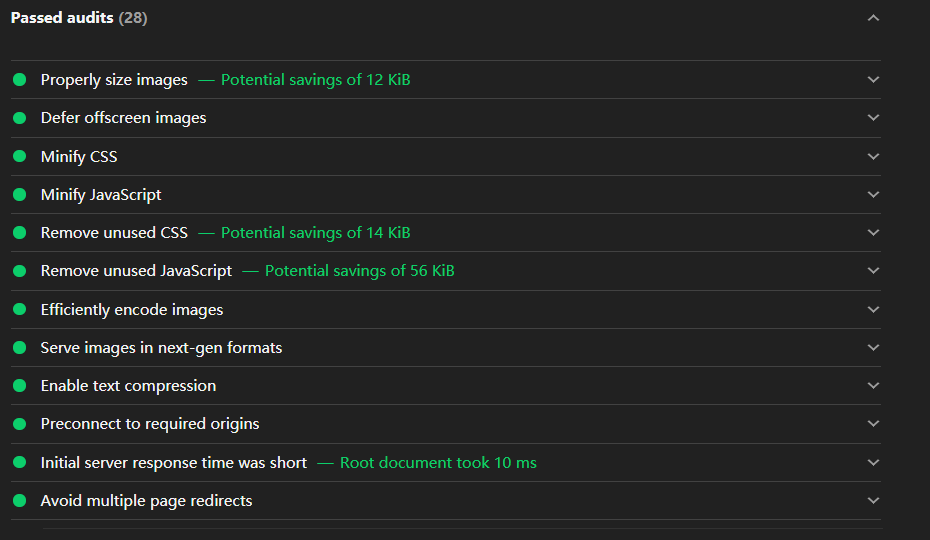

# 使用灯塔 Lighthouse 测试性能

Lighthouse 直译过来是“灯塔”的意思，它是由 Google 开发并开源的⼀个 Web 性能测试⼯具。该性能检测⼯具以此命名也蕴涵了相同的含义，即通过监控和检测⽹站应⽤的各⽅⾯性能表现，来为开发者提供优化⽤户体验和⽹站性能的指导建议。

## 准备

参考：https://developer.chrome.com/docs/devtools/speed/get-started/

    git clone https://github.com/lipengzhou/salt-resolute-icecream.git

## 使⽤⽅式

Lighthouse 提供了多种使⽤⽅式：

- [在 Chrome DevTools 中使⽤ Lighthouse](https://github.com/GoogleChrome/lighthouse#using-lighthouse-in-chrome-devtools)
- [使⽤ Chrome 扩展](https://github.com/GoogleChrome/lighthouse#using-the-chrome-extension)
- [使⽤ Node CLI 命令⾏⼯具](https://github.com/GoogleChrome/lighthouse#using-the-node-cli)
- [使⽤ Node 包](https://github.com/GoogleChrome/lighthouse#using-the-node-module)

## 性能报告

关于性能报告部分的检测结果，Lighthouse 给出的信息包括：检测得分、性能指标、优化建议、诊断结果及已通过的性能，下⾯来分别进⾏介绍。

## 检测得分

经过检测，Lighthouse 会对上述五个维度给出⼀个 0 ～ 100 的评估得分，如果没有分数或得分为 0，则很有可能是检测过程发⽣了错误，⽐如⽹络连接状况异常等；如果得分能达到 90 分以上，则说明⽹站应⽤在该⽅⾯的评估表现符合最佳实践，如下图所示。

关于如何得到这个评估得分，Lighthouse ⾸先会获得关于评估指标的原始性能数据，然后根据指标权重进⾏加权计算，最后以其数据库中⼤量的评估结果进⾏对数正态分布的映射并计算最终得分。

- https://googlechrome.github.io/lighthouse/scorecalc
- https://web.dev/performance-scoring/

## 性能指标

关于性能指标有以下六个关键的数据。

这 6 种不同的指标数据需要通过加权计算，才能得到关于性能的最终评分，所加的权值越⼤表示对应指标对性能的影响就越⼤，如下图所示，列出了⽬前 Lighthouse 的权重情况。

| Audit                    | Weight |
| ------------------------ | ------ |
| First Contentful Paint   | 15%    |
| Speed Index              | 15%    |
| Largest Contentful Paint | 25%    |
| Time to Interactive      | 15%    |
| Total Blocking Time      | 25%    |
| Cumulative Layout Shift  | 5%     |

该权重系统还在不断优化过程中，虽然 Lighthouse 对于其中个别指标给予了较⼤的权重，也就意味着对该指标的优化能够带来更显著的性能评分提升，但这⾥还要建议在优化的过程中切勿只关注单个指标的优化，⽽要从整体性能的提升上来考虑优化策略。

## 优化建议

为了⽅便开发者更快地进⾏性能优化，Lighthouse 在给出关键性能指标评分的同时，还提供了⼀些切实可⾏的优化建议，如下图所示为检测报告中的优化建议。

这些建议按照优化后预计能带来的提升效果从⾼到低进⾏排列，每⼀项展开⼜会有更加详细的优化指导建议，从上到下依次包括以下内容：

（1）**移除阻塞渲染的资源**，部分 JavaScript 脚本⽂件和样式表⽂件可能会阻塞系统对⽹站⻚⾯的⾸次渲染，建议可将其以内嵌的⽅式进⾏引⽤，并考虑延迟加载。报告会将涉及需要优化的资源⽂件排列在下⾯，每个⽂件还包括尺⼨⼤⼩信息和优化后预计提升⾸屏渲染时间的效果，据此可安排资源⽂件优化的优先级。

（2）**预连接所要请求的源**，提前建⽴与所要访问资源之间的⽹络连接，或者加快域名的解析速度都能有效地提⾼⻚⾯的访问性能。这⾥给出了两种⽅案：⼀种是设置〈link rel="preconnect"〉的预连接，另⼀种是设置〈link rel="dns-prefetch"〉的 DNS 预解析，前⾯章节对这两种⽅案都有过讨论，此处就不再赘述了。

（3）**降低服务器端响应时间**，通常引起服务器响应缓慢的原因有很多，因此也有许多改进⽅法：⽐如升级服务器硬件以拥有更多的内存或 CPU，优化服务器应⽤程序逻辑以更快地构建出所需的⻚⾯或资源，以及优化服务器查询数据库等，不要以为这些可能并⾮属于前端⼯程师的⼯作范围就不去关注，通常 node 服务器转发层就需要前端⼯程师进⾏相应的优化。

（4）**适当调整图⽚⼤⼩**，使⽤⼤⼩合适的图⽚可节省⽹络带宽并缩短加载⽤时，此处的优化建议通常对于本应使⽤较⼩尺⼨的图⽚就可满⾜需求，但却使⽤了⾼分辨率的⼤图，对此进⾏适当压缩即可。

（5）**移除未使⽤的 CSS**，这部分列出了未使⽤但却被引⼊的 CSS ⽂件列表，可以将其删除来降低对⽹络带宽的消耗，若需要对资源⽂件的内部代码使⽤率进⾏进⼀步精简删除，则可以使⽤ Chrome 开发者⼯具的 Coverage ⾯板进⾏分析。

## 诊断结果

这部分 Lighthouse 分别从影响⽹站⻚⾯性能的多个主要维度，进⾏详细检测和分析得到的⼀些数据：

（1）**对静态资源⽂件使⽤⾼效的缓存策略**，这⾥列出了所有静态资源的⽂件⼤⼩及缓存过期时间，开发者可以根据具体情况进⾏缓存策略的调整，⽐如延迟⼀些静态资源的缓存期限来加快⼆次访问时的速度。

（2）**减少主线程的⼯作**，浏览器渲染进程的主线程通常要处理⼤量的⼯作：如解析 HTML 构建 DOM，解析 CSS 样式表⽂件并应⽤指定的样式，以及解析和执⾏ JavaScript ⽂件，同时还需要处理交互事件，因此渲染进程的主线程过忙很容易导致⽤户响应延迟的不良体验，Lighthouse 给我们提供了这⼀环节⽹站⻚⾯主线程对各个任务的执⾏耗时，让开发者可针对异常处理过程进⾏有⽬标的优化。

（3）**降低 JavaScript 脚本执⾏时间**，前端项⽬的逻辑基本都是依托于 JavaScript 执⾏的，所以 JavaScript 执⾏效率与耗时也会对⻚⾯性能产⽣不⼩的影响，通过对这个维度的检测可以发现执⾏耗时过⻓的 JavaScript ⽂件，进⽽针对性的优化 JavaScript 解析、编译和执⾏的耗时。

（4）**避免存在较⼤尺⼨⽹络资源的请求**，因为如果⼀个资源⽂件尺⼨较⼤，那么浏览器就需要等待其完全加载好后，才能进⾏后续的渲染操作，这就意味着单个⽂件的尺⼨越⼤其阻塞渲染流程的时间就可能越⻓，并且⽹络传输过程中存在丢包的⻛险，⼀旦⼤⽂件传输失败，重新传输的成本也会很⾼，所以应当尽量将较⼤尺⼨的资源进⾏优化，通常⼀个尺⼨较⼤的代码⽂件可以通过构建⼯具打包成多个尺⼨较⼩的代码包；对于图⽚⽂件如⾮必要还是建议在符合视觉要求的前提下尽量进⾏压缩。可以看出该检测维度列出的⼤尺⼨资源⽂件，基本都是图⽚⽂件。

（5）**缩短请求深度**，浏览器通常会对同⼀域名下的并发请求进⾏限制，超过限制的请求会被暂时挂起，如果请求链的深度过⻓，则需要加载资源的总尺⼨也会越⼤，这都会对⻚⾯渲染性能造成很⼤影响。因此建议在进⾏性能检测时，对该维度进⾏关注和及时优化。

## 已通过的性能

这部分列出的优化项为该⽹站已通过的性能审核项，下⾯对其中重要的⼏项进⾏介绍和解读。

1. 延迟加载⾸屏视窗外的图⽚，该审核项的优化原理在有关图像优化章节有过详细的介绍，对⾸屏关键资源加载完毕后，延迟⾸屏外或处于隐藏状态的图⽚加载能够有效缩短⽤户可交互前的等待时间，提升⽤户访问体验。

2. 压缩 CSS ⽂件，可降低⽹络负载规模。

3. 压缩 JavaScript ⽂件，可降低⽹络负载规模。

4. 对图⽚⽂件采⽤⾼效的编码⽅式，经过编码优化的图⽚⽂件，不但其加载速度会更快，⽽且需要传输的数据规模也会越⼩，详情可参考图像优化章节的内容。

5. 采⽤新⼀代的图⽚⽂件格式，WebP、JPEG XR、JPEG 2000 等较新的图⽚⽂件格式通常⽐传统的 PNG 或 JPEG 有更好的压缩效果，能够获得更快的下载速度和更少的流量消耗，但使⽤的同时还需要注意对新格式的兼容性处理。

6. 开启⽂本压缩，对于⽂本资源，先压缩再提供能够最⼤限度地减少⽹络传输的总字节数，常⽤的压缩⽅式有 gzip、 deflate 和 brotli，⾄少采⽤其中⼀种即可。

7. 避免多次⻚⾯重定向，过多的重定向会在⽹⻚加载前造成延迟。

8. 预加载关键请求，通过 `<link rel="preload">` 来预先获取在⽹⻚加载后期需要请求的资源，这主要是为了充分利⽤⽹站运⾏的间歇期。

9. 使⽤视频格式提供动画内容，建议通过 WebM 或 MPEG4 提供动画，来取代⽹站⻚⾯中⼤型 GIF 的动画。

10. 避免 DOM 的规模过⼤，如果 DOM 规模过⼤，则可能会导致消耗⼤量的内存空间、过⻓的样式计算耗时及较⾼的⻚⾯布局重排代价。Lighthouse 给出的参考建议是，⻚⾯包含的 DOM 元素最好少于 1500 个，树的深度尽量控制不要超过 32 层。

11. 确保在⽹⻚字体加载期间⽂本内容可⻅，使⽤ CSS 的 font-display 功能，来让⽹站⻚⾯中的⽂本在字体加载期间始终可⻅
