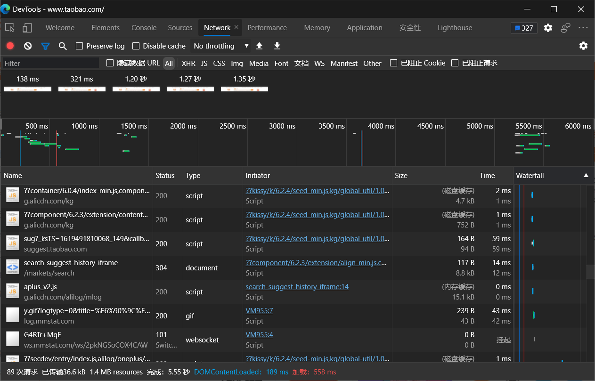
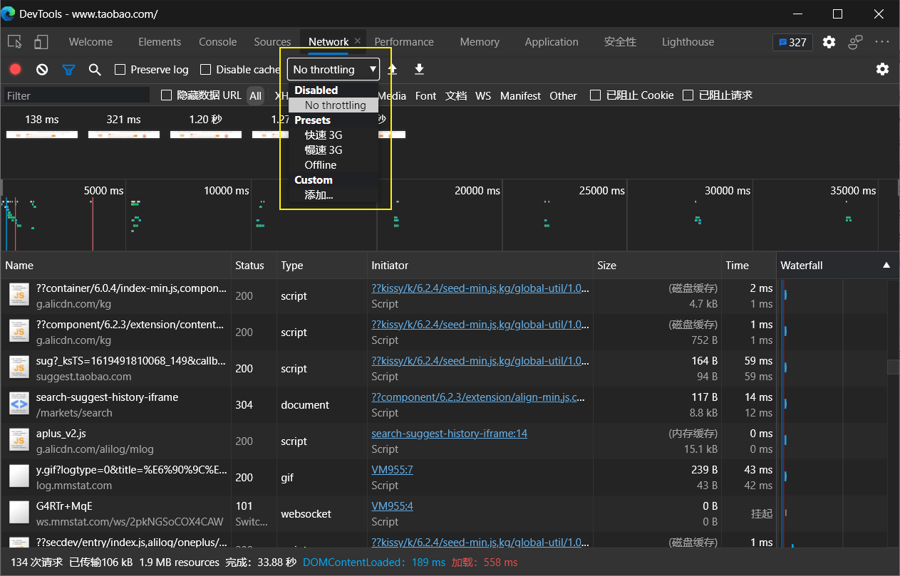
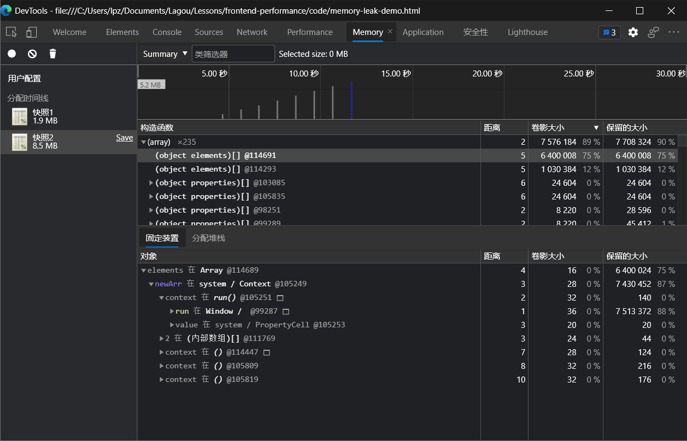

# 使用 Chrome DevTools 测试性能

## 浏览器任务管理器

通过 Chrome 任务管理器我们可以查看当前 Chrome 浏览器中，所有进程关于 GPU、⽹络和内存空间的使⽤情况，这些进程包括当前打开的各个⻚签，安装的各种扩展插件，以及 GPU、⽹络、渲染等浏览器的默认进程，通过监控这些数据，我们可以在有异于其他进程的⼤幅开销出现时，去定位到可能存在内存泄漏或⽹络资源加载异常的问题进程。

## Network ⽹络分析

Network 面板是 Chrome 开发者⼯具中⼀个经常会被⽤到的⼯具面板，通过它可以查看到⽹站所有资源的请求情况，包括加载时间、尺⼨⼤⼩、优先级设置及 HTTP 缓存触发情况等信息，从⽽帮助我们发现可能由于未进⾏有效压缩⽽导致资源尺⼨过⼤的问题，或者未合理配置缓存策略导致⼆次请求加载时间过⻓的问题等。

- https://developer.chrome.com/docs/devtools/network/

## 面板设置

## 查看⽹络请求信息

## 缓存测试

## ⽹络吞吐测试

## ⽹络请求阻⽌

- 打开⽅式：Ctrl+ Shift + P -> Show Network Request Blocking
- 启⽤⽹络请求阻⽌
- 添加阻⽌规则

## Coverage 面板

我们可以通过 Coverage 面板监控并统计出⽹站应⽤运⾏过程中代码执⾏的覆盖率情况。该面板统计的对象是 JavaScript 脚本⽂件与 CSS 样式表⽂件，统计结果主要包括：每个⽂件的字节⼤⼩、执⾏过程中已覆盖的代码字节数，以及可视化的覆盖率条形图。

根据执⾏结果我们能够发现，在启动录制的过程中到底有哪些尺⼨较⼤的代码⽂件执⾏覆盖率较低，这就意味着有些代码⽂件中可能存在较多的⽆⽤代码，更准确地说是暂时没⽤到的代码。这些信息对性能优化来说是⾮常有⽤的，开发者可以据此将执⾏覆盖率较低的代码⽂件进⾏拆分，将⾸屏渲染阶段暂时不会执⾏到的代码部分单独打包，仅在需要的时候再去加载。

同时对规模较⼤且迭代周期较⻓的项⽬来说，⼯程代码中会包含⼀些永远都不会执⾏到的代码，⽽使⽤ webpack 的 Tree Shaking 仅能根据 export 进⾏⽆关联引⽤，那么此时 Coverage 面板就为优化提供了⼀条可以尝试的途径。

## Memory 面板

前端主要使⽤ JavaScript 代码来处理业务逻辑，所以保证代码在执⾏过程中内存的良性开销对⽤户的性能体验来说尤为重要，如果出现内存泄漏，那么就可能会带来⽹站应⽤卡顿或崩溃的后果。

为了更细致和准确地监控⽹站应⽤当前的内存使⽤情况，Chrome 浏览器开发者⼯具提供了 Memory 面板，通过它可以快速⽣成当前的堆内存快照，或者查看内存随时间的变化情况。据此我们可以查看并发现可能出现内存泄漏的环节，下图是使⽤ Memory 面板查看堆内存使⽤快照的情况。

## Performance 面板

使⽤ Performance 面板主要对⽹站应⽤的运⾏时性能表现进⾏检测与分析，其可检测的内容不仅包括⻚⾯的每秒帧数（FPS）、CPU 的消耗情况和各种请求的时间花费，还能查看⻚⾯在前 1ms 与后 1ms 之间⽹络任务的执⾏情况等内容。

### 使⽤⽅式

使⽤⽅式⾮常简单，只需要在进⾏性能检测的⽹站⻚⾯中打开 Chrome 开发者⼯具的 Performance 面板即可，这⾥建议在 Chrome 浏览器的匿名模式下使⽤该⼯具，因为在匿名模式下不会受到既有缓存或其他插件程序等因素的影响，能够给性能检测提供⼀个相对⼲净的运⾏环境。

Performance 面板中常⽤的是图中标出的三个按钮。通常当我们需要检测⼀段时间内的性能状况时，可单击两次“启动/停⽌检测”按钮来设置起⽌时间点，当单击第⼆次按钮停⽌检测后，相应的检测信息便出现在控制面板下⽅的区域。

图中的“启动检测并刷新⻚⾯”按钮⽤来检测⻚⾯刷新过程中的性能表现，单击它会⾸先清空⽬前已有的检测记录，然后启动检测刷新⻚⾯，当⻚⾯全部加载完成后⾃动停⽌检测。

打开测试示例：https://googlechrome.github.io/devtools-samples/jank/

### 面板信息

Performance 的评估结果⻚，其中的面板信息⼤致可分为四⼤类：控制面板、概览面板、线程面板及统计面板。

### 控制面板

（1）Screenshots：表示是否截取每⼀帧的屏幕截图，默认会勾选，并且在概览面板中展示随时间变化的每帧截屏画⾯，如果取消勾选，则不会在概览面板中展示这部分内容。

（2）Memory：表示是否记录内存消耗，默认不会勾选，如果勾选则会在线程面板与统计面板之间展示出各种类型资源的内存消耗曲线。

（3）⽹⻚指标：表示是否展示性能指标信息，默认不会勾选，如果勾选则会在⽹络和 Frames 之间展示出核⼼指标的节点状态。

（4）Disable javaScript samples：如果勾选则表示关闭 JavaScript 示例，减少在⼿机端运⾏时的开销，若要模拟⼿机端的运⾏环境时则需要勾选。

（5）Enable advanced paint instrumentation（slow）：如果选中则表示开启加速渲染⼯具，⽤来记录渲染事件的相关细节。因为该功能⽐较消耗性能，所以开启后重新⽣成检测报告的速度会变慢。

（6）Network：在性能检测时，⽤以切换模拟⽹络环境。

（7）CPU：限制 CPU 处理速度，主要⽤于模拟低速 CPU 运⾏时的性能。

### 概览面板

在概览面板的时间轴上，可以通过选择⼀个起始时间点，然后按住⿏标左键滑动选择面板中的局部范围，来进⾏更⼩范围内的性能观察。

这部分可观察的性能信息包括：FPS、CPU 开销和⽹络请求时间。对每秒帧数⽽⾔，尽量保持在 60FPS 才能让动画有⽐较流畅的视觉体验。

对 CPU 开销⽽⾔，不仅可以在整个检测时间轴上以曲线的形式观察 CPU 处理任务所花费时间的变化情况，同时还可以在统计面板中查看当前选中时间区域⾥各个任务花费时间的占⽐，其中占⽐较⼤的部分就有可能存在性能问题，可以进⼀步检测与分析。

对⽹络请求时间⽽⾔，概览面板提供的信息可能不够清晰，这⾥建议在线程面板的 Network 部分中具体查看，⽐如时间轴上每个请求的耗时及起⽌时间点都会更加清楚，从⽽⽅便开发者发现响应过⻓的⽹络请求并进⾏优化。

### 线程面板

这部分最主要的信息即为主线程执⾏过程的⽕焰图，主线程在解析 HTML 和 CSS、⻚⾯绘制及执⾏ JavaScript 的过程中，每个事件调⽤堆栈和耗时的情况都会反映在这张图上，其中每⼀个⻓条都代表了⼀个事件，将⿏标悬浮其上的时候可以查看到相应事件的执⾏耗时与事件名。

这个⽕焰图的横轴表示执⾏时间，纵轴表示调⽤栈的情况，上⾯的事件会调⽤下⾯的事件，越往下事件数量越少，所以⽕焰图是倒⽴的形式。

⽕焰图中的事件会以不同颜⾊进⾏标注，常⻅的事件类型有以下⼏种：HTML 解析、JavaScript 事件（例如⿏标单击、滚动等）、⻚⾯布局更改、元素样式重新计算及⻚⾯图层的绘制。了解并熟知这些事件的执⾏情况，有助于发现潜在的性能问题。

### 统计面板

统计面板会根据在概览面板中选择时间区域的不同，绘制出不同类型任务执⾏耗时的可视化图标。统计面板中包含四个⻚签。

其中 Summary ⻚签中会展示各类任务事件耗时的环形图；

其中 Summary ⻚签中会展示各类任务事件耗时的环形图；

Call Tree ⻚签中可以查看全部或指定⽕焰图中某个事件的调⽤栈，如下图所示

Event Log ⻚签中可查看关于每个事件的详细⽇志信息，如图下图所示。

### 保存测试记录

## FPS 计数

另⼀个⾮常⽅便的⼯具是 FPS 计数，可在⻚⾯运⾏时提供对 FPS 的实时估计。

1、选择 Control+Shift+P (Windows、Linux) 或 Command+Shift+P (macOS) 打开命令菜单。

2、在命令菜单中开始键⼊ Rendering，然后选择显示渲染.

3、在呈现⼯具 中，打开 FPS 指示器。 新的叠加层将显示在视线的右上⻆。

4、关闭 FPS 计数并选择 Escape 来关闭呈现⼯具。

## Performance monitor

虽然使⽤ Performance 面板来进⾏检测能够得到较为全⾯的性能数据，但依然存在两个使⽤上的问题，即面板信息不够直观和数据的实时性不够强。

为了弥补这两⽅⾯的不⾜，Chrome 从 64 版本开始便在开发者⼯具中引⼊了 Performance monitor 面板，通过它让我们可以实时监控⽹站应⽤运⾏过程中，诸如 CPU 占⽤率、JavaScript 内存使⽤⼤⼩、内存中挂的 DOM 节点数、JavaScript 事件监听次数及⻚⾯发⽣重绘与重排的处理时间等信息。

据此如果我们发现，当与⻚⾯的交互过程中出现某项指标有较为陡峭的增⻓，就意味着可能有影响性能体验的⻛险存在。

如图所示为 Performance monitor 面板，图中出现的明显波动是执⾏刷新⻚⾯操作所产⽣的，可观察到 JavaScript 堆内存⼤⼩与 DOM 节点数的指标都有⼀个明显的断崖式下跌，这正是刷新操作清除了原有 DOM 节点后，还未重新渲染出新节点的时间点。

## 参考链接

- https://developer.chrome.com/docs/devtools/
- https://developer.chrome.com/docs/devtools/evaluate-performance/
- https://docs.microsoft.com/zh-cn/microsoft-edge/devtools-guide-chromium/evaluate-performance/
