# 前端页面的生命周期

性能问题呈现给⽤户的感受往往是简单⽽直接的：加载资源缓慢、运⾏过程卡顿或响应交互迟缓等，当把这些问题呈现到前端⼯程师⾯前时，却是另⼀种系统级别复杂的图景。

从域名解析、TCP 建⽴连接到 HTTP 的请求与响应，以及从资源请求、⽂件解析到关键渲染路径等，每⼀个环节都有可能因为设计不当、考虑不周、运⾏出错⽽产⽣性能不佳的体验。作为前端⼯程师，为了能在遇到性能问题时快速⽽准确地定位问题所在，并设计可⾏的优化⽅案，熟悉前端⻚⾯的⽣命周期是⼀堂必修课

## ⼀道前端⾯试题

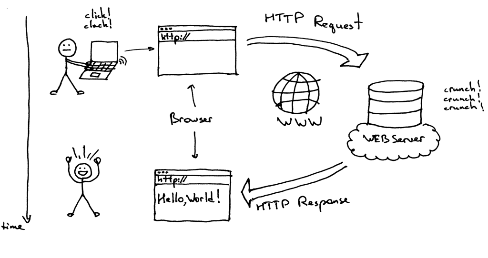

⼤家在进⾏前端⾯试时，经常问这样⼀个问题：**从浏览器地址栏输⼊ URL 后，到⻚⾯渲染出来，整个过程都发⽣了什么？** 这个问题不仅能很好地分辨出⾯试候选⼈对前端知识的掌握程度，能够考查其知识体系的完整性，更重要的是，能够考查⾯试者在前端性能优化⽅⾯理解和掌握此过程的深⼊程度，与快速定位性能瓶颈及⾼效权衡出恰当的性能优化解决⽅案是正相关的。

根据笔者⾯试和⼯作的经验，笔者将⼯程师的能⼒由低到⾼划分了若⼲等级：不堪⼀击、初窥⻔径、略有⼩成、驾轻就熟、融会贯通……

如果⾯试者的回答是：⾸先浏览器发起请求，然后服务器返回数据，最后脚本执⾏和⻚⾯渲染，那么这种程度⼤概在不堪⼀击与初窥⻔径之间，属于刚⼊⻔前端，对性能优化还没什么概念。

如果知道在浏览器输⼊ URL 后会建⽴ TCP 连接，并在此之上有 HTTP 的请求与响应，在浏览器接收到数据后，了解 HTML 与 CSS ⽂件如何构成渲染树，以及 JavaScript 引擎解析和执⾏的基本流程，这种程度基本算是初窥⻔径，在⾯对⽹站较差的性能表现时，能够尝试从⽹络连接、关键渲染路径及 JS 执⾏过程等⻆度去分析和找寻可能存在的问题。

其实这个问题的回答可以⾮常细致，能从信号与系统、计算机原理、操作系统聊到⽹络通信、浏览器内核，再到 DNS 解析、负载均衡、⻚⾯渲染等，可以划分为以下⼏个阶段。

1. 浏览器接收到 URL，到⽹络请求线程的开启。
2. ⼀个完整的 HTTP 请求并的发出。
3. 服务器接收到请求并转到具体的处理后台。
4. 前后台之间的 HTTP 交互和涉及的缓存机制。
5. 浏览器接收到数据包后的关键渲染路径。
6. JS 引擎的解析过程。

## ⽹络请求线程开启

浏览器接收到我们输⼊的 URL 到开启⽹络请求线程，这个阶段是在浏览器内部完成的，需要先来了解这⾥⾯涉及的⼀些概念。

⾸先是对 URL 的解析，它的各部分的含义如下图所示。

| 标题     | 名称               | 备注                                                            |
| -------- | ------------------ | --------------------------------------------------------------- |
| Protocol | 协议头             | 说明浏览器如何处理要打开的⽂件，常⻅的有 HTTP、FTP、Telnet 等。 |
| Host     | 主机域名 / IP 地址 | 所访问资源在互联⽹上的地址，主机域名或经过 DNS 解析为 IP 地址。 |
| Port     | 端⼝号             | 请求程序和响应程序之间连接⽤的标识                              |
| Path     | ⽬录路径           | 请求的⽬录或⽂件名                                              |
| Query    | 查询参数           | 请求所传递的参数                                                |
| Fragment | ⽚段               | 次级资源信息，通常作为前端路由或锚点                            |

- URL 结构： Protocol://Host:Port/Path?Query#Fragment
- 例如：http://example.com/users/1?foo=bar#abc

解析 URL 后，如果是 HTTP 协议，则浏览器会新建⼀个⽹络请求线程去下载所需的资源，要明⽩这个过程需要先了解进程和线程之间的区别，以及⽬前主流的多进程浏览器结构。

## 进程与线程

简单来说，进程就是⼀个程序运⾏的实例，操作系统会为进程创建独⽴的内存，⽤来存放运⾏所需的代码和数据；⽽线程是进程的组成部分，每个进程⾄少有⼀个主线程及可能的若⼲⼦线程，这些线程由所属的进程进⾏启动和管理。由于多个线程可以共享操作系统为其所属的同⼀个进程所分配的资源，所以多线程
的并⾏处理能有效提⾼程序的运⾏效率。

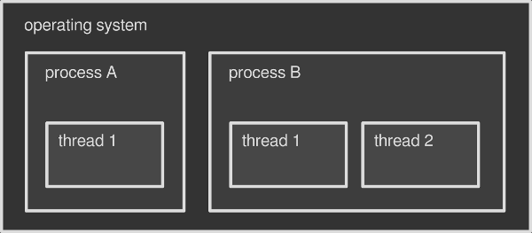

进程和线程之间的区别：

1. 只要某个线程执⾏出错，将会导致整个进程崩溃。
2. 进程与进程之间相互隔离。这保证了当⼀个进程挂起或崩溃的情况发⽣时，并不会影响其他进程的正常运⾏，虽然每个进程只能访问系统分配给⾃⼰的资源，但可以通过 IPC 机制进⾏进程间通信。
3. 进程所占⽤的资源会在其关闭后由操作系统回收。即使进程中存在某个线程产⽣的内存泄漏，当进程退出时，相关的内存资源也会被回收。
4. 线程之间可以共享所属进程的数据。

## 单进程浏览器

在熟悉了进程和线程之间的区别后，我们在此基础上通过了解浏览器架构模型的演变，来看看⽹络请求线程的开启处在怎样的位置。

说到底浏览器也只是⼀个运⾏在操作系统上的程序，那么它的运⾏单位就是进程，⽽早在 2008 年⾕歌发布 Chrome 多进程浏览器之前，市⾯上⼏乎所有浏览器都是单进程的，它们将所有功能模块都运⾏在同⼀个进程中，其架构示意图如下图所示。

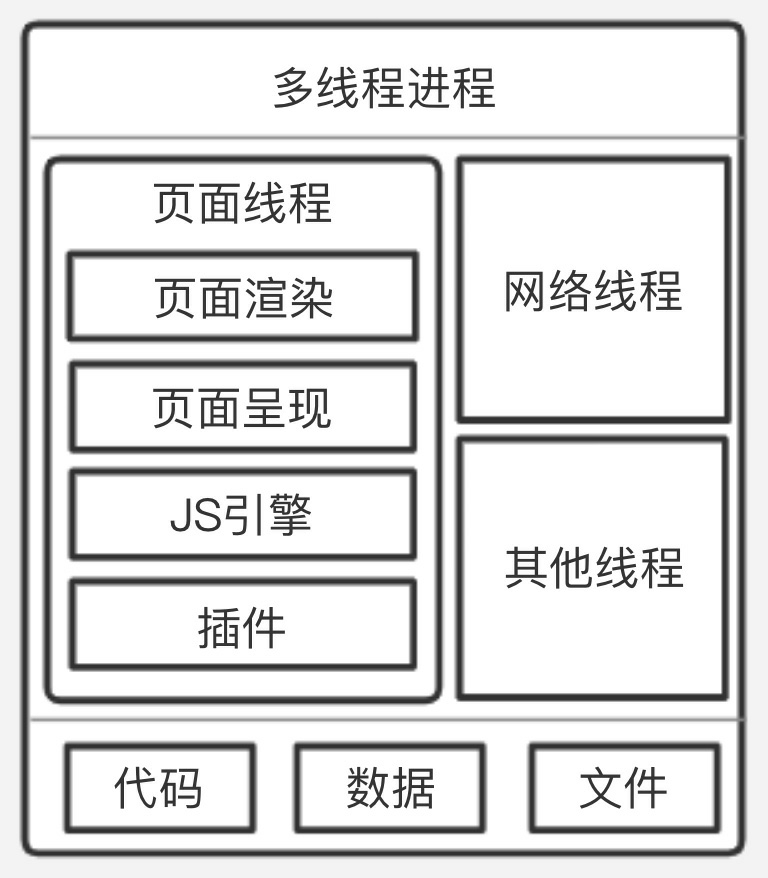

单进程浏览器在以下⽅⾯有着较为明显的隐患。

- 流畅性：⾸先是⻚⾯内存泄漏，浏览器内核通常⾮常复杂，单进程浏览器打开再关闭⼀个⻚⾯的操作，通常会有⼀些内存不能完全回收，这样随着使⽤时间延⻓，占⽤的内存会越来越多，从⽽引起浏览器运⾏变慢；其次由于很多模块运⾏在同⼀个线程中，如 JS 引擎、⻚⾯渲染及插件等，那么执⾏某个循环任务的模块就会阻塞其他模块的任务执⾏，这样难免会有卡顿的现象发⽣。

- 安全性：由于插件的存在，不免其中有些恶意脚本会利⽤浏览器漏洞来获取系统权限，进⾏引发安全问题的⾏为。

- 稳定性：由于所有模块都运⾏在同⼀个进程中，对于稍复杂的 JS 代码，如果⻚⾯渲染引擎崩溃，就会导致整个浏览器崩溃。同样，各种不稳定的第三⽅插件，也是导致浏览器崩溃的隐患。

## 多进程浏览器

出于对单进程浏览器存在问题的优化，Chrome 推出了多进程浏览器架构，浏览器把原先单进程内功能相对独⽴的模块抽离为单个进程处理对应的任务，主要分为以下⼏种进程。

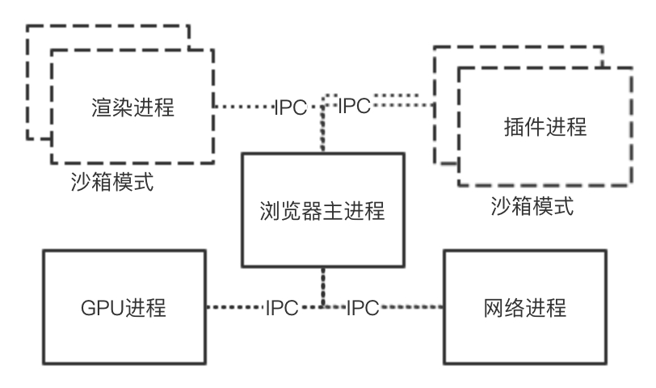

1. 浏览器主进程：⼀个浏览器只有⼀个主进程，负责如菜单栏、标题栏等界⾯显示，⽂件访问，前进后退，以及⼦进程管理等。
2. GPU 进程：GPU（图形处理单元）最初是为了实现 3D 的 CSS 效果⽽引⼊的，后来随着⽹⻚及浏览器在界⾯中的使⽤需求越来越普遍，Chrome 便在架构中加⼊了 GPU 进程。
3. 插件进程：主进程会为每个加⼊浏览器的插件开辟独⽴的⼦进程，由于进程间所分配的运⾏资源相对独⽴，所以即便某个插件进程意外崩溃，也不⾄于对浏览器和⻚⾯造成影响。另外，出于对安全因素的考虑，这⾥采⽤了沙箱模式（即上图中虚线所标出的进程），在沙箱中运⾏的程序受到⼀些限制：不能读取敏感位置的数据，也不能在硬盘上写⼊数据。这样即使插件运⾏了恶意脚本，也⽆法获取系统权限。
4. ⽹络进程：负责⻚⾯的⽹络资源加载，之前属于浏览器主进程中的⼀个模块，最近才独⽴出来。
5. 渲染进程：也称为浏览器内核，其默认会为每个标签窗⼝⻚开辟⼀个独⽴的渲染进程，负责将 HTML、CSS 和 JavaScript 等资源转为可交互的⻚⾯，其中包含多个⼦线程，即 JS 引擎线程、GUI 渲染线程、事件触发线程、定时触发器线程、异步 HTTP 请求线程等。当打开⼀个标签⻚输⼊ URL 后，所发起的⽹络请求就是从这个进程开始的。另外，出于对安全性的考虑，渲染进程也被放⼊沙箱中。

打开 Chrome 任务管理器，可以从中查看到当前浏览器都启动了哪些进程.

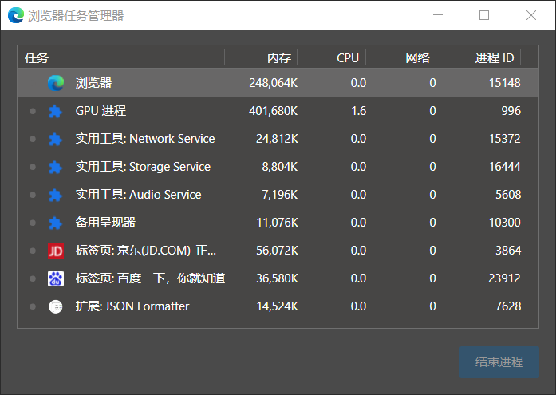

此时仅打开了两个标签⻚，除了笔者浏览器添加插件所开辟的进程，还可以看到浏览器进程、GPU 进程、⽹络进程，以及最近新抽离出来的⼀个⾳频服务进程等。

## 建⽴ HTTP 请求

这个阶段的主要⼯作分为两部分：DNS 解析和通信链路的建⽴。

简单说就是：⾸先发起请求的客户端浏览器要明确知道所要访问的服务器地址然后建⽴通往该服务器地址的路径

## DNS 解析

URL 解析，其实仅将 URL 拆分为代表具体含义的字段，然后以参数的形式传⼊⽹络请求线程进⾏进⼀步处理，⾸先第⼀步便是这⾥讲到的 DNS 解析。其主要⽬的便是通过查询将 URL 中的 Host 字段转化为⽹络中具体的 IP 地址，因为域名只是为了⽅便帮助记忆的，IP 地址才是所访问服务器在⽹络中的“⻔牌号”。

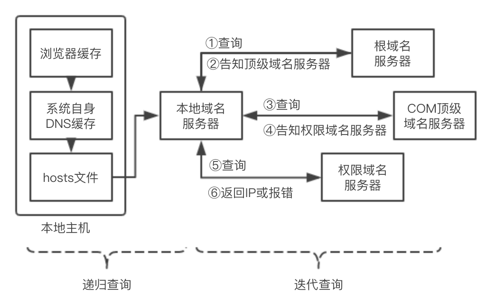

⾸先查询浏览器⾃身的 DNS 缓存，如果查到 IP 地址就结束解析，由于缓存时间限制⽐较⼤，⼀般只有 1 分钟，同时缓存容量也有限制，所以在浏览器缓存中没找到 IP 地址时，就会搜索系统⾃身的 DNS 缓存；如果还未找到，接着就会尝试从系统的 hosts ⽂件中查找。

在本地主机进⾏的查询若都没获取到，接下来便会在本地域名服务器上查询。如果本地域名服务器没有直接的⽬标 IP 地址可供返回，则本地域名服务器便会采取迭代的⽅式去依次查询根域名服务器、COM 顶级域名服务器和权限域名服务器等，最终将所要访问的⽬标服务器 IP 地址返回本地主机，若查询不到，则返回报错信息。

由此可以看出 DNS 解析是个很耗时的过程，若解析的域名过多，势必会延缓⾸屏的加载时间。本节仅对 DNS 解析过程进⾏简要的概述，⽽关于原理及优化⽅式等更为详细的介绍会在后续课程中单独展开介绍。

## ⽹络模型

在通过 DNS 解析获取到⽬标服务器 IP 地址后，就可以建⽴⽹络连接进⾏资源的请求与响应了。但在此之前，我们需要对⽹络架构模型有⼀些基本的认识，在互联⽹发展初期，为了使⽹络通信能够更加灵活、稳定及可互操作，国际标准化组织提出了⼀些⽹络架构模型：OSI 模型、TCP/IP 模型，⼆者的⽹络模型图示如下图所示。

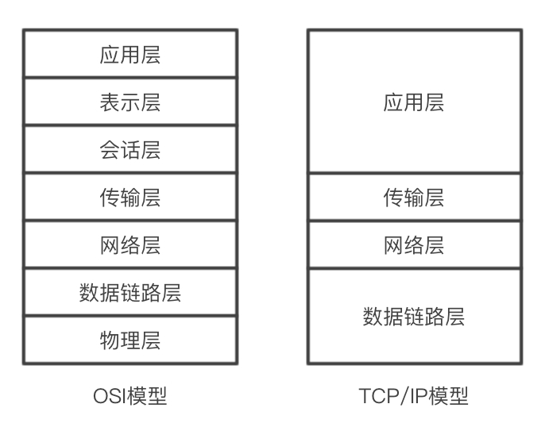

OSI（开放系统互连）模型将⽹络从底层的物理层到顶层浏览器的应⽤层⼀共划分了 7 层，OSI 各层的具体作⽤如下表所示。

| 名称       | 解释                                                                                                                           |
| ---------- | ------------------------------------------------------------------------------------------------------------------------------ |
| 应⽤层     | 负责给应⽤程序提供接⼝，使其可以使⽤⽹络服务，HTTP 协议就位于该层                                                              |
| 表示层     | 负责数据的编码与解码，加密和解密，压缩和解压缩                                                                                 |
| 会话层     | 负责协调系统之间的通信过程                                                                                                     |
| 传输层     | 负责端到端连接的建⽴，使报⽂能在端到端之间进⾏传输。TCP/UDP 协议位于该层                                                       |
| ⽹络层     | 为⽹络设备提供逻辑地址，使位于不同地理位置的主机之间拥有可访问的连接和路径                                                     |
| 数据链路层 | 在不可靠的物理链路上，提供可靠的数据传输服务。包括组帧、物理编址、流量控制、差错控制、接⼊控制等                               |
| 物理层     | 主要功能包括：定义⽹络的物理拓扑，定义物理设备的标准（如介质传出速率、⽹线或光钎的接⼝模型等），定义⽐特的表示和信号的传输模式 |

OSI 是⼀种理论下的模型，它先规划了模型再填⼊协议，先制定了标准再推⾏实践，TCP/IP 充分借鉴了 OSI 引⼊的服务、接⼝、协议及分层等概念，建⽴了 TCP/IP 模型并⼴泛使⽤，成为⽬前互联⽹事实上的标准。

## TCP 连接

根据对⽹络模型的介绍，当使⽤本地主机连上⽹线接⼊互联⽹后，数据链路层和⽹络层就已经打通了，⽽要向⽬标主机发起 HTTP 请求，就需要通过传输层建⽴端到端的连接。

传输层常⻅的协议有 TCP 协议和 UDP 协议，由于本章关注的重点是前端⻚⾯的资源请求，这需要⾯向连接、丢包重发及对数据传输的各种控制，所以接下来仅详细介绍 TCP 协议的“三次握⼿”和“四次挥⼿”。

由于 TCP 是⾯向有连接的通信协议，所以在数据传输之前需要建⽴好客户端与服务器端之间的连接，即通常所说的“三次握⼿”，具体过程分为如下步骤。

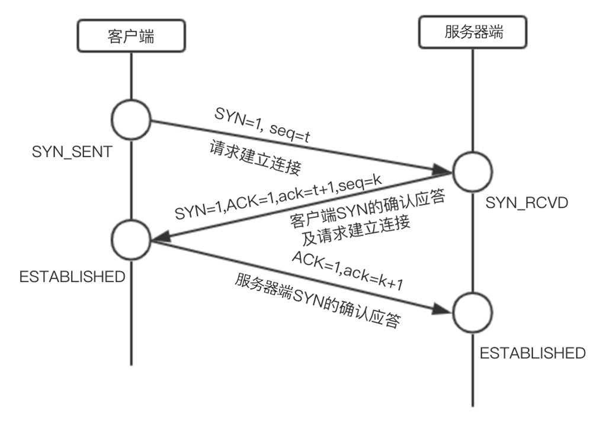

**“3 次握⼿”的作⽤就是双⽅都能明确⾃⼰和对⽅的收、发能⼒是正常的。**

1. 第 1 次握⼿：客户端⽣成⼀个随机数 seq ，假设其值为 t ，并将标志位 SYN 设为 1 ，将这些数据打包发给服务器端后，客户端进⼊等待服务器端确认的状态。

2. 第 2 次握⼿：服务器端收到客户端发来的 SYN=1 的数据包后，知道这是在请求建⽴连接，于是服务器端将 SYN 与 ACK 均置为 1 ，并将请求包中客户端发来的随机数 t 加 1 后赋值给 ack ，然后⽣成⼀个服务器端的随机数 seq=k ，完成这些操作后，服务器端将这些数据打包再发回给客户端，作为对客户端建⽴连接请求的确认应答。

3. 第三次握⼿：客户端收到服务器端的确认应答后，检查数据包中 ack 的字段值是否为 t+1 ，ACK 是否等于 1，若都正确就将服务器端发来的随机数加 1（ack=k+1） ，将 ACK=1 的数据包再发送给服务器端以确认服务器端的应答，服务器端收到应答包后通过检查 ack 是否等于 k+1 来确认连接是否建⽴成功。连接建⽴的关系图如下图所示。

当⽤户关闭标签⻚或请求完成后，TCP 连接会进⾏“四次挥⼿”断开连接，具体过程如下。

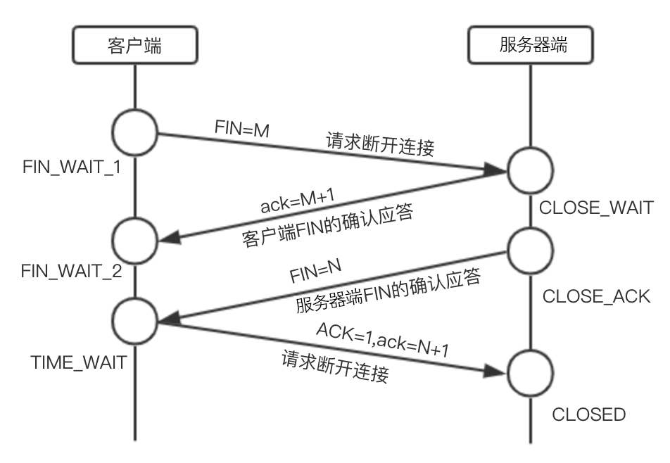

1. 由客户端先向服务器端发送 FIN=M 的指令，随后进⼊完成等待状态 FIN_WAIT_1 ，表明客户端已经没有再向服务器端发送的数据，但若服务器端此时还有未完成的数据传递，可继续传递数据。
2. 当服务器端收到客户端的 FIN 报⽂后，会先发送 ack=M+1 的确认，告知客户端关闭请求已收到，但可能由于服务器端还有未完成的数据传递，所以请客户端继续等待。
3. 当服务器端确认已完成所有数据传递后，便发送带有 FIN=N 的报⽂给客户端，准备关闭连接。
4. 客户端收到 FIN=N 的报⽂后可进⾏关闭操作，但为保证数据正确性，会回传给服务器端⼀个确认报⽂ ack=N+1 ，同时服务器端也在等待客户端的最终确认，如果服务器端没有收到报⽂则会进⾏重传，只有收到报⽂后才会真正断开连接。⽽客户端在发送了确认报⽂⼀段时间后，没有收到服务器端任何信息则认为服务器端连接已关闭，也可关闭客户端信息。

只有连接建⽴成功后才可开始进⾏数据的传递，由于浏览器对同⼀域名下并发的 TCP 连接有限制，以及在 1.0 版本的 HTTP 协议中，⼀个资源的下载需对应⼀个 TCP 的请求，这样的并发限制⼜会涉及许多优化⽅案，我们将在后续章节中进⾏进⼀步介绍。

这⾥较为详细地介绍了 TCP 连接建⽴和断开的过程，⾸先让读者有⼀个⽹络架构分层的概念，虽然前端⼯作基本围绕在应⽤层，但有⼀个全局的⽹络视⻆后，能帮助我们在定位性能瓶颈时更加准确；其次也为了说明影响前端性能体验的因素，不仅是⽇常编写的代码和使⽤的资源，⽹络通信中每个环节的优劣缓急都值得关注。

**QA：为什么三次握⼿建⽴连接的 TCP 客户端最后还要发送⼀次确认呢？**

⼀句话，主要防⽌已经失效的连接请求报⽂突然⼜传送到了服务器，从⽽产⽣错误。

如果使⽤的是两次握⼿建⽴连接，假设有这样⼀种场景，客户端发送了第⼀个请求连接并且没有丢失，只是因为在⽹络节点中滞留的时间太⻓了，由于 TCP 的客户端迟迟没有收到确认报⽂，以为服务器没有收到，此时重新向服务器发送这条报⽂，此后客户端和服务器经过两次握⼿完成连接，传输数据，然后关闭连接。此时此前滞留的那⼀次请求连接，⽹络通畅了到达了服务器，这个报⽂本该是失效的，但是，两次握⼿的机制将会让客户端和服务器再次建⽴连接，这将导致不必要的错误和资源的浪费。

如果采⽤的是三次握⼿，就算是那⼀次失效的报⽂传送过来了，服务端接受到了那条失效报⽂并且回复了确认报⽂，但是客户端不会再次发出确认。由于服务器收不到确认，就知道客户端并没有请求连接。

**QA：为什么建⽴连接是三次握⼿，关闭连接确是四次挥⼿呢？**

建⽴连接的时候， 服务器在 LISTEN 状态下，收到建⽴连接请求的 SYN 报⽂后，把 ACK 和 SYN 放在⼀个报⽂⾥发送给客户端。

⽽关闭连接时，服务器收到对⽅的 FIN 报⽂时，仅仅表示对⽅不再发送数据了但是还能接收数据，⽽⾃⼰也未必全部数据都发送给对⽅了，所以⼰⽅可以⽴即关闭，也可以发送⼀些数据给对⽅后，再发送 FIN 报⽂给对⽅来表示同意现在关闭连接，因此，⼰⽅ ACK 和 FIN ⼀般都会分开发送，从⽽导致多了⼀次。

**QA：如果已经建⽴了连接，但是客户端突然出现故障了怎么办？**

TCP 还设有⼀个保活计时器，显然，客户端如果出现故障，服务器不能⼀直等下去，⽩⽩浪费资源。服务器每收到⼀次客户端的请求后都会重新复位这个计时器，时间通常是设置为 2 ⼩时，若两⼩时还没有收到客户端的任何数据，服务器就会发送⼀个探测报⽂段，以后每隔 75 秒发送⼀次。若⼀连发送 10 个探测报⽂仍然没反应，服务器就认为客户端出了故障，接着就关闭连接。

## 前后端的交互

当 TCP 连接建⽴好之后，便可通过 HTTP 等协议进⾏前后端的通信，但在实际的⽹络访问中，并⾮浏览器与确定 IP 地址的服务器之间直接通信，往往会在中间加⼊反向代理服务器。

## 反向代理服务器

对需要提供复杂功能的⽹站来说，通常单⼀的服务器资源是很难满⾜期望的。⼀般采⽤的⽅式是将多个应⽤服务器组成的集群由反向代理服务器提供给客户端⽤户使⽤，这些功能服务器可能具有不同类型，⽐如⽂件服务器、邮件服务器及 Web 应⽤服务器，同时也可能是相同的 Web 服务部署到多个服务器上，以实现负载均衡的效果，反向代理服务器的作⽤如图所示。

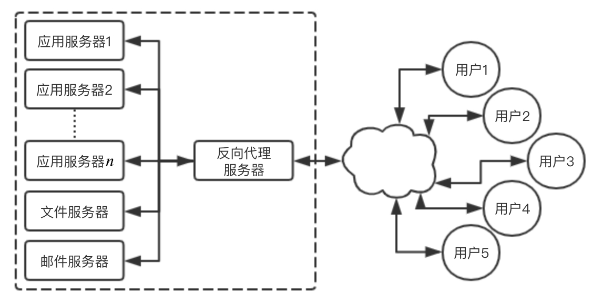

反向代理服务器根据客户的请求，从后端服务器上获取资源后提供给客户端。反向代理服务器通常的作⽤如下：

- 负载均衡。
- 安全防⽕墙。
- 加密及 SSL 加速。
- 数据压缩。
- 解决跨域。
- 对静态资源缓存。

常⽤作反向代理服务器的有 Nginx、IIS、Apache，我们会在后⾯针对 Nginx 深⼊介绍⼀些可⽤于性能优化的配置。

## 后端处理流程

经反向代理收到请求后，具体的服务器后台处理流程⼤致如下。

1. ⾸先会有⼀层统⼀的验证环节，如跨域验证、安全校验拦截等。如果发现是不符合规则的请求，则直接返回相应的拒绝报⽂。
2. 通过验证后才会进⼊具体的后台程序代码执⾏阶段，如具体的计算、数据库查询等。
3. 完成计算后，后台会以⼀个 HTTP 响应数据包的形式发送回请求的前端，结束本次请求。

## HTTP 相关协议特性

HTTP 是建⽴在传输层 TCP 协议之上的应⽤层协议，在 TCP 层⾯上存在⻓连接和短连接的区别。所谓⻓连接，就是在客户端与服务器端建⽴的 TCP 连接上，可以连续发送多个数据包，但需要双⽅发送⼼跳检查包来维持这个连接。

HTTP 是建⽴在传输层 TCP 协议之上的应⽤层协议，在 TCP 层⾯上存在⻓连接和短连接的区别。所谓⻓连接，就是在客户端与服务器端建⽴的 TCP 连接上，可以连续发送多个数据包，但需要双⽅发送⼼跳检查包来维持这个连接。

在 HTTP 1.0 时，默认使⽤短连接，浏览器的每⼀次 HTTP 操作就会建⽴⼀个连接，任务结束则断开连接。

在 HTTP 1.1 时，默认使⽤⻓连接，在此情况下，当⼀个⽹⻚的打开操作完成时，其中所建⽴⽤于传输 HTTP 的 TCP 连接并不会断开关闭，客户端后续的请求操作便会继续使⽤这个已经建⽴的连接。如果我们对浏览器的开发者⼯具留⼼，在查看请求头时会发现⼀⾏ Connection: keep-alive 。⻓连接并⾮永久保持，它有⼀个持续时间，可在服务器中进⾏配置。

⽽在 HTTP 2.0 到来之前，每⼀个资源的请求都需要开启⼀个 TCP 连接，由于 TCP 本身有并发数的限制，这样的结果就是，当请求的资源变多时，速度性能就会明显下降。为此，经常会采⽤的优化策略包括，将静态资源的请求进⾏多域名拆分，对于⼩图标或图⽚使⽤雪碧图等。

在 HTTP 2.0 之后，便可以在⼀个 TCP 连接上请求多个资源，分割成更⼩的帧请求，其速度性能便会明显上升，所以之前针对 HTTP 1.1 限制的优化⽅案也就不再需要了。

HTTP 2.0 除了⼀个连接可请求多个资源这种多路复⽤的特性，还有如下⼀些新特性。

1. ⼆进制分帧：在应⽤层和传输层之间，新加⼊了⼀个⼆进制分帧层，以实现低延迟和⾼吞吐量。
2. 服务器端推送：以往是⼀个请求带来⼀个响应，现在服务器可以向客户端的⼀个请求发出多个响应，这样便可以实现服务器端主动向客户端推送的功能。
3. 设置请求优先级：服务器会根据请求所设置的优先级，来决定需要多少资源处理该请求。
4. HTTP 头部压缩：减少报⽂传输体积。

## 浏览器缓存

在基于 HTTP 的前后端交互过程中，使⽤缓存可以使性能得到显著提升。具体的缓存策略分为两种：强缓存和协商缓存。

强缓存就是当浏览器判断出本地缓存未过期时，直接读取本地缓存，⽆须发起 HTTP 请求，此时状态为：200 from cache 。在 HTTP 1.1 版本后通过头部的 cache-control 字段的 max-age 属性值规定的过期时⻓来判断缓存是否过期失效，这⽐之前使⽤ expires 标识的服务器过期时间更准确⽽且安全。

协商缓存则需要浏览器向服务器发起 HTTP 请求，来判断浏览器本地缓存的⽂件是否仍未修改，若未修改则从缓存中读取，此时的状态码为： 304 。具体过程是判断浏览器头部 if-none-match 与服务器短的 e-tag 是否匹配，来判断所访问的数据是否发⽣更改。这相⽐ HTTP 1.0 版本通过 last-modified 判断上次⽂件修改时间来说也更加准确。具体的浏览器缓存触发逻辑如图所示。

在浏览器缓存中，强缓存优于协商缓存，若强缓存⽣效则直接使⽤强缓存，若不⽣效则再进⾏协商缓存的请求，由服务器来判断是否使⽤缓存，如果都失效则重新向服务器发起请求获取资源。本节仅简要说明浏览器缓存的触发过程，由于这部分对性能优化来说⽐较重要，所以在后续章节也会详细介绍。

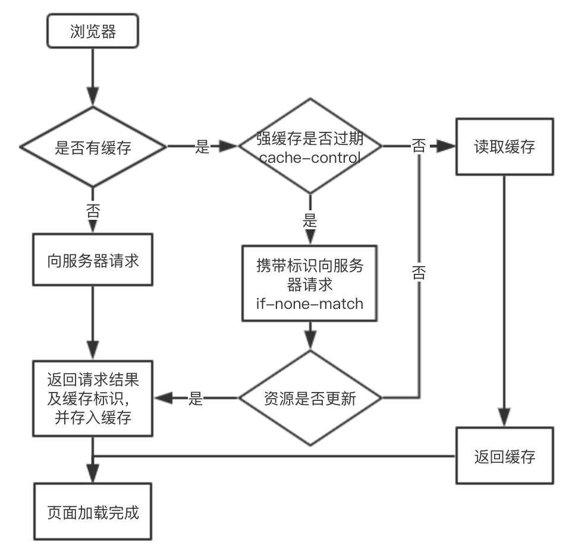

## 关键渲染路径（CRP）

当我们经历了⽹络请求过程，从服务器获取到了所访问的⻚⾯⽂件后，浏览器如何将这些 HTML、CSS 及 JS ⽂件组织在⼀起渲染出来呢？

### 构建对象模型

⾸先浏览器会通过解析 HTML 和 CSS ⽂件，来构建 DOM（⽂档对象模型）和 CSSOM（层叠样式表对象模型），为便于理解，我们以如下 HTML 内容⽂件为例，来观察⽂档对象模型的构建过程。

```html
 <!DOCTYPE html>
 <html lang="en">
 <head>
 <meta charset="UTF-8">
 <meta http-equiv="X-UA-Compatible" content="IE=edge">
 <meta name="viewport" content="width=device-width, initial-scale=1.0">
 <title>关键路径渲染</title>
 <link rel="stylesheet" href="style.css">
 </head>
 <body>
 <p>你好<span>性能优化</span></p>
 <div>
 
 </div>
 </body>
 </html
```

浏览器接收读取到的 HTML ⽂件，其实是⽂件根据指定编码（UTF-8）的原始字节，形如 3C 62 6F 79 3E 65 6C 6F 2C 20 73 70… 。⾸先需要将字节转换成字符，即原本的代码字符串，接着再将字符串转化为 W3C 标准规定的令牌结构，所谓令牌就是 HTML 中不同标签代表不同含义的⼀组规则结构。然后经过词法分析将令牌转化成定义了属性和规则值的对象，最后将这些标签节点根据 HTML 表示的⽗⼦关系，连接成树形结构，如下图所示。

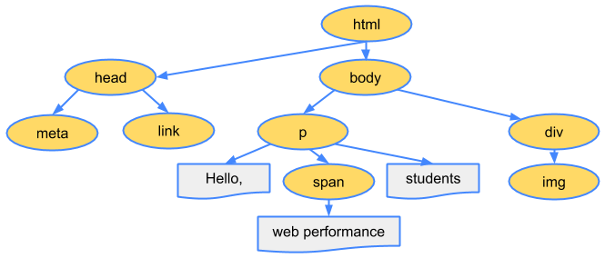

### 构建 CSSOM

DOM 树表示⽂档标记的属性和关系，但未包含其中各元素经过渲染后的外观呈现，这便是接下来 CSSOM 的职责了，与将 HTML ⽂件解析为⽂档对象模型的过程类似，CSS ⽂件也会⾸先经历从字节到字符串，然后令牌化及词法分析后构建为层叠样式表对象模型。假设 CSS ⽂件内容如下：

```css
body {
  font-size: 16px;
}

p {
  font-weight: bold;
}

span {
  color: red;
}

p span {
  display: none;
}

img {
  float: right;
}
```

最后构建的 CSSOM 树如图所示。

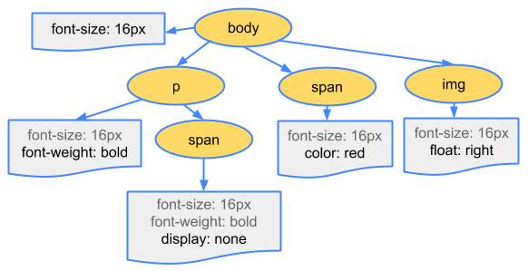

这两个对象模型的构建过程是会花费时间的，可以通过打开 Chrome 浏览器的开发者⼯具的性能选项卡，查看到对应过程的耗时情况，如图所示。

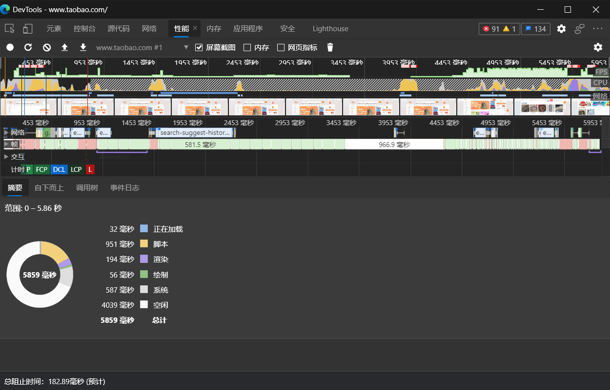

### 渲染绘制

当完成⽂档对象模型和层叠样式表对象模型的构建后，所得到的其实是描述最终渲染⻚⾯两个不同⽅⾯信息的对象：⼀个是展示的⽂档内容，另⼀个是⽂档对象对应的样式规则，接下来就需要将两个对象模型合并为渲染树，渲染树中只包含渲染可⻅的节点，该 HTML ⽂档最终⽣成的渲染树如图所示。

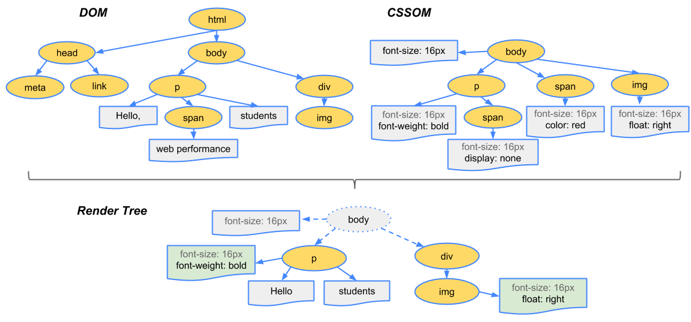

渲染绘制的步骤⼤致如下。

1. 从所⽣成 DOM 树的根节点开始向下遍历每个⼦节点，忽略所有不可⻅的节点（脚本标记不可⻅、CSS 隐藏不可⻅），因为不可⻅的节点不会出现在渲染树中。
2. 在 CSSOM 中为每个可⻅的⼦节点找到对应的规则并应⽤。
3. 布局阶段，根据所得到的渲染树，计算它们在设备视图中的具体位置和⼤⼩，这⼀步输出的是⼀个“盒模型”。
4. 绘制阶段，将每个节点的具体绘制⽅式转化为屏幕上的实际像素。

此处所举的例⼦较为简单，读者要明⽩执⾏构建渲染树、布局及绘制过程所需要的时间取决于实际⽂档的⼤⼩。⽂档越⼤，浏览器需要处理的任务就越多，样式也复杂，绘制需要的时间就越⻓，所以关键渲染路径执⾏快慢，将直接影响⾸屏加载时间的性能指标。

当⾸屏渲染完成后，⽤户在和⽹站的交互过程中，有可能通过 JavaScript 代码提供的⽤户操作接⼝更改渲染树的结构，⼀旦 DOM 结构发⽣改变，这个渲染过程就会重新执⾏⼀遍。可⻅对于关键渲染路径的优化影响的不仅是⾸屏性能，还有交互性能。

## 参考链接

- https://developer.mozilla.org/en-US/docs/Web/Performance/How_browsers_work
- https://zhuanlan.zhihu.com/p/80551769
- https://docs.microsoft.com/zh-cn/microsoft-edge/extensions-chromium/getting-started/
- https://blog.csdn.net/qzcsu/article/details/72861891
- https://zhuanlan.zhihu.com/p/53374516
