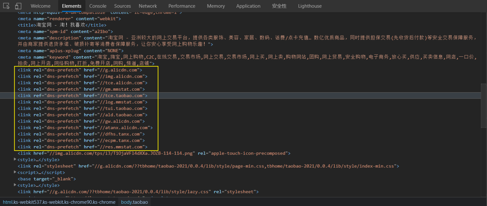

# DNS 解析

当浏览器从（第三⽅）服务器请求资源时，必须先将该跨域域名解析为 IP 地址，然后浏览器才能发出请求。此过程称为 DNS 解析。DNS 作为互联⽹的基础协议，其解析的速度似乎很容易被⽹站优化⼈员忽视。现在⼤多数新浏览器已经针对 DNS 解析进⾏了优化，⽐如 DNS 缓存。典型的⼀次 DNS 解析需要耗费 20-120 毫秒，所花费的时间⼏乎可以忽略不计，但是当⽹站中使⽤的资源依赖于多个不同的域的时候，时间就会成倍的增加，从⽽增加了⽹站的加载时间。⽐如在某些图⽚较多的⻚⾯中，在发起图⽚加载请求之前预先把域名解析好将会有⾄少 5% 的图⽚加载速度提升。

⼀般来说，在前端优化中与 DNS 有关的有两点：

- 减少 DNS 的请求次数
- 进⾏ DNS 预获取：DNS Prefetch

## 减少 DNS 查找

域名系统（DNS）将主机名映射到 IP 地址，就像电话簿将⼈们的姓名映射到他们的电话号码⼀样。在浏览器中输⼊ www.taobao.com 时，浏览器联系的 DNS 解析器将返回该服务器的 IP 地址。DNS 有成本。DNS 通常需要 20-120 毫秒来查找给定主机名的 IP 地址。在 DNS 查找完成之前，浏览器⽆法从该主机名下载任何内容。

域名系统（DNS）将主机名映射到 IP 地址，就像电话簿将⼈们的姓名映射到他们的电话号码⼀样。在浏览器中输⼊ www.taobao.com 时，浏览器联系的 DNS 解析器将返回该服务器的 IP 地址。DNS 有成本。DNS 通常需要 20-120 毫秒来查找给定主机名的 IP 地址。在 DNS 查找完成之前，浏览器⽆法从该主机名下载任何内容。

默认情况下，Internet Explorer 会缓存 30 分钟的 DNS 查找，这是由 DnsCacheTimeout 注册表设置指定的 。Firefox 在 network.dnsCacheExpiration 配置设置的控制下缓存 DNS 查找 1 分钟。Chrome 也是 1 分钟。

当客户端的 DNS 缓存为空（对于浏览器和操作系统）时，DNS 查找的次数等于⽹⻚中唯⼀主机名的数⽬。这包括在⻚⾯的 URL，图像，脚本⽂件，样式表，Flash 对象等中使⽤的主机名。减少唯⼀主机名的数量将减少 DNS 查找的数量。

减少域名的数量有可能减少⻚⾯中并⾏下载的数量。避免 DNS 查找会减少响应时间，但是减少并⾏下载可能会增加响应时间。原则是将这些资源划分为⾄少两个但不超过四个域名。这将在减少 DNS 查找和允许⾼度并⾏下载之间取得良好的折衷。

## dns-prefetch

DNS-prefetch (DNS 预获取) 是尝试在请求资源之前解析域名。这可能是后⾯要加载的⽂件，也可能是⽤户尝试打开的链接⽬标。域名解析和内容载⼊是串⾏的⽹络操作，所以这个⽅式能减少⽤户的等待时间，提升⽤户体验 。

dns-prefetch 可帮助开发⼈员掩盖 DNS 解析延迟。 HTML `<link>` 元素通过 dns-prefetch 的 rel 属性值提供此功能。然后在 href 属性中指要跨域的域名：

```html
<link rel="dns-prefetch" href="https://fonts.googleapis.com/" />
```

⽐如这是淘宝⽹对 dns-prefetch 的使⽤：



还可以通过使⽤ HTTP Link 字段将 dns-prefetch （以及其他资源提示）指定为 HTTP 标头：

```txt
Link: <https://fonts.gstatic.com/>; rel=dns-prefetch
```

每当站点引⽤跨域域上的资源时，都应在 `<head>` 元素中放置 dns-prefetch 提示，但是要记住⼀些注意事项：

1. dns-prefetch 仅对跨域域上的 DNS 查找有效，因此请避免使⽤它来指向您的站点或域。这是因为，到浏览器看到提示时，您站点域背后的 IP 已经被解析。

2. dns-prefetch 需慎⽤，多⻚⾯重复 DNS 预解析会增加重复 DNS 查询次数。

3. 默认情况下浏览器会对⻚⾯中和当前域名（正在浏览⽹⻚的域名）不在同⼀个域的域名进⾏预获取，并且缓存结果，这就是隐式的 DNS Prefetch。如果想对⻚⾯中没有出现的域进⾏预获取，那么就要使⽤显示 DNS Prefetch 了。

4. 虽然使⽤ DNS Prefetch 能够加快⻚⾯的解析速度，但是也不能滥⽤，因为有开发者指出禁⽤ DNS 预读取能节省每⽉ 100 亿的 DNS 查询。

```html
<meta http-equiv="x-dns-prefetch-control" content="off" />
```

## 更多 DNS 解析优化

1. 延⻓ DNS 缓存时间
2. 尽可能使⽤ A 或 AAAA 记录代替 CNAME
3. 使⽤ CDN 加速域名
4. ⾃⼰搭建 DNS 服务

## 附：清除 DNS 缓存

1、清除浏览器 DNS 缓存

- 清除 DNS 缓存： chrome://net-internals/#dns
- 有时候也需要同时清除套接字缓存池： chrome://net-internals/#sockets

2、清除系统 DNS 缓存

```bash
# 在 Windows 中查看 DNS 缓存记录
ipconfig /displaydns

# 在 Windows 中清除 DNS 缓存记录
ipconfig /flushdns

# 在 macOS 中清除 DNS 缓存记录
sudo killall -HUP mDNSResponder
```

## 参考链接

- https://developer.mozilla.org/zh-CN/docs/Web/Performance/dns-prefetch
- https://developer.mozilla.org/zh-CN/docs/Web/HTTP/Headers/X-DNS-Prefetch-Control
- https://ashu.online/blogs/optimize-dns-resolution-for-fast-website
