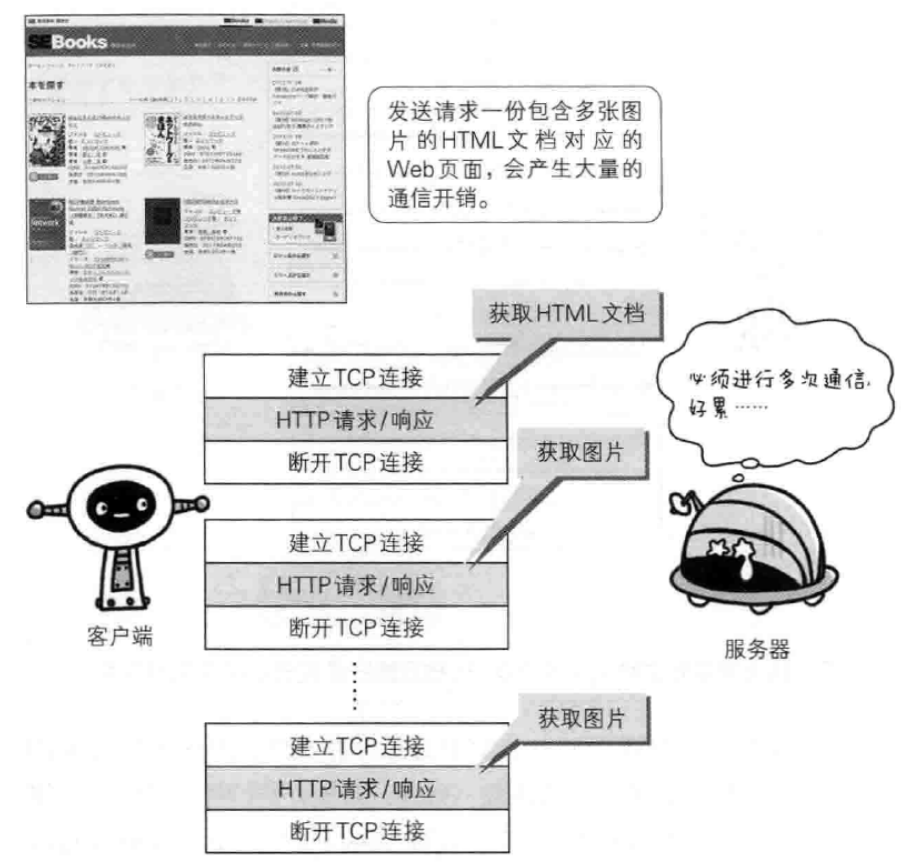

# HTTP 长连接

## 短连接

HTTP 协议的初始版本中，每进⾏⼀次 HTTP 通信就要断开⼀次 TCP 连接。


以早期的通信情况来说，因为都是些容量很⼩的⽂本传输，所以即使这样也没有多⼤问题。但是随着 HTTP 的⼤量普及，⽂档中包含⼤量富⽂本（图⽚、视频等资源）的情况多了起来。

⽐如，使⽤浏览器浏览⼀个包含多张图⽚的 HTMl ⻚⾯时，在发送请求访问 HTMl ⻚⾯资源的同时，也会请求该 HTML ⻚⾯包含的其它资源。因此，每次的请求都会造成⽆谓的 TCP 连接建⽴和断开，增加通信录的开销。



为了解决这个问题，有些浏览器在请求时，⽤了⼀个⾮标准的 Connection 字段。

```txt
Connection: keep-alive
```

这个字段要求服务器不要关闭 TCP 连接，以便其他请求复⽤。服务器同样回应这个字段。

```txt
Connection: keep-alive
```

⼀个可以复⽤的 TCP 连接就建⽴了，直到客户端或服务器主动关闭连接。但是，这不是标准字段，不同实现的⾏为可能不⼀致，因此不是根本的解决办法。

## ⻓连接

1997 年 1 ⽉，HTTP/1.1 版本发布，只⽐ 1.0 版本晚了半年。它进⼀步完善了 HTTP 协议，直到现在还是最流⾏的版本。

HTTP 1.1 版的最⼤变化，就是引⼊了持久连接（HTTP Persistent Connections），即 TCP 连接默认不关闭，可以被多个请求复⽤，不⽤声明 Connection: keep-alive 。


持久连接的好处在于减少了 TCP 连接的重复建⽴和断开所造成的额外开销，减轻了服务器端的负载。另外，减少开销的那部分时间，使 HTTP 请求和响应能够更早的结束，这样 Web ⻚⾯的显示速度也就相应提⾼了。

客户端和服务器发现对⽅⼀段时间没有活动，就可以主动关闭连接。不过，规范的做法是，客户端在最后⼀个请求时，发送 Connection: close ，明确要求服务器关闭 TCP 连接。

```txt
Connection: close
```

⽬前，对于同⼀个域名，⼤多数浏览器允许同时建⽴ 6 个持久连接。

## 管道机制

HTTP 1.1 版还引⼊了管道机制（pipelining），即在同⼀个 TCP 连接⾥⾯，客户端可以同时发送多个请求。这样就进⼀步改进了 HTTP 协议的效率。

从前发送请求后需等待并接收响应，才能发送下⼀个请求。管线化技术出现后，不⽤等待响应即可直接发送下⼀个请求。这样就能够做到同时并⾏发送多个请求，⽽不需要⼀个接⼀个的等待响应了，与挨个连接相⽐，⽤持久连接可以让请求更快结束。⽽管线化技术则⽐持久连接还要快。请求数越多，时间差就越明显。


举例来说，客户端需要请求两个资源。以前的做法是，在同⼀个 TCP 连接⾥⾯，先发送 A 请求，然后等待服务器做出回应，收到后再发出 B 请求。管道机制则是允许浏览器同时发出 A 请求和 B 请求，但是服务器还是按照顺序，先回应 A 请求，完成后再回应 B 请求。

## Content-Length 字段

⼀个 TCP 连接现在可以传送多个回应，势必就要有⼀种机制，区分数据包是属于哪⼀个回应的。这就是 Content-length 字段的作⽤，声明本次回应的数据⻓度。

```txt
Content-Length: 3495
```

上⾯代码告诉浏览器，本次回应的⻓度是 3495 个字节，后⾯的字节就属于下⼀个回应了。

在 1.0 版中， Content-Length 字段不是必需的，因为浏览器发现服务器关闭了 TCP 连接，就表明收到的数据包已经全了。

## 分块传输编码

使⽤ Content-Length 字段的前提条件是，服务器发送回应之前，必须知道回应的数据⻓度。

对于⼀些很耗时的动态操作来说，这意味着，服务器要等到所有操作完成，才能发送数据，显然这样的效率不⾼。更好的处理⽅法是，产⽣⼀块数据，就发送⼀块，采⽤“流模式”（stream）取代“缓存模式”（buffer）。

因此，1.1 版规定可以不使⽤ Content-Length 字段，⽽使⽤"分块传输编码"（chunked transferencoding）。只要请求或回应的头信息有 Transfer-Encoding 字段，就表明回应将由数量未定的数据块组成。

```txt
Transfer-Encoding: chunked
```

每个⾮空的数据块之前，会有⼀个 16 进制的数值，表示这个块的⻓度。最后是⼀个⼤⼩为 0 的块，就表示本次回应的数据发送完了。

```txt
HTTP/1.1 200 OK
Content-Type: text/plain
Transfer-Encoding: chunked

25
This is the data in the first chunk

1C
and this is the second one

3
con

8
sequence

0
```

## ⻓连接的缺点

虽然 HTTP 1.1 版允许复⽤ TCP 连接，但是同⼀个 TCP 连接⾥⾯，所有的数据通信是按次序进⾏的。服务器只有处理完⼀个回应，才会进⾏下⼀个回应。要是前⾯的回应特别慢，后⾯就会有许多请求排队等着。这称为"队头堵塞"（Head-of-line blocking）。

为了避免这个问题，只有两种⽅法：

- ⼀是减少请求数
- ⼆是同时多开持久连接

这导致了很多的⽹⻚优化技巧，⽐如合并脚本和样式表、将图⽚嵌⼊ CSS 代码、域名分⽚（domain sharding）等等。如果 HTTP 协议设计得更好⼀些，这些额外的⼯作是可以避免的
