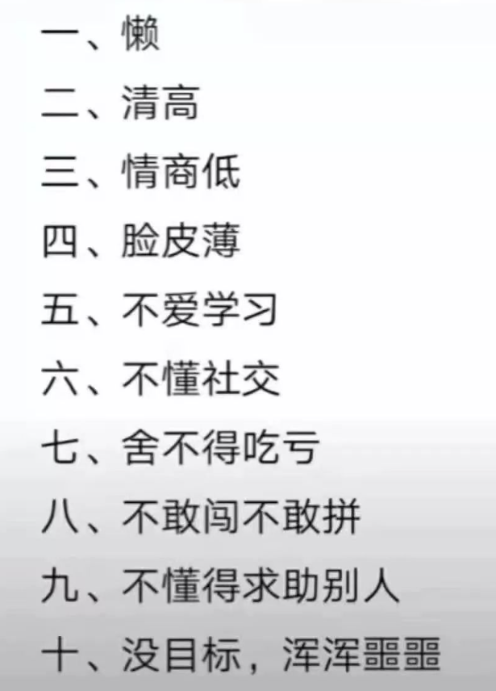

# 程序员的自我修养与高效学习方法

## 让所有程序员终生受益的一堂课

- 培养个人素养
- 选择篇
- 素养篇
- 视野篇
- **人会不自觉的站在自己的立场上说话**
- 要有自己的分辨力

## 选择很重要

人生选择可能很重要，一念之差也许就咫尺天涯。

### 编程语言的选择与特点

- C、Delphi（Pascal）、C#、JavaScript
- JAVA、Lua、PHP、Python、Go

### 给服务端开发者的语言建议

想入门选择  JAVA（C#）

语言的选择：

- 经典工业型语言
- 面对对象
- 虽然笨重，但严谨
- 工作机会多

学会 Java 之后，再学习其他语言很快，（Go 除外）

已入行服务端：一动一静
- PHP + Java
- Java + Python

### 给前端开发者的语言建议

已入行前端：JavaScript

学习一门服务端语言：

- Nodejs
- Python

### php 和 python 我选哪个？

国内、国外差距大
- PHP、Python、C#
- 实用为主

国内：受大厂影响

关于 PHP：
- 世界上最好的语言，却非常尴尬
- 不是初学者的首选语言
- 适合找工作，但 Java 范围更广

关于 Python：
- 如果你会 Python，你一定能找到工作
- 如果找不到，这说明你只会 Python
- 非常适合独立、自由、有情怀的开发者
- 一个语言，**覆盖除底层外的所有场景**

关于 C#：
- 用最好的语言，写最土的项目

找工作：
- Web 方向：前端、Java、PHP

### 选前端还是服务端？

**喜欢什么选什么**

找工作：
- 其实服务端成本较低
- 但是，前端工作需求量很大

前端：
- 需要有一定得审美能力
- 必须有极强的耐心
- 适合女孩子？

服务端：
- 有一定得大局观和架构能力

举棋不定，选择服务端：
- 前端可能变化快，但服务端稳定
- 服务端学习前端相对轻松
- 很多在前端的新模式，都来源于服务端思想
- 服务端编程思维更通用，更接近本质
- 前端会将大量的时间浪费在 UI 上

### 要不要成为全栈/前端有必要进阶服务端吗

什么是全栈？

前后分离，削弱了程序员的成长力

前端非常有必要进阶服务端：
- 10 年前，本身就没有前后之后，只是因为服务端多了数据库？

要不要成为全栈？
- 纵向前后，比横向扩展语言要划算
- 前端很容易原地打转
- 前端：学习一门服务端语言
- 服务端，学习一下JS、CSS 看兴趣

前端非常有必要进阶服务端：
- 前端进入工程化时间太短，发展路线不明确
- CTO、技术总监少有纯前端
- 掌握服务端，更容易统领全局
- **谁离数据更近，谁更有话语权**
- 前端主要负责人机交互，易受 UI 终端影响
- 服务端转型（机器学习、自然语言处理）更快速

**人要现实点，认清自己。吃饱饭是第一要务**

**踏踏实实，做好手头工作最重要**

## 给在校生的忠告

给在校学生的一点小建议。学生时代是一段极其珍贵的时光，且行且珍惜。

### 我是在校学生应该怎么确定发展方向？

在校学生的选择

- 985：目标只有一个没进入一线互联网公司
- 211：能进一线进一线，进不了，选择小而美的公司
- 普通高校：进一线难度较大
    - 薪资不是首要
    - 必须选择“有人用” 的产品
    - 优先选择互联网公司，不选择外包、传统软件

为什么

- 技术的提升，必须有复杂业务的驱动
- 没人用，或者要求不高，就无法提升技术

### 在校生一定要提前做的事情

- 985
    - 优先数学、英语、算法、数据结构
    - 高等数学、统计与概率论、线性代数
    - 复变函数、计算机原理
    - 重理论、轻业务、语言选 Java

- 211
    - 最好与 985 学习内容保持一致
    - 需要偏向一些业务、动手实践、做项目

- 普通高校
    - 最好与 985 学习内容保持一致
    - 额外：必须大量实践项目
    - 精力有限的前提下：轻理论，重点是做出成品高质量的项目

简单来说：把校招当社招，大学4年，起码要积累 2-3年的工作经验

### 什么时候跳槽，怎么选择互联网公司？

- **习惯是最可怕的杀猪刀**
- **环境可以湮灭一个优秀的人**
- **安逸可以磨灭一个人的上进心**

程序员
- 何时跳：技术陈旧、没有用户的公司、没有高要求的公司
- 多跳跳，不是坏事儿，但要更上一层楼
- 努力是一个基本条件

### 到底要不要考研

如果能考一所 985（最差211）的学校，考！

**做该做的事情**

人生很多的困境，都是因为适当的年龄，没有干适当的事情

大学是最后的梦境，珍惜时间，珍惜友谊

## 你还在做一个只会 coding 的程序员吗？

### 正确认识程序员这个职业！

薪水比其他行业略高

门槛低，好入门。不用什么积淀就能找到一份工作

很少有高光的时刻，所以女朋友难找

代码没有视觉冲击力，很难吸引人，也很难得到大众的赞许

这和画家、作家、音乐家的职业有天然的区别

技术变迁太快，很难有“打磨”和”沉淀“的感觉

甘于平淡，耐得住寂寞

### 程序员的价值到底是什么

- 赚钱 ===》 很现实
- **做出有人用的产品**

### 如何高效学习？

定计划、看书、看视频？

需要太强主观性的学习方式，都不是高效的方式

自控力不行，讲再多都是纸上谈兵，没什么用
- 比如看美剧学英语、背单词学英语

不要看太多方法论的东西

**被动驱动学习**：做一款高质量、业务复杂的产品；注重每一个细节，死磕项目

互联网到处都是优秀的项目，完全可以 1:1 实现

### 成就个人价值，不能只有硬实力，综合素养很重要！

程序员的自我修养

- 为什么它会这么多语言和框架？
- 为什么它效率这么高？
- 为什么同样的工作它薪水比我高一倍？

开源团队留下来的都是兴趣广泛的人

程序员是最容易胡适综合素质的群体

短期影响每个细小的选择和思维

当技术达到一定程度的时候，综合素质是瓶颈

综合素质包括：
- 交流能力、管理能力、认知能力、学习能力、任务规划能力等
- 软能力
- 以上能力，很难看一本书或者一个视频短期内解决
- 少盯着技术不放，少学习各种功能雷同的框架
- 多看书，文学、历史、小说、诗词皆可
- 人的自我意识会帮助你进化
- 有选择的看技术书
- 带有太强的目的性学习，反而不利于成长
- 培养一个兴趣：摄影、绘画、乐器、写作、书法

程序员的抽象能力和思维逻辑能力不错，但观察能力和审美较差

- 同编程一样，细节很重要、很重要
- 忽略细节，成长会很慢

编程不是为了考试，不要用上学考试的思维来学习编程

**以解决问题为目标**

少学习功能雷同的框架

要懂得舍弃，卖东西的都说自己的东西好，但这个好，对你来说可能没有意义

做一个有成就感的大项目，又能学习技术

## 关于优质书籍/职场忠告/技术视野/现代大型 web 架构

### 推荐一些优秀的图书

书单：
- 代码大全2
- JavaScript 高级编程
- 流程的 Python
- Java 核心技术 （Java编程思想）
- 算法图解

语言看书，框架看视频

- 黑客与画家
- 念楼学短 - 推荐
- 万历十五年
- 全球通识
- 浮生六记（最好看原版）
- 白夜行
- 百年孤独
- 少年得到

### 给初入职场的你一些忠告，这样做更好！

工作必须主动：

古人早就把人的职业进阶分成了七层: 奴、徒、工、匠、家、师、圣。

- 奴：非自愿和靠人监督的人
- 徒：能力不足，肯自愿学习的人
- 工：老老实实，按规矩做事的人
- 匠：精通一门技艺或手艺的人
- 师：掌握了规律，又能将其传授给他人的人
- 家：有固定的信念，让别人生活得更好的人
- 圣：精通事理，通达万物的人

这个世界绝大多数人，都要在「奴」的层次过一辈子，他们本职工作完全没有主观能动性，纯属为了养家糊口。不仅看不到职业的上升通道，思想上还毫无改变的意识，庸庸碌碌过完一生。

相比而言，「徒」是一个进步者，能意识到自己能力不足，去学习去改变，境况要好一些，假以时日会遇到改变的机会。

至于「工」，可以说世界的发展，离不开他们所做的一切。但对个人而言，如果满足于此，就只是维持而已，不会带来进更大步或改善，是被动的生存策略。

到了「匠」，也就是我们所说的专业人士了，他们对本职业务达到了精通，做出来的东西，普通人都能看出其质量，一般来说，这是普通人的职业天花板。

「师」相当于现在教授级的人，不但业务能力非常出色，还能长期不断地给其他人传授规律和知识。

而「家」，就是业内的顶尖人物，像企业家，画家、音乐家、作家，他们有自己的理念和思想，具有鲜明的个人特色。有固定的信念，推动社会进步，让社会变得更美好。

最后是「圣」，这是全人类极少数人的境界，不但在所属领域出类拔萃，无人能敌，前无古人，后难有来者，影响着一代又一代的人。

还要有高尚品格和极具睿智，有一颗高贵的不同凡响的心，具备常人难以抵达的善和超越。

**区别在哪？**

前四层：奴，徒，工，匠都是靠自己的体力成果赚钱生存。

后三层：师，家，圣，都是靠脑力来建立自己的影响力。

而后者所得成就和社会地位远远大于前三层。

体力和脑力，哪个更辛苦？

我们在新闻上常常看到某某创业者，企业高管，金融从业者猝死，却少有看到某某白领文员，某某工人干体力活累死的新闻，这说明了什么？

脑力劳动的压力远远大于体力劳动者的压力，体力工作者劳身不劳心，脑力工作者劳身更劳心。

**如何破局？**

知人者智，自知者明。知道自己的位置和想要抵达的高度才是有可能到达的第一步。

第二步，改变你的思维认知，向你更高阶层学习，输入他们的思维方式和信息源，看他们看的书，做的事，站在他们的角度格局思考。

第三部就是实际行动，做到以下几条，你就优于80%的同类了。

唯有战胜人性自身的弱势欲望方能有所成就，和人性反着来和普通人反着来你就对了。凡是让你爽的东西，一定也会让你痛苦。凡是你痛苦的必将使你强大。主动选择爽，你就会痛苦。主动选择痛苦，你就会爽。每一种结果都是你不停选择的因。

**从职场的角度来看，主动工作的人永远最受青睐**

不要玻璃心：坚韧一些，大部分的批评都是善意的

**提问**：
- 如何提问很重要，不仅关系到能否得到解答
- 提问更能折射出一个人的素养，影响很大

**能够自己解决的问题，绝不麻烦别人，是职场的铁定律**

尤其是编程，80% 的问题都能够通过调试解决，19% 的问题能够通过搜索解决，只有 1% 的问题是真正可能需要提问的

编程，必须学会自我解决问题。不能自我解决，永远学不会编程

怎么培养自己的编程思维？自我解决问题

编程提升速度最快的方式就是自我解决问题，寻找答案的思考过程

我就是解决不了，咋办?
- 依赖心里太强，没有逼自己，又不是造火箭大炮？

好的问题是答者和问者共同构建的

前因后果，有理有据，逻辑清晰，描述正确

提问是一个人综合素质的体现

### 关于开源项目 Lin ui 和 Lin cms

- https://github.com/TaleLin

Serverless 是更进一步的云

- IaaS  基础设施即服务
- PaaS  平台即服务
- SasS  软件即服务
- FaaS  功能即服务

亚马逊 AWS

很早就有了，LeanCloud

Serverless 适合微服务

目前不适合整站 Serverless

### Serverless 与云开发

做 Web 的必须有一个完整的视野

### 关于现代 Web 架构

云开发是特定场景下的 Serverless

云开发因小程序而引起重视

云开发：
- 统一集成开发环境
- 省去运维、部署等麻烦事儿
