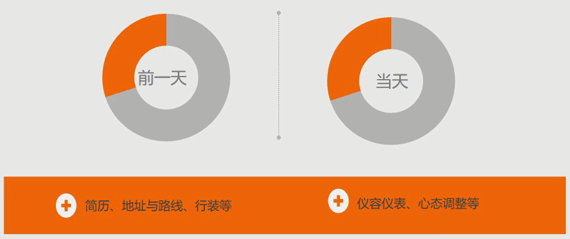
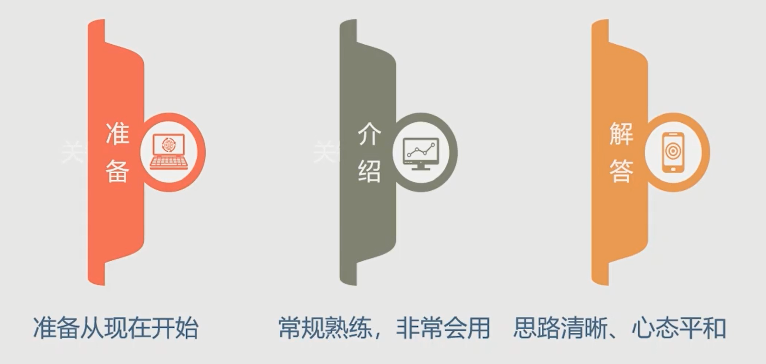

# 程序员必备简历面试指导

## 职场规划篇 - 如何做一份不后悔的职业规划？

1. 如何做职业规划
2. 公司的选择
3. 跳槽、转岗、转行

带着问题：
- 我为什么找不到工作呢？
- 什么样的工作适合我呀？
- 我怎么找不到合适的人呢
- 随便先找份工作干着吧
- 干的不高兴了，"爷"不伺候了

### 共性问题

- Future ？
    - 敢问路在何方？

### 分类

### 影响因素

知彼：

知己：

- 目标取向、能力取向

### 原则

### SMART 原则

### SWTO

发挥优势，克服劣势，利用机会，避免威胁 ---- 趋利避害

### 制定与实施

### 总结与管理

## 职场规划篇 - 如何选择一家适合自己的公司？

## 职场规划篇 - 跳槽、转岗、转行的准备与时机？

## 简历篇 - 关于简历必须要知道的真相

1. 需要知道的真相
2. 简历构成
3. 投递简历

### 需要知道的真相

- 认知的误区
- 我们需要准备几份简历？
- 简历的前世今生

误区：
- 模板
- 盲从
- 五颜六色
- Copy
- 繁琐

我们需要准备几份简历？

- 按使用场景进行分类
    - 网络  -  各大网站的简历
    - 纸质简历 - HR 面试时的简历
- 岗位的特殊性

简历的前世今生
- 简历呈现
    - 自我分析
    - 目标确立
- 原则：诚实守信、实事求是、适度包装（把亮点更好的描述出来）

## 简历篇 - 标题、基础信息、求职目标的正确填写

分解：
- 标题（抬头）
- 基础信息
- 求职岗位

## 简历篇 - 自我评价其实是关键

一般 100 字以内

从事本岗位 3 年时间，我参与哪类哪类项目的开发，在这类项目的开发中主要应用了那些核心技术，目前已交付的项目有几个，已上线的项目有几个，项目是企业外包的还是自我产品研发的，这些项目为产品带来了那些效益，比如为线上带了引流。如果是外包则可以描述得到了客户的高度认可，接下来将开发2.x 版本。

不要直接描述自我能力好，这个需要体现出来，直观的带出来即可。

简历是一个自述的文章，里面则是自己的履历。

## 简历篇 - 工作经验、项目经验、专业技能的亮点

工作经验：
- 先写最近的工作

岗位职责：负责哪块的工作，工作内容主要的12345

项目经验：
- 项目名称及开发时间段
- 采用了那些技术
- 自己在岗位中处于什么样的职务
- 在不违规的情况下，把链接放在简历中（若违规，则不写或用同类型的代替）
- 为什么要开发这个项目，这个项目的立足点是什么，为什么做这个事情，你负责那个模块的开发，使用了那些技术
- 项目中收获

专业技能：
- 精炼专一，而不是大而全
- 主攻的那一部分
- 精通、熟练、了解等词要考量更准确，要有一定的选择

## 简历篇 - 用教育背景、荣誉、成绩秀一下自己

普通人写毕业学校及专业即可

## 简历篇 - 简历的附加信息与简历模板

一般情况不要添加附件

简历没有固定的格式，但是有固定的要求和突出点

## 简历篇 - HR揭秘简历投递的绝对机密

简历投递：
- 时间
- 群发
- 每日数量

## 面试篇

1. 面试前准备
2. 自我介绍
3. 面试技巧

面试前准备
- 长期准备：就业准备
    - 行业信息与资讯
    - 自我分析
    - 知识、技术储备
    - 综合能力提升
- 短期准备

前一天：简历微调，项目经验和第二天的岗位做一个匹配，突出主打项目

当天：提前15-30分钟到达，上个卫生间、整理下着装造型

## 自我介绍

常规自我介绍：

我叫什么名字，今年多大了，毕业于什么院校什么专业；从事某个行业多少年，先后就职于什么样的单位，从事什么样的岗位，取得了那些成绩，因此今天应聘什么岗位。

从几几年到几几年在某某公司某某公司从事什么工作，工作岗位是什么，主要的核心内容是什么，在这个过程中参与了多少个项目的开发，开发的项目涉及了什么种类，这些项目是否已经交付，交付了多少，现在市场的体验是什么样的，取得了那些成就。

特殊：

## 面试技巧 - 如何回答面试中的一些问题

状态：面不改色，心不跳

