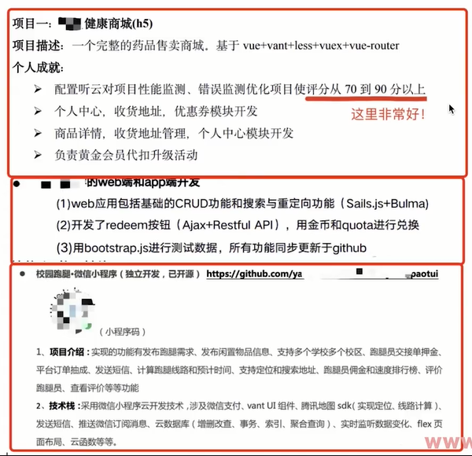
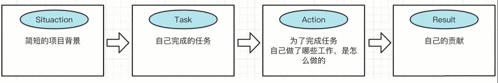
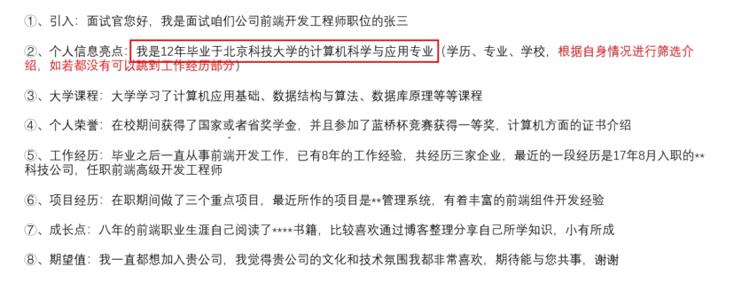

# 前端简历怎么写

## 简历是什么？

找工作之前投递的个人信息和工作能力———这是不全面的

应该是：个人当前阶段的价值观

前者是：我能卖多少钱；后者：我现在值多少钱

## 什么时候准备，怎么准备

半年总结或则一年总的的时候，可以写出来。个人价值总结的形式

**面试是需要刻意准备和精心准备的。**

公司内部晋升答辩，需要精心准备

面试、简历，同样需要精心准备，才能有望达到100%的效果

工作是人生大事，精心准备！

## 内容

- 面试官是怎么分析简历的
- 简历模板和内容
- 个人信息
- 教育经历
- 专业技能
- 工作经历
- 项目经历
- 提现自己的亮点
- 注意：不要造假

## 面试官如何分析 一份简历-知己知彼百战不殆

分析过程：
- 看技术栈和项目经历，是否匹配当前工作？
- 工作年限和技能是否匹配？
- 如果有博客或者开源，则点开看一下，内容是否有价值
- 一目十行，寻找亮点
- 如找到亮点，则再详细看看简历
- 根据工作年限，准备面试题

写简历的原则：
- 把自己当做普通人，有亮点展示出来，不要等着别人发掘
- 技术栈尽量写全面，但不要浮夸
- 技术能力要匹配工作年限（不要：简历随便写写，面试时再说）

## 简历模板-简历应该包含哪些内容

下载和创建：
- 可以网上搜索、下载简历模板
- 可以自己用 word 创建
- 简历不要过于花哨，白纸黑字，简洁明了

模块和顺序：
- 个人信息
- 教育经历
- 专业技能
- 工作经历
- 项目经历
- 自我评价

"自我评价"要不要写？
- 如果仅仅是空话，那就不要写了
- 如果有实际的内容印证，那就写上
- 和工作无关的信息（如兴趣爱好）不要写

    ```
    热爱学习，看过 xx 本技术书籍，最近正在看 <xxx>
    热爱分享，曾在公司组织过 xx 分享，最近的主题是 xxx
    ```

简历要写几页：
- 应届生或者三年内工作经验：1-2页
- 3年以上工作经验：2-3 页
- 不要刻意压缩，一页密密麻麻的不好阅读

注意事项：
- 错别字，英文单词拼写，首字母大小写
- 投递简历用 pdf 格式，可命名为<前端工程师简历-姓名.pdf>
- 去面试时，打印几份简历带着

## 个人信息-不要暴露太多个人隐私

个人信息-不要写太多

必要信息：
- 姓名
- 性别
- 手机号
- 邮箱

非必要信息：
- 照片
- 年龄
- 博客、开源

不要写：
- 婚姻状态
- 期望薪资
- 名族、政治面貌

## 教育经历 - 专科能进大厂吗

必要信息：
- 学校（入学和毕业时间）
- 学历
- 专业

加分项
- 获奖（如软件大赛、学校奖学金）
- 证书（软考、PMP）
- 英语（6级及以上）

专科能进大厂吗？

- 可以
- 要有亮点、有技能
- `今早让你的工作成绩覆盖你的学历`

## 专业技能-面试需要必备哪些专业技能？

条目清晰
- 每项技能独占一行，写全面，写丰富
- 不要混乱，不要重复
- 不要写的太基础，如 git svn vscode ，这些不用写

熟练程度的表达
- 了解：看过文档，做过demo，了解不是很深
- 熟悉：已经用过很熟练，知道是怎么用的，可以用来做一些工作
- 精通（慎用）：既能熟练应用又知道内部的原理，甚至看过源码

```
熟悉计算机基础，熟悉基本的数据结构和算法，了解常用的设计模式；
熟悉前端基础知识 HTML、CSS、JavaScript、ES6，了解 TypeScript，熟悉 HTTP 协议；
熟悉 Vue2、Vue3 及其周边 Vuex、Vue-router、ElementUI、VantUI 等，了解 Vue 原理；
熟悉 Webpack、babel 常用配置，了解 gitlab CI/CD 配置；
了解 React，了解 nodejs；
```

面试必备专业技能:
- 数据结构和算法（尤其大厂）
- 前端基础知识 HTML CSS JS（特别是 JS，知识点非常多）
- 前端框架 Vue React 的应用和原理

## 专业技能-如何快速全面学习专业技能

快速学习成长的统一套路
- 找到知识体系范围和重点
- 刻意训练
- 及时反馈

如何快速补充专业技能
- 自学
- 跟老师学

## 工作经历-程序员不仅仅是写代码的

应届生最好有实习经历

必要信息：
- 公司（入职和离职时间）
- 角色
- 职责

关于职责：
- 沟通评审需求
- 项目管理
- 技术方案设计评审
- Code Review
- 组织学习和分享
- 带团队、带实习生

```
公司1
时间: xxx-xxx
角色：前端工程师
职责：和 PM 沟通需求，新功能的技术方案设计；前端代码开发；配合 QA 测试；线上监控修复 bug

公司2
```

## 项目经历-使用 STAR 模型全面展示

项目经历不是流水账，而是要证明专业技能

工作经历就像讲故事 - 《演讲的力量》
- 时间、地点、人物
- 有剧情、有冲突、有关键的细节
- 有意义的结局

反例：


STAR 模型



```
项目1
项目介绍：
    药品售卖商城。用户可以购买药品并快速配送到家，还有各种营销策略。包括 PC 和 H5。活跃用户30w+，日均PV300w+。
技术栈
    框架：Vue + Vue-router + ELementUI + VantUI
    构建：Webpack + babel
    测试：jest + cypress
    CI/CD: gitlab CI + jenkins + 阿里云
    统计和监控： Arms
    项目管理：teambation + jira
工作和成就：
    负责统计项目性能检测，错误监控。将项目评分从70 分提升到 90 分。
    负责个人中心、收货地址、优惠券开发、带领 2 人，一个月从 0 设计、开发、测试并发布，无延期。
    参与商品详情页开发。期间分析页面代码，抽离出 10 个公共组件。

项目2
```

注意事项：
- 项目名称不要写"防xxx"
- 简历中的项目不要超过 3 个，能体现技能即可。
- 应届生没有项目经历，可以写课程设计或者毕业设计的项目

## 发掘你的亮点

误解：
- 技术牛人不需要亮点，有个人成就
- 普通程序员没有个人成就，就需要发掘亮点
- 亮点就在日常工作中

发掘亮点：
- 个人信息：有质量的博客、开源作品
- 自我评价：能真正体现出自己的学习热情和能力
- 教育经历：证书、获奖、英语
- 专业技能：技术栈全面，有深度、有广度
- 工作经历：除了开发之外的其他能力，复合型人才
- 项目经历：体现出自己的工作成绩

注意事项：
- 亮点起作用的前提：基本技能过关 + 和当前职位匹配
- 技术栈归于单一（只会用 Vue）这是一个短板
- 有些需要日常积累

## 总结

- 简历需要精心准备
- 亮点需要刻意挖掘
- 不要造假

简历内容：
- 个人信息
- 教育经历
- 专业技能
- 工作经历
- 项目经历
- 自我评价


