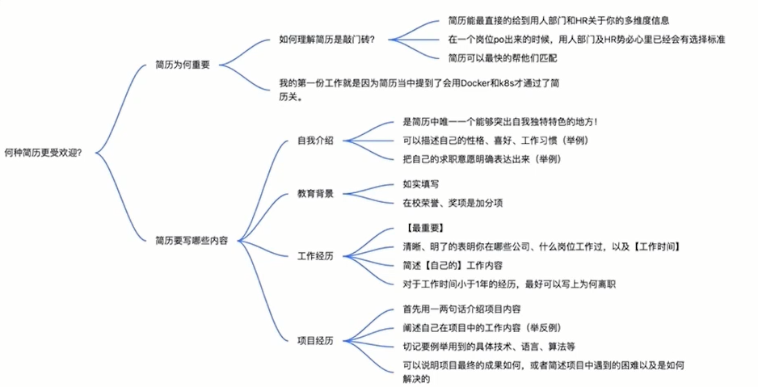

# 如何拿捏技术面试

## 优质的简历是求职的敲门砖

怎样的简历更受面试官欢迎
- 何种简历更受欢迎
- 面试官筛选简历的准则

何种简历更受欢迎
- 简历为何很重要
    - 简历是求职的敲门砖
    - 简历可以最直接的给用人部门和 HR 关于你的多维度信息
- 用人部门依靠简历快速匹配、筛选
- 我们是如何筛选岗位的

    

## 优质简历之自我介绍与教育背景撰写技巧

何种简历更受欢迎

简历需要写什么内容
- 自我介绍
- 教育经历
- 工作经历
- 项目经历

自我介绍
- 简历中唯一可以突破自我特点的地方
- 可以描述自己的性格、喜好、工作习惯等

示例：

写代码，搭架构，搞基建。

业务敏感，自我驱动，具备产品与团队从0到1的能力与经验，对世界充满好奇。

毕业之后一直多前端，一直抱着追赶者的心态去工作和学习。 
`在工作中积极思考，通过学习来反育工作`，对主流&新技术比较感兴趣，也研究过一些工具和框架生态圈的实现原理，并记录在 github。 
`工作高效好相处，态度良好不内卷`。

教育经历
- 如实填写
- 在校荣誉、比赛奖项是加分项

## 优质简历之工作经历与项目经历撰写技巧

工作经历
- 对绝大部分求职者而言是简历中最重要的部分
- 简单明了的阐述在那些公司，什么岗位工作过，以及工作时间
- 简述在每段经历中自己的工作内容
- 如有小于1年的经历，最好写上离职原因

项目经历
- 只写和求职意愿岗位相关的项目经历
- 用一两句话`介绍项目内容`，并**阐述自己的工作内容**
- 切记要举**具体用到的语言、技术、算法等**
- 说明项目最终的成功如何，或者阐述项目中遇到的困难以及是如何解决的

## 面试官筛选简历的准则

自我介绍
- 求职意愿是否与公司、岗位匹配
- 性格、工作方式是否与团队融合
- 有无突出成就或者加分经历

期望薪资
- 面试官或 HR 优先看的部分
- 过高或过低都不合适
- 结合自身期望和行业水平填写

教育背景
- 筛选学校+专业
- 如果是外省市或者国外大学，最好标注学校综合排名

工作经历
- 首先最关系有无相似公司、相似岗位的经历
- 其次是工作时间和具体工作内容

项目经历
- 项目中的技术栈、能力栈是否和岗位匹配
- 项目的难度及工作量是否和岗位匹配

加分项
- 开源项目经历
- 竞赛经历

## 怎样与面试官高效的沟通

面试官更青睐怎么样的候选者？
- 怎样与面试官高效的沟通？
- 面试官如何判断候选者的优劣
- 如何介绍过往经历
- 让自己多思考"二阶问题"

怎样与面试官高效的沟通？
- `沟通能力十分重要`
    - 面试官也是普通人，倾向于有良好沟通能力的候选者
    - 在工作中，表现为推进和解决问题的能力
    - Senior Engineer VS Junior Engineer
- 怎么算沟通能力好
    - 能抓住重点
    - 不饶弯子、避免答非所问、可做适当的扩展
- 如何提高面试时沟通能力
    - 找身边的家人、朋友，给他们介绍自己的工作
    - 力求简介、直白

示例: 个人介绍
- 两方面：管理+开发
- 管理：分配、协调技术团队资源，完成公司的开发任务，并对团队进行考核。
- 开发：复杂产品中推荐系统的架构，包括考虑使用那些数据，以及用什么样的数学模型建模，从而完成千人千面的推荐系统。

## 面试官如何判断候选者得优劣 

- 为何要有当面（电话）沟通，而不是直接做题
- 性格
- 思考问题的思路是否清晰
- 过往经历是否真实、有何亮点
- 抗压能力

问题：
- 你相对其他人有何优势？
    - 学习能力强、吃苦耐劳、容易跟同事打成一片、性格很好
    - 考察思路是否清晰，能否快速找到自己的优势并加以论证
- 为什么对我们公司感兴趣？
    - 看看你对公司了不了解，贵公司的产品很好，发展潜力很大
    - 论证，实例+观点
- 在工作中你是个什么样的人？

##  如何向面试官展示“抗压能力”

- 最近这些年被考察的越来越多
- 对候选者所有的回答表现的都很消极
- 明显表达对候选者的某方面的不满
- 以比较高压的姿态挑战候选者的专业能力

## 如何快速提高沟通能力

- 多面试，在面试喜欢的公司前多找几家练手
- 思维导图训练自己的逻辑性和对问题的拆解能力

## 介绍过往经历时面试官看重什么

- 对自己宣称用过的技术、算法是否真的掌握
- 希望看到面试者解决问题的能力
- 可以突出介绍自己的成长经历

## 让自己多思考“二阶”问题 

- 何为“二阶”问题 
- 不要为现在是几点、而去想什么是时间？
- 不要问怎么赚钱、而是思考什么是财富？

**知其然，更知知其所以然**
- 为何选择了这个技术，而不是其他的？
- A方法相对于B有何优点？又有何缺点呢？
- 你的思考、决策过程是怎样的？

## 技术轮面试究竟在考察什么？

- 技术面试相对而言有何不同
- 为何越来越多的面试官喜欢考察基础算法
- 面试官在技术面试中考察的重点是什么
- 算法考题

技术面试相对而言有何不同
- 技术面试者是相对幸运的
    - 容易考察专业能力
    - 针对性强
    - 候选者也较容易做响应准备

## 为什么技术面试喜欢考察算法

- 筛选出学习能力强并且聪明的候选者
- 算法面试更加标准化

## 面试官在技术面试中看中什么

- **代码实践能力**
    - 对于应该熟练掌握的语言，是否能不依赖 IDE 进行编码
    - 能否对所需的数据、逻辑进行有效的代码抽象
- **算法能力**
    - 对于给出的问题能否快速找出合适的算法
    - 算法的时间、空间复杂度能否计算正常
    - 正确实现算法
    - leetcode 按分类来训练
- **对同一问题是否能有多种思路**
    - 往往一个问题不止一种做法
    - 能否找出多种实现方法
    - 并说出各自的优缺点（二阶问题）

## 举栗子

给定一个数组，找出其中位数
- 就题目中不清楚的点与面试官进行沟通
- 数组中元素的数据类型？
- 数组是否存在重复元素？
- 数组的规模？

变种：给定一个存在重复元素的 int 类型数组，找出其中中位数。数据规模 n < 1,000,000

实现之前：
- 几种思路
- 各自的时间复杂度？
- 时间复杂度优秀的做法一定好吗？

实现之后：
- 测试
- 尽可能全面的覆盖各种测试用例
- 最大、最小数据规模，奇数、偶数个元素
