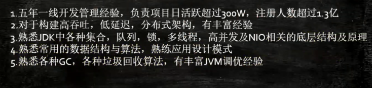
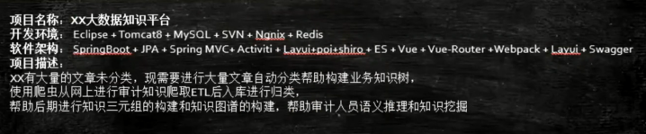

# 面试指导

## 招聘职位解析及错误简历类型

简历书写：
- 一对一简历
- 通用性简历

## 面试问题解决

为什么**`面试造火箭，入职拧螺丝`**
- 人太多要筛选
- 原理性的东西让人更好的运用工具和知识

## 怎样找到工作

怎么样才能找到工作
- 找工作机会
- 发简历
- 笔试/面试
- HR 面试
- 入职
- 稳定3个月以上

拿不到面试机会怎么办？怎样才能拿到面试机会？
- 面试机会和你自己的技能 --- 无关
- 写简历 投简历 --- 要敢
- 简历应该持续建设
- 简历应该看人下菜碟

面试不过心里难过，感觉人生晦暗严重受挫
- 要做打不死的小强

投简历的时间：
- 上午 9 点左右
- 下午 1.30 左右
- 打招呼：boss
- 投邮箱: 标题（言简意赅）

穿着：
- 阳光大男孩
- 活泼小姑娘
- 干净整洁
- `管理好你自己的个人形象，管理好你自己的身材。胖子没前途` - 多25-50%的机会
- 自信：眼神坚定

时间：提前 5-10 分钟到就行了

## 简历个人概况

- 姓名
- 性别
- 电子邮件
- 毕业院校
- 学历
- 专业
- 毕业时间

## 简历求职意向

- 工作性质：全职
- 目标职位：Java 开发专家
- 目标地点：北京

## 简历技能描述

加分项：
- 个人博客
- Git 源码

## 简历个人评价

技术崇拜，能够抗压，喜欢阅读框架源码，研究算法和数据结构，喜欢研究较为底层的技术

个人经历：
- 获奖
- 培训（PMP 开发  敏捷）
- 证书

## 简历工作经历

- 建议不要写离职原因
- 时间逆序

## 简历项目经历

专业名词：QPS TPS 日活量

TDD、DDD

## 入职裁员人事法律

- 入职：离职证明、学历证书
    - 试用期：3-6个月 降薪
- 裁员
    - 赔付：N+1（当月满薪 + N 月补贴）
- 人事
    - 劳动合同格式文本，工资的构成
    - 销售：底薪、提成、全勤补助、补助、老员工奖
    - 公积金、养老保险、医疗保险
    - 公司付出：公司多出工资 30% 左右
- 法律
    - 证据（银行的流水工资条 转账的证明）
    - 劳动局举报

## 面试官对于你还有什么问题问我的回答

我这边没什么问题了，你有什么问题问我的？

- 技术面试：有戏
    - 问问业务线，招人的组主要用到那些技术栈（做足功课，了解公司，从事的业务，人员规模）
    - 录音：回听一下，总结反思
- HR：大概率有戏，有的是形式
    - 是不是加班很严重，会不会加班，有没有饭补，有没有各种补助，我到手能拿多少钱，年终奖发多少（这些全都不能问）
    - 正常的保险公积金（晋升机会HR不清楚，问所在部门）
    - 3个月半年的空档期，帮朋友创业了
    - 正常的上下班时间
    - 无关痛痒的问题都可以问

## 谈薪资

- 简历明确的写了：手头有工作，寻找更好的工作
    - 年薪30W（税后）
- 写的是一个范围
    - 期望：20-30k
    - 不建议写一个范围
- 简历没写
    - 招聘岗位上会写岗位薪水
    - 直接定，愿不愿意接受
    - 要你自己定，根据面试效果
    - 按下线给，企业对人才的认识不到位
- 上家工资的薪水：
    - 15k -> 30k(背调)
    - 一半涨 30%-50%
    - 打流水
    - 公司避税：提供发票给补助
    - 现金
    - 公司提供住房，住公司宿舍，吃饭不要钱
    - 背调：学历，工作经历

创业：不仅做好技术，更重要的是做好市场、关系，才有可能做成功

年终奖：
- 0-6 年终奖
- 证据：口头允诺录音

## 面试相关技巧

举例 + 画图

表现自己不是考试

排序
1. 判断参数
2. 注释
3. 有没有更牛的写法（多线程）
4. 想法写上

## 你的理想、你的职业规划

- 你的理想、你的职业规划
    - 钱多活少离家近

- 你有什么优缺点
    - 优点：刻苦坚持学习、能力还不错，打交道合群
    - 缺点
        - 自尊心过强、意志力不够坚定（容易听人劝）
        - 不擅长和业务人员沟通，但是现在在改进

其他：
- 不辞活儿
- 站在老板角度

## 面试问题解决

HR问想找一个什么样的工作或者对新的工作有什么样的要求
- 专心致志的做技术，不要做技术之外的（客服、售后）
- 能不能和我的知识匹配上，能够有一些挑战，能够让我学到更多的知识，来让我自己成长，也能为公司做贡献

入职时间
- 一周以后
- 先离职，后面有什么事也可以解决，不要闹掰

整个部门被裁
- 先说主动离职，抗不过去再说部门被裁

公司经验不善，发不出工资了，但是技术团队还是不错的，处于个人考虑

内推
- 可以尽快的拿到面试机会和录取机会

