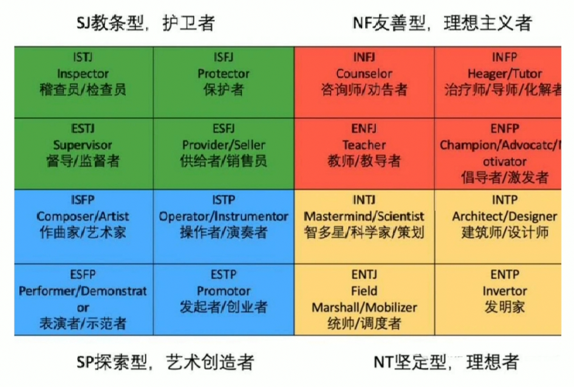
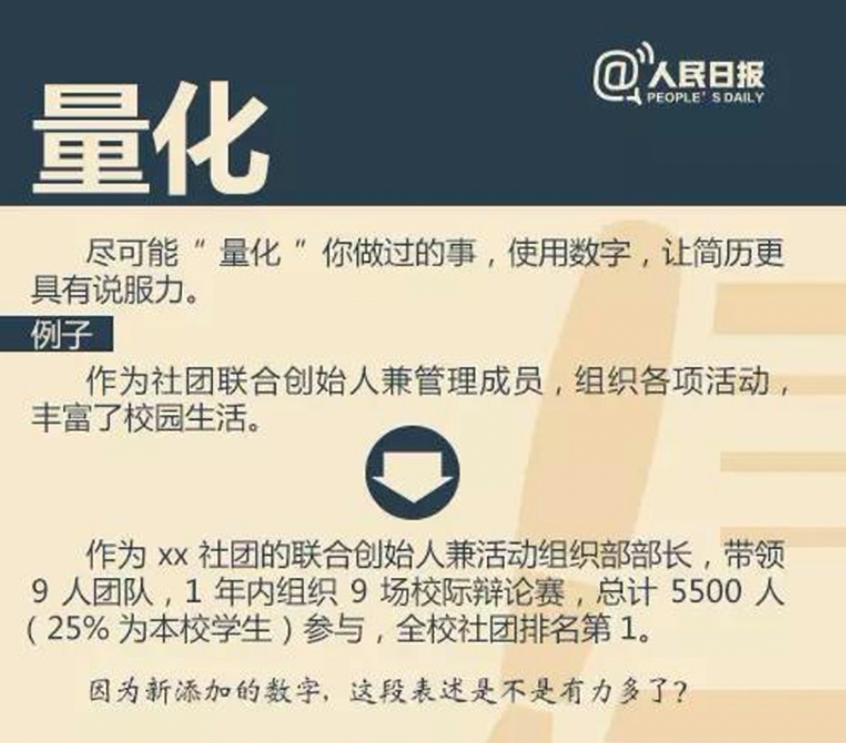
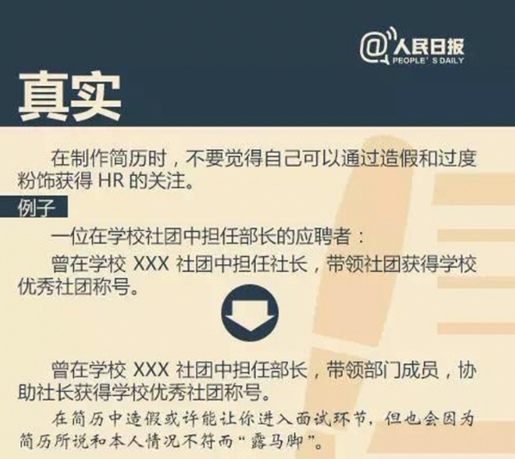
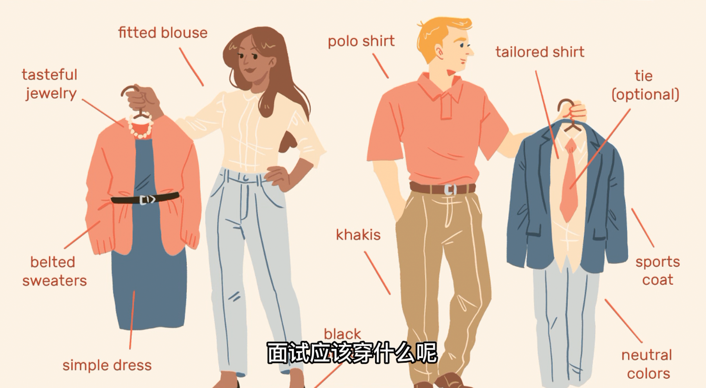

# 职场秘籍

<!-- 
## 介绍

第一阶段：寻找方向
- 第一课：作为普通人，是不是真的有所谓命中注定的好工作？
- 第二课：从竞争中脱颖而出，我的优势在哪里？
- 第三课：隔行如隔山，要如何踏出翻越大山第一步？
- 第四课：为什么说阅人无数，也不如名师指路？
- 第五课：这行业都说我能有发展，那我到底能不能有发展？

第二阶段：目标钻研
- 第一课：加入大公司，是不是真的背靠大树好乘凉？
- 第二课：加入创业型公司，是不是真的三十岁退休指日可待？
- 第三课：公司不大也不融资，是不是就没啥做头了？
- 第四课：为什么我们总说，要靠近公司的核心业务？
- 第五课：什么公司都需要也不都很需要的职位，前途在哪里？

第三阶段：简历面试
- 第一课：什么样的简历，至少让企业能看下去？
- 第二课：只有一页的简历，放些什么好？
- 第三课：同样一件事情，为什么有的人写得平平无奇，有的人写得波澜壮阔？
- 第四课：群体面试，我要怎么才能脱颖而出？
- 第五课： 1v1 面试，我要怎么和面试官谈笑风生？

第四阶段：成长方案
- 第一课：硬学历背景不理想，我未来还有机会吗？
- 第二课：想换专业换领域，没有工作经验怎么办？
- 第三课：都说软实力很重要，可软实力到底怎么提升？
- 第四课：总说中国是个人情社会，可这人情要怎么有怎么用呢？
- 第五课：为什么说中年失业，足够權毀一个人？
 -->

## 问：什么时候该开始准备换工作了？

为什么总容易延误机会？
- 学婊横行
- 计划太远
- 生活没规划

当你觉得你想要的东西已经给不了，就准备开始找工作吧

具体：
- 钱
- 权
- 知识

重要时间点：
- 金三银四
- 金九银十

为什么不容易实现跃升？
- 厌恶损失
- 担忧末来
- 自我认知不清

**想要换工作，首先要先不怕换工作**

思考：
- 目前的工作能不能给你带来技能提升？
    - 专业技能、项目经验、人脉关系
- 你每天工作开心嘛？
    - 激动上班还是抗拒上班
- 公司里有没有你想成为的人？
    - 财富、权力、知识
- 你离公司的核心业务近吗？
    - 你们公司是干什么的，在这件事中你有没有不可替代的作用

## 第一阶段

### 第一课：作为普通人，是不是真的有所谓命中注定的好工作？

斩掉所有的路，找到真正的路

人不可能什么都有，工作也不可能什么都做，也不可能什么工作你都做的出类拔萃

只有适合的工作，才有可能获得足够的快乐，也因此才能做出成绩

心态分析
- 其实，你不懂你自己
- 损失厌恶：只能选一条路
- 损失厌恶：放弃就是一无所有

需要做到
- 摆正心态，不迷信
- 选埄你在一份职业中最看重的三样东西
- 在推荐的领域＋职位中选择三个你最认可的

理想工作的三个方向：
1. 需要有明确的任务目标
2. 公司我希望规章制度清晰
3. 大部分时间和情绪稳定讲道理的人共事

### 第二课：从竞争中脱颖而出，我的优势在哪里？

心态分析
- 缺乏成长主线
- 缺乏阶段性总结
- 缺乏快速了解大部分行业和职业的方法

技巧：
- 找到优势，要掌握一个原则：**稀缺**

需要：
- 深挖专业背景
- 回忆高光时刻
- 请教亲友意见

人的精力是有限的，认知资源也是有限的

### 第三课：隔行如隔山，要如何踏出翻越大山第一步？

要打破隔行如隔山的境界，可以采取以下几种方法：

1. 多元化学习：不仅要学习自己所在领域的知识，还要学习其他领域的知识，了解其他行业的发展趋势和创新思路，从而拓宽自己的视野。
2. 多元化交流：与不同领域的人交流，了解他们的工作和思维方式，从中汲取灵感和启示，发现不同领域之间的联系和相互影响。
3. 跨界合作：与其他行业的人合作，共同探索新的领域和新的商业模式，创造出更多的价值。
4. 创新思维：在思考问题和解决问题的过程中，要运用创新思维，打破传统的思维模式和行业惯性，寻找新的解决方案和商业模式。

总之，要打破隔行如隔山的境界，需要不断拓宽自己的视野，积极交流和合作，运用创新思维，不断探索新的领域和商业模式。

### 第四课：为什么说阅人无数，也不如名师指路？

在进入一个新的行业之前，一定一定找业内的人聊一聊

心态分析：
- 网络信息真实性良莠不齐
- 网络信息与个人情況不符
- 某信息无法通过网络传播

上哪儿找
- 亲戚朋友
- 校友网络
- 相关课程

怎么聊呢？
1. 准备好访谈提纲：核心问题或者核心忧虑
2. 当前状态
3. 过往经历
4. 性格相似度

### 第五课：这行业都说我能有发展，那我到底能不能有发展？

面对一家，听起来或者说看起来还不错的公司，然后有一个看起来也还行的岗位，但是薪资、成长、环境、文化都让你非常的不满意。这个时候就该思考到底要不要离职呢

不狠心，最好的两年白费

MVP思维：
- 工作内容MVP
- 工作节奏MVP

## 第二阶段：目标钻研

### 第一课：加入大公司，是不是真的背靠大树好乘凉？

优点：
- 优点一：铁饭碗
- 优点二：福利多
- 优点三：压力小

缺点：
- 缺点一：晉升慢
- 缺点二：人际复杂
- 缺点三：体系依赖强

找到信息来源：集团官网/招聘网站/你认识的人
- 第一条：了解清楚组织架构
- 第二条：尽可量化你的隐藏福利
- 第三条：明确你的晋升途径

### 第二课：加入创业型公司，是不是真的三十岁退休指日可待？

创业公司分析
- 高回报：
    - 期权变现
    - 职级跃迁
    - 能力拓展
- 高风险：
    - 公司跑路
    - 末富先衰
    - 边缘游走

干货技巧
- 公司的融资轮次（天使轮/A轮/B轮/C轮/D轮）和融资计划
- 公司的创始人是谁，你和他合适不
- 仔细了解业务，排查风险

### 第三课：公司不大也不融资，是不是就没啥做头了？

中不溜型公司 --- 过渡，作为跳板

事态分析：
- 企业之间巨大差距
- 缺乏管理和晋升体系

千货技巧
- 在中型非创业型企业找好自己的定位

1. 了解这家公司具体的人
2. 发展硬技能，保证自己对职业选择的能力
3. 要给自己一个长程的规划，不要在每天的业务中迷失

长远而言
- 选一家管理明晰/上升路径清晰的大企业
- 或者有爆发增长的创业型企业为好

### 第四课：为什么我们总说，要靠近公司的核心业务？

工作岗位
- 业务型
- 功能型
- 综合型

什么叫核心业务呢？
- 一个是把产品做出来，一个是把这个产品卖出去。
- 产品本身质量和价值怎么样？
- 产品占公司营收百分比多少？

产品原则：
- 定义
- 设计
- 运营
- 硏发
- ...

### 第五课：什么公司都需要也不都很需要的职位，前途在哪里？

怎么办？
- 工作没意思
- 前途没发展
- 别人看不起

功能型职位特点：
- 使公司的业务部门得以流畅地运转
- 大多数情況下，无过优先于有功
- 常见岗位：
    - 法务
    - 财务
    - 税务

干货技巧
- 你要怎么证明自己和别人不一样的价值

怎么做？
1. 拿证书
2. 多了解其他晋升途径
3. 留底信息

## 第三阶段：简历面试

### 第一课：什么样的简历，至少让企业能看下去？

简历常见问题
- 太粗糙，未经雕琢
- 太多余，排版混乱
- 太冗长，缺乏意向

建议：
- 用 word，加对齐线；
- 不建议有花里胡哨的修饰；
- 不建议写和工作岗位无关的内容，也不建议出现任何主观判断的形容词
- 每一行问下去都可以和目标岗位产生联系
- 要做到任何人都能迅速的找到他想找到的信息

### 第二课：只有一页的简历，放些什么好？

简历常见问题
- 同质化，没有亮点
- 不改动，不合需求
- 乱堆砌，缺乏关联

干货技巧
- 深度挖掘建立素材，找到详细事例和故事
- 超额准备内容，分段打标签，按需修改
- 在个人经历中整理出合理主线

### 第三课：同样一件事情，为什么有的人写得平平无奇，有的人写得波澜壮阔？

额外加分的内容：
- 动机信
- 推荐信
- 执行方案

### 第四课：群体面试，我要怎么才能脱颖而出？

群体面试分两种:
- 聊天型
- 任务型

聊天型
- 珍惜每次发言机会
- 自由讨论务必发言
- 关注自己的小动作

任务型
- 抢上台发言的机会
- 主动组织
- 多做总结
- 团队协作

### 第五课： 1v1 面试，我要怎么和面试官谈笑风生？

面试常见误区
- 误以为面试会考很多抖机灵的问题
- 误以为考官笑了就是你答得好
- 把考官当上帝，什么都实话实说

原则向题
- 让面试官听到他想要听的内容
- 对简所要做到绝对的熟悉
- 体现出你对金钱或者成功的渴望

** 常见问题 **

关于薪资期望：
1. 我需要
2. 我值这个数（一定按这个答）

简单介绍一下你自己
- 我叫XXX，毕业于蓝旗营男子职业技术学校，挖掘机驾驶与养护专业，今天想面试贵公司活动策划这个职位，，谢谢。
- 建议准备1分钟版本、2分钟版本、5分钟版本；（每分钟大概400字

你最大的缺点是什么？
- 我最大的缺点是太过追求完美（这个答案是错误的，虚伪的
- 方法：直视自己的缺点，然后想办法改变他，且告诉对方你已经取得了一定的成果，但还是你的缺点

你为什么选择我们公司/这个职位？
- 我简历在网上随便投的。（❌
- 方法：对公司有定位，对自己有定位，对职位有定位（将自己的使命愿景价值观和公司匹配上时才对

在你 XX 经历中印象深刻的事儿是什么？

你离职的原因是什么/对上司的期待是什么/对同事的期待是什么？
- 实话实说就好，但是不要出现明确跟这家公司不合适的东西，
- 据理力争，对事不对人还是必要的，你可以讲上家公司什么事做的不好，或者什么事跟你不合适，但千万不要攻击上家公司的人
- 简单一点：就是上家公司有什么是你不认可的，别跟现在的公司有明确的冲突

1. 不要被网上误导
2. 不要让面试官的情绪，影响你的状态和发挥
3. 不要过于实诚有啥说啥

秉承的三大原则：
1. 说面试官想听的话，也就是和招聘岗位匹配的内容
2. 熟悉自己的简历
3. 表现出对金钱和成功的渴望

## 第四阶段：成长方案

### 第一课：硬学历背景不理想，我未来还有机会吗？

学历常见问题
- 行业是否有硬性要求
- 企业看重的学历水平
- 自我认知调整与修正

提升！提升！提升！前进前进前进进！

- 本科学历
- 硕士学历
- MBA/MPA/MEM/MPAcC
- 博士学历

### 第二课：想换专业换领域，没有工作经验怎么办？

状况分析
- 工作就是忍耐吗？
- 专业决定命运吗？

反复横跳的可能性

考试
- CFA
- CPA
- 注卌建筑师考试
- 司法考试
- 英语
- ...

以挣钱为目的学习
- 摄影
- 烘培
- 瑜伽
- 编程
- 写作
- ...

### 第三课：都说软实力很重要，可软实力到底怎么提升？

软实力：你迁就别人的能力

迁就别人的能力
- 温和地说对方能听懂的话
- 帮对方想多一点、深一点
- 白己稳定点，别人放心点

按规矩办而不是按情绪办

着重提升：
- 人际沟通能力
- 深度思考能力
- 情绪管理能力

### 第四课：总说中国是个人情社会，可这人情要怎么有怎么用呢？

心态分析
- 人情难还，不想麻烦别人
- 怕走后门，凡事要走正道
- 高攀不起，人脉无从提升

干货分享：
- 定期归纳、梳理你的人脉
- 让自己多出现在你希望见到的人出现的地方
- 用好信用账户理论

### 第五课：为什么说中年失业，足够權毀一个人？

中年失业？
- 公司喜爱年轻人
- 中年人追不上潮流
- 中年人失业后能东山再起吗？

千货分享
- 积累财富，优化被动收入策略
- 多元化主动收入
- 永远记得提升硬实力

## 思考

为什么说，公司越大，越需要你有清晰的个人定位？

## 推荐

《别让情绪毁了你的努力》|你要学会的不仅仅是十年如一日地低头耕耘，还要时常抬头看看天，看风云变幻，四季更替。
