# 简历之术

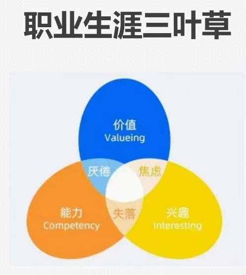

## 五大犯贱错误一简历模板怎么选？

- 第一犯贱：简历模板胡乱用
- 第二犯贱：跳槽频繁没定型
- 第三犯贱：工资需求乱开价
- 第四犯贱：复制抄袭不用心
- 第五犯贱：不知深浅乱炫技

干货讲解
- 简历给谁看？
- 投简历目的？
- 简历模板怎么选？

## 频繁跳槽怎么办？

简历包装术
- HR希望看到的是什么
- 稳定、专一：前序公司的忠诚度
- 单位时间是否足够长：1年以上或2年
- 跳槽原因：客观
- 公司业务调整-倒闭搬家

套路
- 套路：1年以上时长-被动旁职 万分不舍
- 注意：工作空档期问题，不能说坏话一领导业务：因队

面试必成法
- 跳槽原因提前预设好
- 回应面试官潜在疑虑：忠诚度言
- 强调职场教育、自我成长
- 被动离职万分不舍

套路实调
- 提前背诵 逐字稿
- 1分钟、3分钟
- 对应简历 滚瓜烂熟

天龙八部

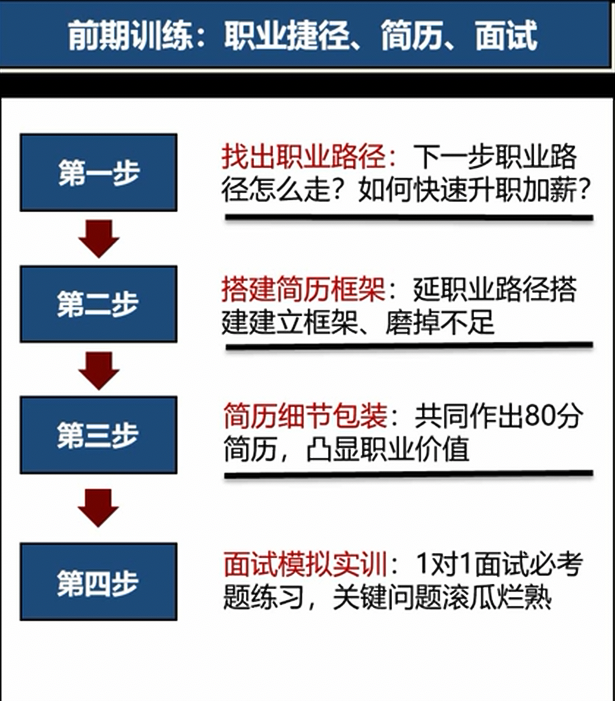

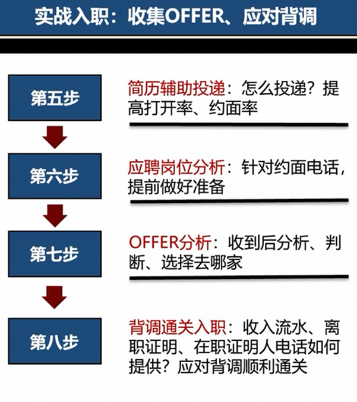

## 复制抄袭不用心

抄岗位职责
1. 抄岗位职责
2. 展现不全面
3. 文风不一致
4. 奇葩写作
5. 自我介绍不要脸

## 简历长啥样

- 职位不断升职
- 行业实操经验
- 上市梦想的公司

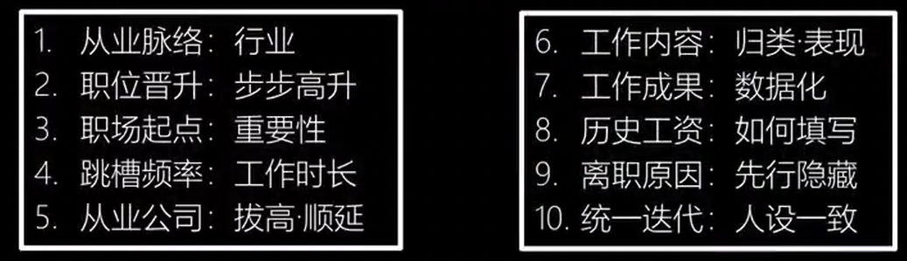

## 刷新简历-工作主动上门

你现在的努力，决定你未来的状态

## 基础信息

- 名字要用真名•不要用英文名
- 参加工作年份越早越好，可以从实习算起
- 现居住地写目标公司城市，不要写具体
- Q、手机号、微信、邮箱，自我检查不被人肉
- 婚姻状況、政治面貌填写注意事项

## 个人评价

- 自我评价写作三段论
- 自我评价目的是什么？
- 想象场景HR如何看你的简历
- 工作经历技能经验 求职意愿的汇总
- 自我评价写作三段论
- 评价的是自我切忌网上抄袭-空话套话废话
- 本现：商务写作功底 逻辑思维能力 -态度责任心

## 职小白自我评价三段论：第一段为工作+实习经历汇总

- 工作经验向前延长 每个工作1年以上
- 最多2份工作

三段论
- 第一段为工作＋实习经历汇总
- 第二段为职场训练描述，获得荣誉
- 第三段为呼应应聘岗位-表决心

## 职场路线

- 资历够吗？
- ＞35岁了？
- ＞10年职场经验？
- ＞总监or副总裁？
- ＞50万年薪？
- ＞百人面试？
- ＞ 50人团队管理？
- 多种行业岗位经历？
- 自己成功的职涯路径？

## 求职意向

- 求职意向，在正式简历中体现；一定要认真填写
- 基本要求：专一、清晰、一脉相承
- 不犯错：期望月薪、工作性质
- 求职意向与简历配套，不同简历可不同求职意向
- 到岗时间 期望薪资-刷新简历

## 到岗时间

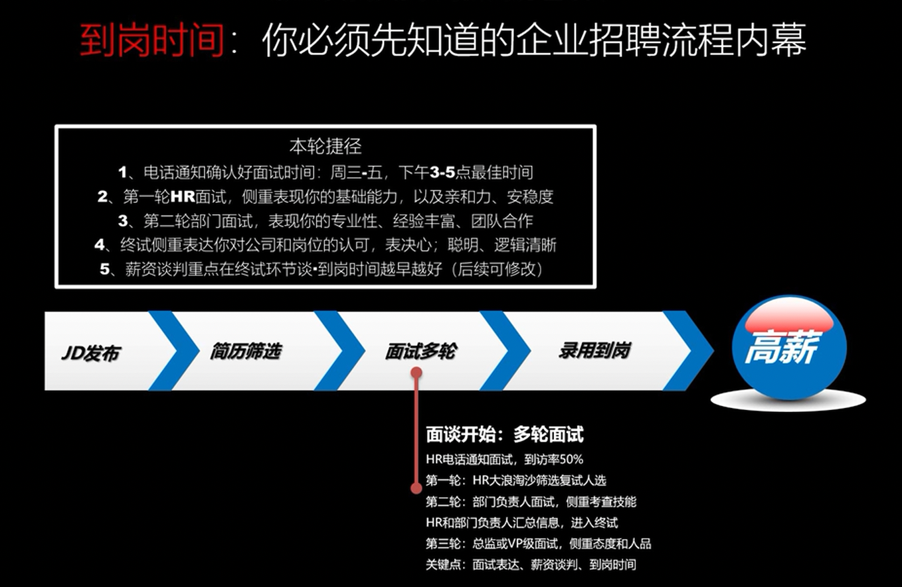

## 期望薪资

- 谁先出价谁先死
- 先了解预算范围
- 历史工作作参照
- 应聘职位配得上

## 工作经历：精心填写、大胆布局、完美成稿

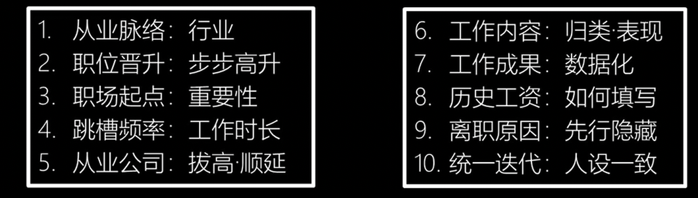

1、从业脉络：所在行业
- HR希望看到的是什么
- 行业从一而终，经验丰富
- 反套路：抹掉不相关的行业经历
- 反套路：隐藏小公司、拉长优质公司的工作时间

2、职位晋升：步步高升
- 职位晋升：实习-员工-组长- 主管-经理-总监
- 为什么一定要有职位：要上高工资的前提
- 公司心态：古便宜少给钱/怕你跑了不稳定
- 注意：职位上不能走下坡路，只能更好更强

3、职场起点：扎实专业
- 论出身：第一份工作
- 和你求职的岗位尽可能一致：始终如一/包含关系
- 公司尽可能的大：人员规模行业知名度 适度包装
- 快速晋升：完成从小白到管理的通路

4、跳槽频率：工作时长-空档期
- HR希望看到的是什么
- 稳定、专一：在之前公司的忠诚度
- 在前序公司呆的时间是否足够长：1年以上或2年
- 注意：工作空档期问题

5、历史公司：拔高、顺延
- HR希望看到的是什么
- 同行业工作经验：规模大、品牌好
- xx万年薪购买经验行业先进性
- 反适度公司包装一规模、品牌、年限等
- 反套路：公司越来越好-和职位交替发展

6、工作内容：归类 表现
- HR希望看到的是什么
- 岗位价值：花少钱干多活 占便宜
- 工作内容归类 有利用价值

7、工作成果：数据化、个人化

8、历史工资：如何填写
- 反套路：切记跨度大 呼应求职意向-呼应岗位薪资预算
- 反套路：如何要到高工资？

9、离职原因：先行隐藏
- 客观原因：公司业务调整倒闭搬家
- 反套路：被动离职 万分不舍兢兢业业
- 注意：无论如何不能说原公司的坏话一领号、业务、团队等

10、 定期迭代：人设一致
- 定期迭代你的简历
- 压缩前几份工作;展开临近的工作描述
- 注意：人设一致文风一致-分清主次-全面拔高

## 教育背景：无缺陷-上档次-高工资

1. 我是大专，怎么办？
    - 考本考硕
2. 专业不对口，和工作不匹配怎么办？
    - 解決方案
    1. 学科追溯包装
    2. 考研专业升级
    3. 辅修学位转换
3. 学校很差，拿不出手怎么办？
    - 解决方案
    1. 技能培训升级
    2. 自考学校升级
    3. 学校更名包装

教育背景潜在问题
- 加码：在校实践 培训经历-所获奖项-考取证书

## 社会实践

体现经历丰富/商务写作套路
- 详细和全面的说明做的事情、取得的业绩
- 在技术和能力上有什么提高

简洁到位-条理清晰 商务写作套路
- 使用 “动宾结构”，少用“我
- 描达你所做的事情，最容易展示出能力

所获奖励 混学生会商务写作套路
- 挖掘相关技能-荣誉能力；必得奖学金，必混学生会
- 并分门别类，写详细，写清楚

## 培训证书-语言：上进心/有价值

1. 时效性：删掉过期老旧的内容
2. 一致性：与身价匹配
3. 针对性：与应聘工作相关

## 兴趣爱好特长：与求职岗位一致

1、围绕求职意向写
- 技术岗：网页设计，趴技术论坛，参加技术聚会，在知乎、百度百科上给人回答问题等，天生喜欢技术
- 市场公关岗：突出口才好，思维敏捷，涉猎广泛的兴趣爱好，如参
- 加演讲比赛，热爱桌游等群体性面对面策略游戏
- 销售岗：经常参加团队类、 竞争类的活动
- 财务会计岗：需要踏实做事，思维镇密性；匹配阅读类的兴趣爱好

2、证明性格且与应聘岗位匹配
- 蓝球足球排球：团队精神，适用大多数岗位
- 围棋国际象棋：战略意识，应聘市场类或者高端职位
- 阅读写作：学习力体现，适用大多数岗位
- 旅游：适应不同环境的能力，心胸开阔、性格开朗
- 跆拳道：意志，适用于管理类，市场类职位
- 演讲辩论：沟通能力强，适用于市场销售类职位
- 舞蹈唱歌：外向、易沟通，适用大多数岗位

3、最多三项-体育爱好-旅游阅读
- 合并同类项：归类体育爱好，说明发达四肢，坚强体魄足以
- 体育爱好：体质健康•体现毅力-团队精神 适应高强度工作
- 旅游：体现户外心胸开阔-热爱生活 乐观
- 阅读：体现学习力-专注研究 深度思维-列出3本近期读的书

## 求职信写作针对性锁定

- 求职信是针对特定的公司职位&简历是针对特定的工作岗位
- 针对性的写好，会起到态度作用，可脱颖而出
- 转型降维特别说明有用
- 轻易别写•写就见血

## 项目经验-反复证明你胜任

项目经历：
- 项目经验重要作用是体现你的能力本身了是你工作职责、工作成绩的 一种补充。
- 项目经验经历写作包括
    - 项目描述：
    - 个人职责：
    - 项目成果：

- 这三部份重点要说你个人，也就是你在项目里做了什么，做到什么成绩。
- 项目经历必须有代表性，是你能力的体现
- 同时你也要把自己的项目精选出 3个。找有代表性的，含金量高的，和你应聘的岗位贴近的项目

## 应该有几份简历？

- 简历布局；
- 三份起·拔高版_常规版_针对版
- 招聘网站后台如何设置

多份简历布局思路
- 第一份：中规中矩-适当美化-贴近现实
- 第二份：拔高、粉饰、博傻
- 第三份：针对目标公司岗位•全面包装

## 如何让猎头工作主动找你，积累人脉？如何通过招聘网站搜索关键词增加被找到概率？

- 求职网站：智联招聘、前程无忧、BOSS直聘、猎聘网
- 简历刷新方法：每天刷新 保持活跃排名靠前
- 搜索关键字：行业、公司、岗位、具体内容
- 在职注意：屏蔽现有公司权限/名称 了解公司招聘方式
- 积累人脉：同事关系、老上级关系、猎头关系維护

## 怎样高效简历投什么递？好职位长样？广撒网_重点培养·HR如何筛选简历·目标职位JD解读

高效简历投递•刻意练习面试

- 求职方式：招聘网站、企业网站、微信求职
- 简历投递原则：广泛撒网、重点培美
- 解读JD：了解企业需求，针对可性简历面试
- HR筛选：简历呈现形态、HR如何筛选简历
- 刻意练习：短时间大量面试训练-面试必成

## 如何进行面试训练？熟背简历·面试必成包含哪些内容？面试流程内幕类型方法有哪些？

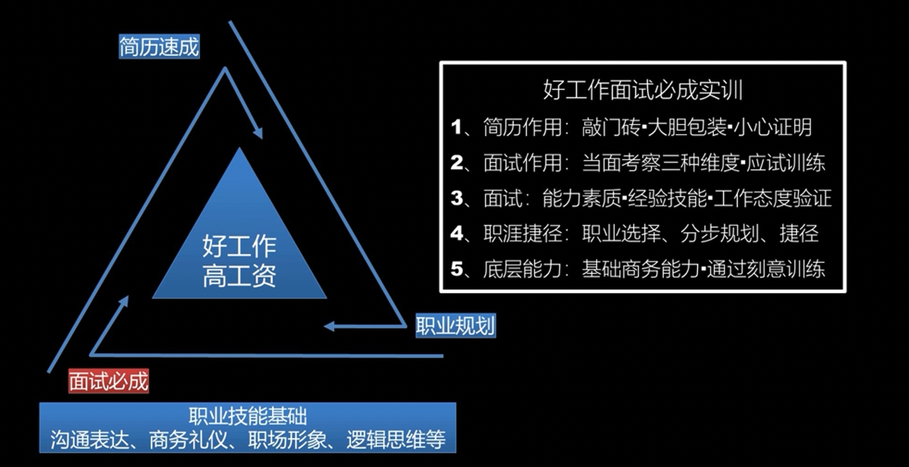

招聘流程：
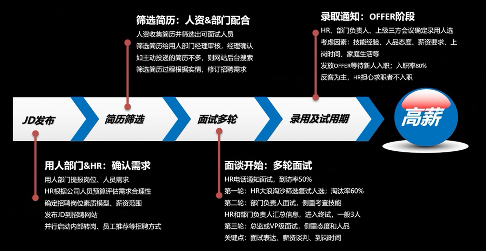

六大面试类型和反套路应对策略
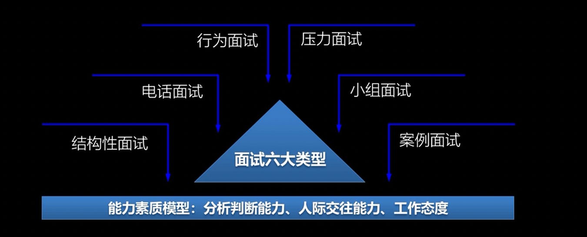

面试流程内幕及考试点的应对策略：
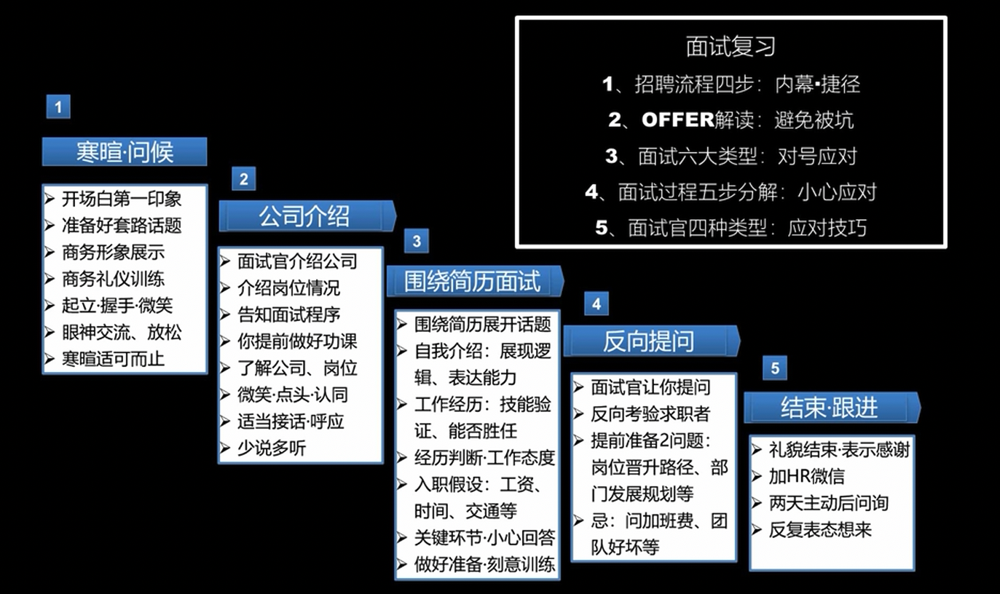

四大典型面试官类型-反套路捷径
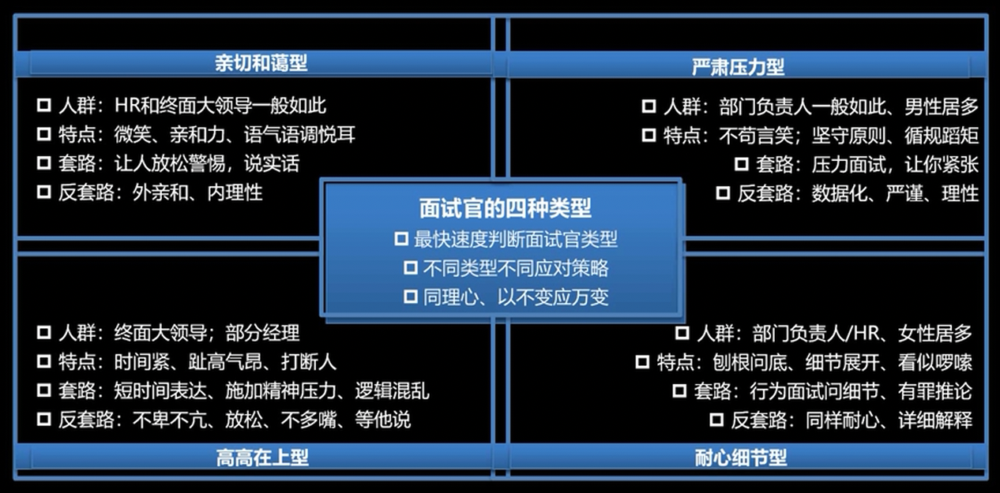

面试考核点表：
- 三维度训练：能力素质维度、经验技能维度、工作态度维度
- 面试问答训练：能力、技能、态度相关问题一对一训练
- 关键问题强化：薪资谈判、自我介绍、离职原因、经验总结

面试三大考核点•如何反套路训练拿高分？
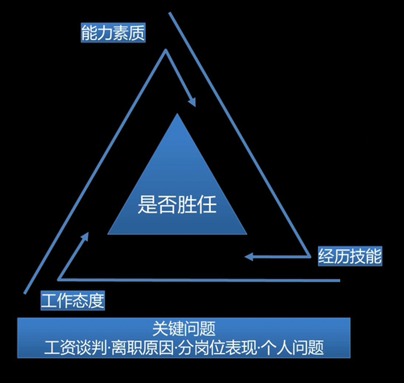

面试应对策略实训
1. 有罪推论：验证你是否造假、夸大技能
2. 能力素质验证：是否具备相关能力
3. 经历技能：经历厲实？能否胜任相关工作
4. 工作态度：人品-团队合作努力度•积极度
5. 关键问题：工资范围•上岗时间-家庭问题

三十堂面试必成小结-22个问题考察点
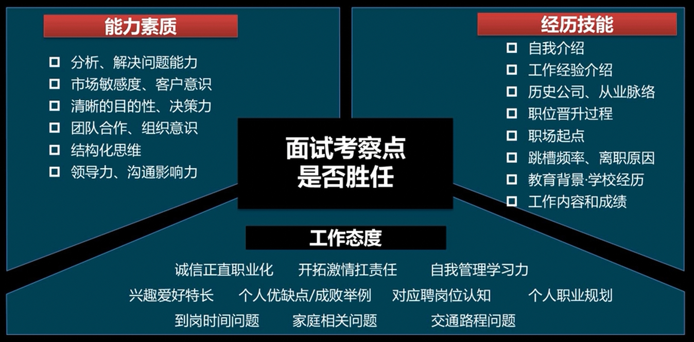

## 招聘流程内幕：招聘岗位是怎么发布的？JD怎么解读？HR和用人部门怎么配合招聘？

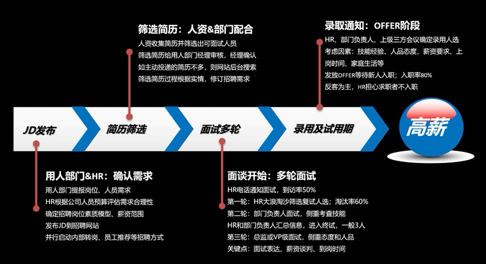

## 面试流程内幕：面试每轮关注点是什么？面试最终谁说了算？凭什么录用你？

JD发布：
1. 根据JD反向修改简历•准备面试
2. 了解薪资上限，做好薪资谈判准备
3. 积累职场人脉，给你内推工作

筛选简历：
1. 满足HR筛选需求，尽可能被选
2. 设置好关键词，简历留联系信息且容易被搜索
3. 定期刷新和更新简历-屏蔽关联公司

多轮面试：
1. 电话通知确认好面试时间，周三.五下午3-5点最佳时间
2. 第一轮HR面试，侧重表现你的基础能力，以及亲和力、安稳度
3. 第二轮部门面试，表现你的专业性、经验丰富、团队合作
4. 终试侧重表达你对公司和岗位的认可，表决心；聪明、逻辑清晰
5. 薪资谈判重点在终试环节谈•到岗时间越早越好（后续可修改）

录用通知：
1. OFFER收到后核对待遇信息
2. 角色转换，可适当提出异议
3. 快速回复、痛快加入
4. 并行继续寻找更合适工作，直到入职

## 收到offer别高兴，要看好社保上多少？工资构成？上岗岗位是什么？企业会设哪些坑？

1. 职位坑
2. 工作地点坑
3. 日期坑
4. 合同、试用期坑
5. 奖金能否达到坑
6. 工资坑：税前税后，工资构成
7. 社保坑：社保&公积金
8. 节假日

## 职业规划：如何选对行业找对岗位？如何跳槽晋升和涨工资？职涯捷径怎么走？

高工资职涯捷径：好工作高工资是规划出来的

## 你上有老下有小的时候怎么办？详细算算你辈子需要多少钱？你必须混下去混得好

算笔账，活到80岁需要多少钱？

算个数：假设你今年25，60退休，活到80

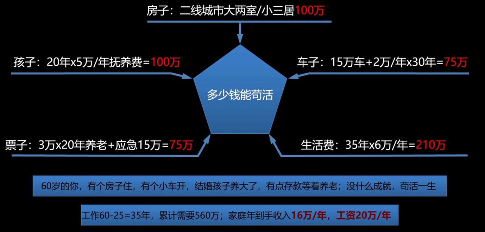

那么，未来38岁的你呢?

未来还会有更好的未来！

