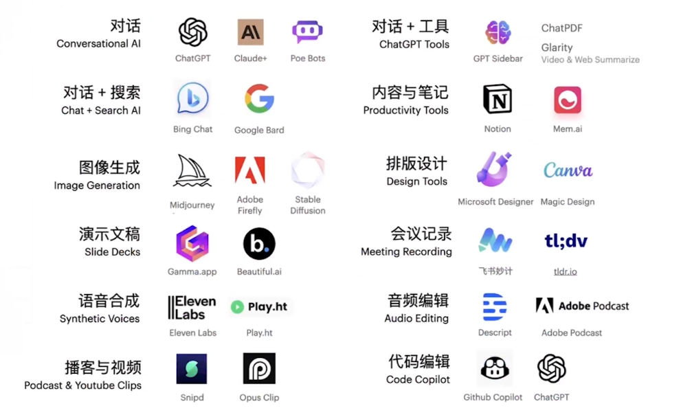
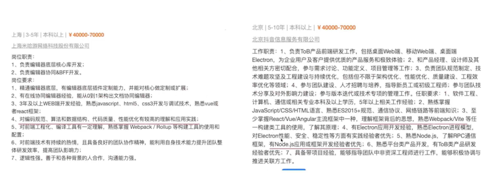

# AI 时代，前端生存指南：危机与挑战下的破局策略

## 前言

反思：
- 简历是不是有问题
- 基于岗位来修改调整简历
- 前端开发工程师、中级前端开发工程师、高级前端开发工程师、特别方向的前端（BI前端开发、AI前端开发

### 大环境

“现在找工作难，没有头绪了”

高薪企业需求：

关键点：
- 源码+架构能力+Nodejs+跨端
- 对标头部公司看自身发展，选择热门的行业很重要

### 常见问题

- 对新人：现在这么卷了，新技术又层出不穷，没有头绪
- 对老人：马上到35岁年龄坎了，感觉好慌想做点其他的
- 对跨专业：前端知识杂且多，很难掌握全

## 目前前端职业前景、压力、挑战和机遇

哪里去收集一手数据？信息？

### 职业前端相关

- 职聘网站（国内外的都可以看看，国内脉脉、国外领英
- 行业报告和研究（艾瑞、麦肯锡等），政府数据和报告
- 招聘会、行业会议、教培机构

### 职业前景举例

### 职业前景”不理想"

- 初级市场竞争压力大，需要往中高级进行发展
- 一线城市的招聘需求减少，相反二三级有所增加
- 薪酬平均水平降低1~3%（环比从2019-2022都有所增长）
- 招聘高级人才的需求一直很大 ，对综合性人才需求大

### 我们该怎么办？-面临的压力与挑战

- 是否考虑新的生活方式？（地址位置）
- 是否考虑缩减开支，学习理财及储蓄（有车房贷、末婚末育）
- 是否考虑提升自己的综合能力，适应市场需求？

### 当下时代的机遇在哪里？-相关机遇

- 知识付费领域（知识达人），主流热门技术分享（AI相关）
- 新技术领域（跨界合作、研发技术产品、开源项目）
- 创业机会：AI安全、伦理相关...

所有的机遇都埋藏在"不期而遇"需要你走出去，多社交

寻找新的收入常见搞 “钱〞思路

### “技术人〞的搞钱思路

- 咨询服务、外包项目
- 在线教育、写作与博客
- 开源社区、技术讲座、研讨会

## AI技术于前端技开发的融合

### AI 工具推荐

- 综合性 ：ChatGPT 4.0、Claude
- 编码：Codeium，, Copilot, Tabnine
- 其他：Cursor.so ( ChatGPT API) , new bing , SQL Chat

### 使用场景

- 写复杂的正则表达式
- 提供Mock数据
- 通用模块的功能示例代码

## 如何确定自己的学习路径，如何突破职业瓶颈

### 关于成长路径

- 通识强化 （基础、框架及生态、Node js)
- 进阶提升（工程化、自动化、CLI)
- 高阶能力（技术重组、架构设计、服务端开发、跨端多端）

职场中，你遇到哪些难过的关？

### 职业瓶颈

- 技术更新迅速，专业发展不明确
- 沟通和协调能力 ，项目管理能力
- 架构设计能力

### 职业瓶颈如何破？

- 设定明确的目标和发展线路
- 提高沟通与管理能力，持续学习，积累专业领域经验
- 尽早的进行跨专业融合与尝试，建立自己的品牌、产品…

### 副业建议

- 副业是个长期的过程 ，要选择`有成长性、能学到东西的`
- 要有`冒险精神`，收益与风险成正比，`远离HDD等违法之事`
- 做出规模有高收益，学习`团队、时间管理`，往脑力型副业转型

## 总结

财不入急门

## 如今的互联网行业…

- AI革命：OpenAI掀起的技术浪潮，让AI技术可以触手可及
- 行业萎缩：大厂业务线关停、裁员、降薪、找工作难（缩招）
- 多重职业：内耗严重，都想找机会（做副业、做外包or创业）

## 2025 前端行情

2023 年春天全网疯传：前端已死。

到现在快两年了，前端到底死没死呢？这是一个很矛盾的话题，你看：

- 一方面： React19 发布，Nextjs15 发布，Deno 2.0 发布，Vue 作者尤雨溪成立 ViodZero， Rust 疯狂重构前端打包工具... 一片欣欣向荣
- 另一方面：大量的裁员、失业，国内更严重，国外也很卷... 一片死气沉沉

从目前的形势来看：
- 整个互联网行业不景气，没有新的增长点（除了前两年 Web3、近两年 AI）。行业不好，所有从业人员都会受影响，不仅仅是前端。
- 前端在发生变化和升级，更需要全栈、AI 等综合性人才，纯前端将会被慢慢淘汰

对于我们每个人来说：
- 不要裸辞，工资是最大的生活保障 （程序员群体，大概家里都不会有矿）
- 不要只顾工作，多考虑自身提升和学习。你全身心为公司考虑，公司可不一定为你考虑，裁员指不定就在哪天。

## 链接

- https://v0.dev/
- https://www.cursor.com/
- https://mini.liboqiao.top/profile
