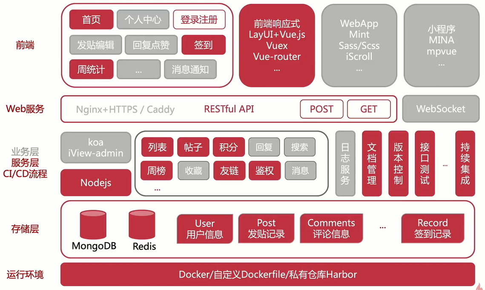

# 6大场景：分析前端高级进阶之路


## 大前端时代


大前端时代的新要求：

- 扎实的前端业务开发能力，交互理解（兵来将挡水来土掩）
- 多角色沟通协调能力（面面俱到的小能手）
- 多端、跨端的开发能力，新技术的学习能力（物尽其用，适者生存）

## 6 大场景

- 前端框架选型
- 前端工程化入门 & 脚手架工具
- 前端测试 & 调试技巧 & Mock 数据
- Nodejs 全栈开发接口服务
- 自动化流程与缺陷管理
- 多端跨端需求与应用





## 重点知识

- 前端开发环境搭建
- 6大常见常见
- 自动化流程、多端跨端应用

`学而不思则罔，思而不学则殆`

- 前端基础知识：HTML、CSS、JS、ES6、TS、React、Webpack、Nodejs、...
- 基本的动手能力、解决问题的能力与`提问能力`


## 软件项目开发

项目定义 -> 需求分析 -> 开发阶段 -> 维护/结束

项目生命周期


项目定义阶段（了解）
- 没有明确项目的目标、资源、工期
- 没有进行合理的苹果与预算
- 客户沟通不及时、不充分、不具体

需求分析（了解）
- 详细的需求分析、项目预算
- 资源计划与合理的分工
- 客户沟通不及时、不充分、不具体

开发阶段（重点）


项目收尾（了解）

- 没有规范的收尾流程、草草结束
- 没有对文档进行归档，对项目进行总结，形成组织资产
- 资源回收不及时，造成资源浪费

## 解决方案：DevOps 流程

- 对组织人员培训，转变思维向自动化、规范化转型
- 配合效率工具（自动化）对流程进行简化/标准化
- 全员参与并实践

DevOps 流程
 


## 开发环境

本地环境：
- Nodejs
    - npm/yarn、nvm、nrm
- IDE
    - Webstorm、VSCode
- Vue-Cli

测试环境：
- Linux
    - 虚拟机环境（Parallels、VMware、Hyperv）
    - 云服务（1C+2G）
    - 安装 Docker：https://mp.weixin.qq.com/s/Y8-nc0HBKUtGE62M7nkOJQ

数据库服务
- MongoDB

## UI 框架选型

- 使用场景：PC、移动端WEB、小程序、响应式
- 组件丰富，成熟的模板，方便集成
- 成熟的社区、成熟的生态

ui 框架：
- Layui
- iView
- Ant Design
- Fusion Design
- Mint UI
- Cube UI
- Vant

## JS 框架选型

- 团队的技术能力
- 应用场景：后台？性能要求？时间要求？
- 成熟的社区、成熟的生态

框架：
- React
- Vue
- Angular

选型：
- 团队的技术能力，按需取用
- 背后的原理，并思考如何自己实现一个JS框架
- 多读文档，求助社区、高效开发

## 什么是前端工程化？

`前端工程化`是指将前端开发的流程`规范化`、`标准化`，包括`开发流程、技术选型、代码规范、构建发布`等，用于提升前端工程师的开发效率和代码质量。


- 复杂度高：前端项目的多功能、多页面、多状态、多系统
- 规模大：团队开发、多人协作、代码质量管理
- 要求高：页面性能优化（CDN、异步加载、请求合并），CSS兼容性、单页面应用、服务端渲染...

## 怎么做到前端工程化

- 从业务着手
    - 简单的页面应用，使用 gulp 打包+同步工具实现开发全流程
- 从复杂度考虑
    - Jenkenis、git/gitlab、webpack、React/Vue/Angular
- 从已知向未知扩展
    - 不同的技术有不同的适应点，选择合适的才是最好的

考虑：
- 前后端技术是否更好的融合
- 前后端分离，接口安全性
- vue 或 React 是否适合当前场景
- 是否更好的集合

最佳实践：
- 组件化、脚手架、工程cli工具
- git flow
- webpack

## webpack 五大核心概念

### 1.Entry

入口（Entry）指示webpack以哪个文件为入口起点开始打包，分析构建内部依赖图。

### 2. Output

输出（Output）指示Webpack打包后的资源bundles输出到那里去，以及如何命名。

### 3. Loader

Loader让Webpack能够取处理那些非JavaScript文件（Webpack自身子理解JavaScript）

### 4. Plugins

插件（Plugins）可以用于执行范围更广的任务，插件的范围包括，从打包优化和压缩，一直到重新定义环境的变量等。

### 5. Mode

模式（Mode）指示Webpack使用相应模式的配置

- development开发模式：能让代码本地调试运行的环境
- production生产模式：能让代码优化上线运行的环境

扩展：

- webpack-notes：https://github.com/ShenBao/webpack-notes
- rollup-notes：https://github.com/ShenBao/rollup-notes
- vite-notes：https://github.com/ShenBao/vite-notes

## 脚手架及CLI工具

- vue-cli
- create-react-app

cli工具：
- commander
- prompt
- yeoman

## CLI 脚手架原理

https://mp.weixin.qq.com/s/xXZpI7D92XBRRXUyGcW9PQ


## 三类真机调试技巧

- Chrome + Android、Safari + IOS
- Fiddler、Charles
- Weinre、Spy-Debugger、vConsole


## 如何调试Webpack？如何配置VSCode调试？

### webpack调试

```bash
// （1）npx
npx node --inspect-brk ./node_modules/.bin/webpack --inline --progress
// （2）package.json配置执行命令
{
    "scripts": {
      "webpack:debug": "node --inspect-brk ./node_modules/.bin/webpack --inline --progress"
    }
}
// 运行
npm run webpack:debug
```

### Vscode 添加配置


### 检查依赖是否需要更新-npm-check-updates

安装

    npm install -g npm-check-updates

使用

    ncu

检查package.json

    ncu -u

升级package.json,运行npm install更新已安装的软件包和package-lock.json。

    npm install


## Mock

- 模拟真实接口

    实现效率开发，前后台同步，特别是分布式的系统

- 虚拟业务场景

    某些开发场景非常难触发，还有一些异常逻辑、交互逻辑

- 压力测试


### Mock 数据工具

- Yapi
- Easy Mock
- Doclever
- Fast Mock


Mock 数据：即为虚拟的数据、虚假的测试数据

Mock 开发：就是使用 Mock 数据，实现效率开发

Mock 特点：模拟接口、虚拟场景业务，临界情况


### 使用 Mockjs 进行 Mock 数据开发

- http://mockjs.com/

## API接口安全相关知识（加密&算法&HTTPS）


Session\Cookie：
- 优点：
    - 较易扩展
    - 简单
- 缺点：
    - 安全性低
    - 性能低，服务端存储
    - 多服务器同步session困难
    - 跨平台困难


JWT：
- 优点：
    - 易扩展
    - 支持移动设备
    - 跨应用调用
    - 安全
    - 承载信息丰富
- 缺点：
    - 刷新与过期处理
    - Payload 不易过大
    - 中间人攻击

Oauth：
- 优点：
    - 开放
    - 安全
    - 简单
    - 权限指定
- 缺点：
    - 需要增加授权服务器
    - 增加网络请求


### 什么是JWT

- jwt.io

JWT 全称 JSON WEB Token，一个 JWT 由三部分构成：Header，Payload，Signature

JWT 特点：
- 防 CSRF（主要是伪造请求，带上 Cookie）
- 适合移动应用
- 无状态，编码数据

JWT 工作原理：


### HTTPS

超文本传输安全协议

是一种通过计算机网络进行安全通信的传输协议。

HTTPS：Hyper Text Transfer Protocol over SecureSocket Layer

常称为 HTTP over TLS、HTTP over SSL 或者 HTTP Secure 

### API 安全设计

- 通信信道加密：使用 HTTPS
- 通信数据加密：密文+加密关键数据
- 通信安全策略：授权中间层、尝试次数、过期策略 ...


## Nodejs写接口：初识 Web 框架 Koa

- https://github.com/koajs/koa

### Koa 核心概念

- Koa Application（应用程序）
- Context（上下文）
- Request(请求)、Response（响应）


### Request属性、路由基础用法、app.use链式处理

- ctx.request

### koa-router

```js
var Koa = require('koa');
var Router = require('koa-router');

// 第一步：实例化koa-router
var app = new Koa();
var router = new Router();

// 第二步：给koa-router对象添加路由和对应的处理函数
router.get('/', (ctx, next) => {
  // 后面会把这个函数注册成中间件，所以这里放心使用ctx和next
  // ctx.router available
});

// 第三步：将koa-router对象的所有路由和处理函数注册成为中间件
app
  .use(router.routes())
  .use(router.allowedMethods());
```

常见类型请求的处理

```js
//根据需要修改
router
  .get('/', (ctx, next) => {
    ctx.body = 'Hello World!';
  })
  .post('/users', (ctx, next) => {
    // ...
  })
  .put('/users/:id', (ctx, next) => {
    // ...
  })
  .del('/users/:id', (ctx, next) => {
    // ...
  })
  .all('/users/:id', (ctx, next) => {
    // ...
  });
```

router中的参数传递方式

（1）地址query

```
路由：/users
地址：localhost:4000/users?q=1
取值：ctx.query
结果：{ q: 1 }
```

（2）获取router params

```
路由：/users/:id
地址：localhost:4000/users/1
取值方式：ctx.params
结果：{ id: 1}
```

（3）请求体body

```
路由：/users
地址：localhost:4000/users，content-type为application/json，参数{"name": "zj"}
取值：
先提前安装 koa-bodyparser：
const bodyParser = require("koa-bodyparser");
app.use(bodyParser());
再：ctx.request.body
结果：{ "name": "zj" }
```

**将api router抽离到单独文件:**

入口代码导入抽离逻辑代码，上层代码导入下层代码

```js
// demo/api/api1.js

const Router = require("koa-router");

const router = new Router();

router.get("/api1", async (ctx, next) => {
  ctx.body = "api1";
});

module.exports = router;

```

```js
// demo/app.js

const Koa = require("koa");
const api1 = require("./api/api1");
const api2 = require("./api/api2");

const app = new Koa();
const port = 3000;

app.use(api1.routes()).use(api1.allowedMethods());
app.use(api2.routes()).use(api2.allowedMethods());

app.listen(3000);
console.log("程序已经启动，在" + port + "端口监听");
```

router.prefix()将路径中公共的部分先抽离出来

```js
const router = require('koa-router')()

router.prefix('/users')

router.get('/', function (ctx, next) {
  ctx.body = 'this is a users response!'
})

router.get('/bar', function (ctx, next) {
  ctx.body = 'this is a users/bar response'
})

module.exports = router
```

**requireDirectory实现路由自动加载:**

思路：
1. 自动去寻找文件夹中的api文件 require进来
2. router require进来以后，自动注册到app中

简单用法：
```js
const Koa = require("koa");
const Router = require("koa-router");

//requireDirectory是一个直接导出的方法
const requireDirectory = require("require-directory");
//requireDirectory方法执行之后会返回一个全部路由的对象
const routers = requireDirectory(module, "./api");

const app = new Koa();
const port = 3000;

// 通过便利把每一个router注册到appshang
for (let routerName in routers) {
  if (routers[routerName] instanceof Router)
    app.use(routers[routerName].routes()).use(routers[routerName].allowedMethods());
}

app.listen(port);
console.log("程序已经启动，在" + port + "端口监听");
```

高级用法：
```js
const Koa = require("koa");
const Router = require("koa-router");
const app = new Koa();
const port = 3000;

function whenLoadModule(router) {
  if (router instanceof Router)
    app.use(router.routes()).use(router.allowedMethods());
}

//requireDirectory是一个直接导出的方法
const requireDirectory = require("require-directory");
//requireDirectory方法也支持opitons参数，配置响应的回调函数
requireDirectory(module, "./api", { visit: whenLoadModule });

app.listen(port);
console.log("程序已经启动，在" + port + "端口监听");
```

### Koa开发热加载、ES6语法支持

**热更新**

热更新很简单，需要使用到nodemon。

用法如下：
```bash
npm i nodemon -D
```
```js
// package.json
"scripts": {
    "start": "nodemon src/index.js"
},
```

复然后运行 npm run start


**es语法支持**
- webpack & webpack-cli
- clean-webpack-plugin: 清除dist目录
- webpack-node-externals: 不对node_modules进行处理
- @babel/core: es6支持
- @babel/node: 调试使用
- @babel/preset-env: 新语法的支持
- babel-loader
- cross-env: 环境变量的处理

webpack.config.js 配置如下：

```js
const path = require('path');
var nodeExternals = require('webpack-node-externals');
const { CleanWebpackPlugin } = require('clean-webpack-plugin');

const webpackconfig = {
  target: 'node',
  mode: 'development',
  entry: {
    server: path.join(__dirname, 'src/index.js')
  },
  devtool: 'eval-source-map',
  output: {
    filename: '[name].bundle.js',
    path: path.join(__dirname, './dist')
  },
  module: {
    rules: [
      {
        test: /\/(js|jsx)$/,
        use: {
          loader: 'babel-loader'
        },
        exclude: [path.join(__dirname, '/node_modules')]
      }
    ],
    },
    externals: [nodeExternals()],
    plugins: [
      new CleanWebpackPlugin()
    ],
    node: {
      console: true,
      global: true,
      process: true,
      Buffer: true,
      __filename: true,
      __dirname: true,
      setImmediate: true,
      path: true
    }
  }

module.exports = webpackconfig
```

.babelrc 配置如下:

```js
{
  "presets": [
    [
      "@babel/preset-env",
      {
        "targets": {
          "node": "current"
        }
      }
    ]
  ]
}
```

然后执行如下命令:
```bash
npx babel-node src/index.js
```

就可以欢乐的使用import 语法了。

当然，我还想结合使用热更新怎么办呢？

```js
"scripts": {
    "start": "nodemon src/index.js",
    "start:es6": "nodemon --exec babel-node src/index.js"
},
```

### JWT鉴权方式：koa-jwt 集成 

- https://www.npmjs.com/package/koa-jwt
- https://github.com/auth0/node-jsonwebtoken

```js
var koaJwt = require('koa-jwt');

const jwt = koaJwt({ secret: 'shared-secret' }).unless({ path: [/^\/public/] });

app.use(jwt);
```

### npm-run-all

- https://www.npmjs.com/package/npm-run-all

```
--parallel: 并行运行多个命令，例如：npm-run-all --parallel lint build
--serial: 多个命令按排列顺序执行，例如：npm-run-all --serial clean lint build:**
--continue-on-error: 是否忽略错误，添加此参数 npm-run-all 会自动退出出错的命令，继续运行正常的
--race: 添加此参数之后，只要有一个命令运行出错，那么 npm-run-all 就会结束掉全部的命令
```

###  动态路由加载：Routes入口优化 require.context

```js
const moduleFiles = require.context('./modules', true, /\.js$/)

const modules = moduleFiles.keys().reduice((items, path) => {

    ​const value = moduleFiles(path)

    ​  items.push(value.default)

    ​return items

})

export default koaCombineRouters(modules)
```

## 四款文档管理工具介绍

- Showdoc
- eoLinker
- MinDoc
- apizza

接口文档工具
- 接口模板、分组
- 权限管理、团队协作
- 版本控制、本地部署

## 项目开发团队协作——版本管理 

**`Git Flow`**

方式一：

经典模型的问题
- 必须使用 dev 分支
- 复杂度高：hotfix与release分支
- 多次Merge合并

方式二：


- 适用于持续集成多环境场景
- 上游分支向下游发展
- 流程：Bug -> New Branch -> Master -> pre branch -> Target Branch

方式三：

- 适用于版本项目
- 稳定版本从 master 检出，bug 修复在独立分支
- 流程：Master -> Stable -> New Branch -> Bug fix -> version


## 关于Gi需要知道的知识点


## 缺陷控制概念&最佳实践

缺陷分类及结果：


缺陷控制概念：

缺陷控制就是在项目全生命周期中，`保障项目质量`的一系列行为。

缺陷跟踪系统/软件是被设计用来帮助质量保证和程序员在工作中维护软件缺陷的跟踪报告，或者称作问题跟踪管理系统。

主要的作用是提供`集中概览、来发状态、提供报告`

缺陷控制办法：


总结办法：

- 分工明确，责任到人
- 借助工具，提升效率
- `量体裁衣，按需取用`
- `动态的眼光看问题，长远的角度实施计划`

案例分析：

- 小公司团队/扁平管理/项目外包/业余多样简单
- 传统团队/二级公司/流程冗长/业务多样复杂
- 中大型公司/KPI驱动/技术单一/业务复杂度高/技术深入

案例总结：
- 无章办事/代码优化/代码质量
- 督办意识/工具看板/轻重缓急
- 意识薄弱/形同虚设/领导意识/团队意识

流程介绍：


## ESLint进阶指南

- ESLint进阶指南: https://mp.weixin.qq.com/s/ShdzdXN5BoR6ctT9MxJpzg

## 什么是前端自动化？什么是CICD？


自动化相关概念：
- 前端自动化是指前端代码的自动化构建、打包、测试及部署等流程。
- 持续集成(Continuous Integration)(CI)
- 持续部署(Continuous Delivery)(CD)
- 前端自动化通常与 CI/CD 流程相结合

为什么要结合自动化流程？

自动化流程的意义：
- 减少人为失误，提高软件质量
- 效率迭代，便捷部署
- 快速交付，便于管理

## 多端应用需求分析难点解析

原型设计：
- 花瓣
- 优设
- UI 中国

PC 端需求分析
- 内容展示
- 回复、点赞
- 积分与用户体系


PC 端文档产出：

- 重要页面原型图
- 主体页面流程图
- 说明文档 .md


WebApp 和小程序需求分析:
- 主体功能
- 技术现实和交互体验
- 童虎数据和流程入口


墨刀: https://modao.cc/

WebApp 和小程序文档产出：
- 重要页面原型图
- 主体页面流程图及跳转逻辑
- 说明文档 .md

## 多应用场景应用技术栈考量

技术栈选择：
- 团队技术实力与业务需求结合
- 能够复用，坚决不造轮子；需要造轮子，坚决不牵强
- `怎么简单怎么来，多考虑时间、进度、质量因素`


## 前端技术展望

- `TypeScript 普及，Vue3.x 的到来`
- `跨端能力增强：Flutter、Electron、Taro、Uniapp`
- GraphQL 落地
- ServerLess 让前端更加专注于业务
- `中后台的发展对模块化、标准化、工程化提出了更高的要求`
- 数据可视化

方向：
- 注重业务应用能力的培养
- 对项目全流程的理解，提升个人综合素养的团队效率
- 打通全栈思维，容器化、工程化、持续集成落地实践


书山有路勤为径，学海无涯苦作舟


## 链接

- https://zhuanlan.zhihu.com/p/42286143
